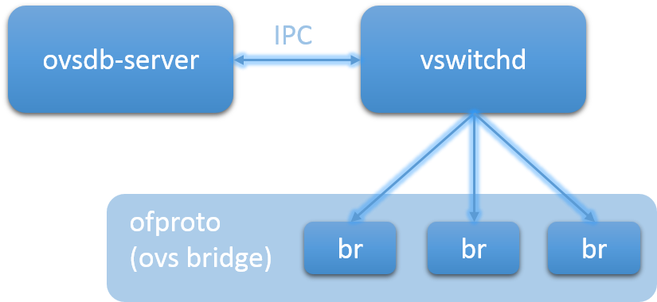
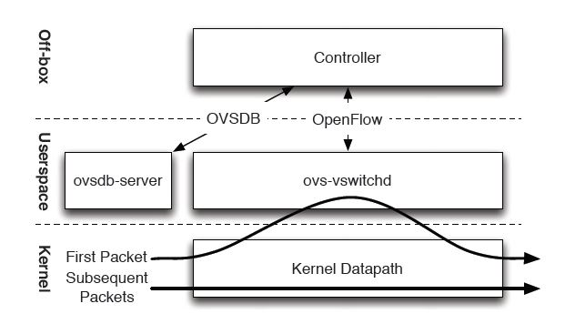
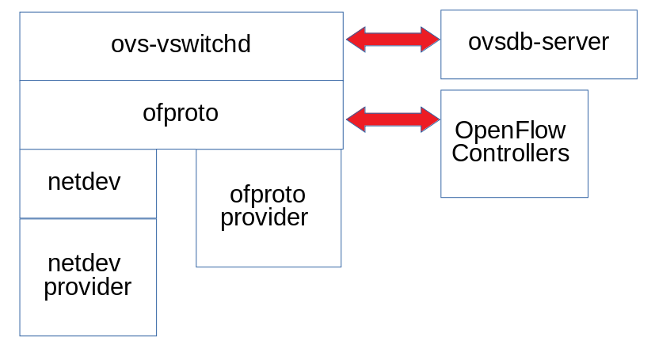
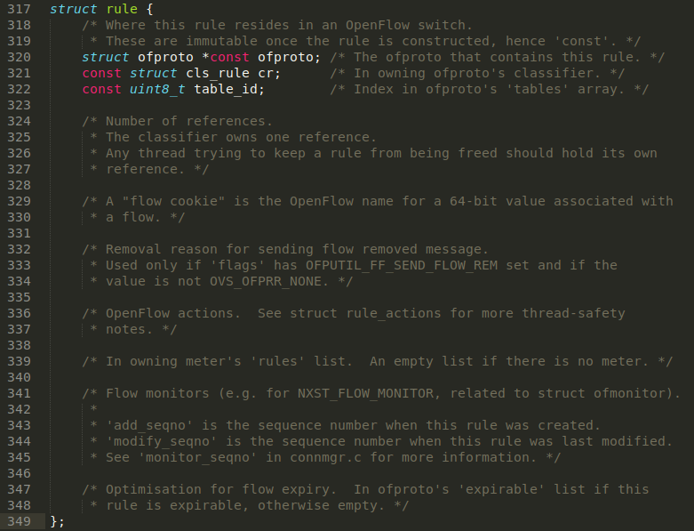
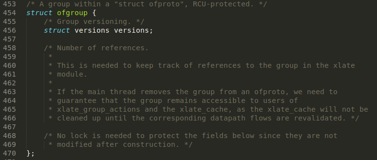

# Kiến trúc của OpenvSwitch
## [1. Kiến trúc tổng quan](#general)
## [1.1. Các thành phần của OpenvSwitch](#component)
## [1.2. OVS Packet Handling](#handle)
## [2. vswitchd](#vswitchd)
## [3. OVSDB](#ovsdb)
## [4. Datapath](#datapath)
---
## <a name="general"></a> 1. Kiến trúc tổng quan
	
- Nhắc lại là OVS thường được sử dụng để kết nối các máy ảo (VM/container) trong một host. OVS quản lý cả các port vật lý (eth0, eth1) và các port ảo (ví dụ như các port của VMs).
- Ba khối cấu trúc chính của OVS:
	- __vswitchd__: Là daemon chạy trên user space.
	- __ovsdb-server__: Là database server của OVS chạy trên user space
	- __kernel module__ (data path): Là module thuộc kernel space, thực hiện công việc chuyển tiếp gói tin.		
- **ovs-vswitchd** nhận các gói tin OpenFlow từ **OpenFlow Controller**, giao thức **OVSDB** sẽ định dạng (format) các gói tin từ **ovsdb-server**. Giao tiếp giữa **ovs-vswtichd** và **datapath** thông qua **netlink** (một họ socket tương tự như Unix Domain Socket). 

## <a name="component"></a> 1.1. Các thành phần quan trọng của OpenvSwitch
Các thành phần này tưong ứng nằm trong 3 khối cấu trúc chính đã đề cập ở trên.
### 1.1.1. OVS Daemon
- **ovs-vswitchd** là daemon của OpenvSwitch chạy trên userspace. Nó đọc cấu hình của OVS từ **ovsdb-server** thông qua kênh IPC (Inter Process Communication) và đẩy cấu hình xuống OSV bridge (là các instance của thư viện **ofproto**). Nó cũng đẩy trạng thái và thông tin thống kê từ các OVS bridge vào trong database.



### 1.1.2. OVSDB
- Nếu như những cấu hình tạm thời (transient configurations) ví dụ như flows được lưu trong **datapath** và **vswitchd** thì các cấu hình bền vững sẽ được lưu trong **ovsdb** và vẫn được lưu giữ sau khi khởi động lại hệ thống. Các cấu hình này bao gồm cấu hình về bridge, port, interface, địa chỉ của OpenFlow controller (nếu dùng),...
- **ovsdb-server** cung cấp giao diện RPC (Remote Procedure Call) tới **ovsdb**. Nó hỗ trợ trình khách JSON-RPC kết nối tới thông qua passive TCP/IP hoặc Unix Domain sockets.
- **obsdb-server** chạy như một backup server hoặc như một active server. Tuy nhiên chỉ có active server mới xử lý giao dịch làm thay đổi **ovsdb**.


### 1.1.3. Datapath
- Datapath là module chính chịu trách nhiệm chuyển tiếp gói tin (packets) trong OVS. Datapath được triển khai (implemented) trong kernelspace nhằm mục đích đạt hiệu năng cao. Nó caches lại các OpenFlow flows và thực thi các action trên các gói tin nhận được nếu các gói tin đó match với một flow đã tồn tại (specific flows). Nếu gói tin không khớp với bất cứ flow nào thì gói tin sẽ đưọc chuyển lên userspace program **ovs-vswitchd**. Nếu flow matching tại **vswitch** thành công thì nó sẽ gửi gói tin lại cho **kernel datapath** kèm theo các action tương ứng để xử lý gói tin đồng thời thực hiện cache lại flow đó vào datapath để datapath xử lý những gói tin cùng loại này đến tiếp sau. Hiệu năng cao đạt được ở đây là bởi thực tế hầu hết các gói tin sẽ match flow thành công tại datapath và do đó được xử lý trực tiếp tại kernelspace.
- Phân loại datapath mà OVS hỗ trợ:
	- Linux upstream: là datapath triển khai bởi module 	của nhân đi cùng với bản phát hành Linux.
	- Linux OVS tree: là datapath triển khai bởi module của nhân phát hành cùng với cây mã nguồn của OVS. Một số tính năng của module này có thể không hỗ trợ các kernel phiên bản cũ, trong trường hợp này, Linux kernel version tối thiếu sẽ được đưa ra để tránh bị biên dịch lỗi. 
	- Userspace datapath: là datapath cho phép xử lý và chuyển tiếp gói tin ở userspace, điển hình là DPDK.
	- Hyper-V: hay còn gọi là Windows datapath.

### <a name="handle"></a> 1.2. OVS Packet Handling
Đầu tiên hãy xem một gói tin đi qua OVS như thế nào:

- Ta nhắc lại rằng, OVS là một phần mềm switch hỗ trợ OpenFlow.
- Openflow controller chịu trách nhiệm đưa ra các hướng dẫn (hay còn gọi là **flow**) cho datapath biết làm sao xử lý các loại gói khác nhau. Một **flow** mô tả hành động (hay còn gọi là **action**) mà datapath thực hiện để xử lý các gói tin của cùng một loại như thế nào. Các kiểu **action** bao gồm chuyển tới (forwarding) pỏt khác, thay đổi vlan tag,... Quá trình tìm kiếm flow khớp với gói tin được gọi là **flow matching**.
- Nhằm mục đích đạt được hiệu năng tốt (như đã đề cập ở trên), một phần của flows được cache trong **datapath** và phần còn lại nằm ở **vswitchd**.
- Một gói tin đi vào OVS datapath sau khi nó đưọc nhận trên một card mạng (NIC - Network Interface Card). Nếu gói tin khớp với flow nào đó trong datapath thì datapath sẽ thực thi các action tương ứng mô tả trong flow entry. Nếu không (flow missing), datapath sẽ gửi gói tin lên ovs-vswitchd và tiến trình flow matching khác được xử lý tại đây. Sau khi ovs-vswitchd xác định làm sao để xử lý gói tin, nó gửi trả gói tin lại cho datapath cùng với yêu cầu xử lý. Đồng thời, vswitchd cũng yêu cầu datapath cache lại flow để xử lý các gói tin tương tự sau đó.

Ở những phần tiếp theo ta sẽ phân tích lần lượt 3 khối cấu trúc của OVS. Chiến lược chung sẽ là dựa trên những kiến trúc và thông tin đã được cung cấp trong các Documentations của OVS trên github, xác định các bộ phận của từng khối. Tiếp đến, đọc code của project, xác định các cấu trúc dữ liệu đại diện cho một số bộ phận chính, phân tích các hàm sử dụng các các cấu trúc dữ liệu đó để thấy được tương tác giữa chúng.

## <a name="code"></a> 2. vswitchd code walk through
### 2.1. Overview
Đầu tiên, ta điểm qua một vài điểm quan trọng của **vswitchd**.

	

Ta có thể thấy, **ovs-vswitchd** nằm ở vị trí trọng yếu của OVS, vị trí cần phải tương tác với OpenFlow Controller, OVSDB và kernel module.
1. **ovs-vswitchd** giao tiếp với:
	- **Môi trường ngoài** (outside world): sử dụng giao thức OpenFlow
	- **ovsdb-server**: sử dụng giao thức OVSDB
	- **kernel**: thông qua **netlink** (tương tự như Unix socket domain)
	- **system**: thông qua abstract interface là **netdev**
2. **ovs-vswitchd** triển khai (implement) miroring, bonding và VLANs
3. CLI Tools: ovs-ofctl, ovs-appctl
Ta xem xét kiến trúc mức cao (high-level architecture) của OVS (from porter's perspective):

	

Ta có thể thấy, module **vswitchd** được chia ra nhỏ hơn thành các submodules/libraries sau:
- **ovs-vswitchd**: vswitchd daemon, như đã đề cập, nó đọc cấu hình của OVS từ **ovsdb-server** thông qua kênh IPC (Inter Process Communication) và đẩy cấu hình xuống OSV bridge (là các instance của thư viện **ofproto**)
- **ofproto**: thư viện trừu tượng hóa ovs bridge (OpenFlow switch)
- **ofproto-provider**: interface để điều khiển một loại OpenFlow switch cụ thể
- **netdev**: thư viện trừu tượng hóa các tương tác với các thiết bị mạng
- **netdev-provider**: interface của hệ điều hành và phần cứng với các thiết bị mạng

Như vậy, ta đã xác định được 4 thành phần chính của **vswitchd**. Ở những phần sau ta sẽ xác định các cấu trúc dữ liệu mô tả các thành phần đó.

#### 2.1. ofproto
```struct ofproto``` trừu tượng hóa (abstract) OpenFlow switch. Một thực thể ofproto (ofproto instance) là một OpenFlow switch (bridge).
Code của các cấu trúc dữ liệu nằm ở địa chỉ ```ofproto/ofproto-provider.h``` trong OVS project clone về từ github. Ta sẽ đi phân tích các cấu trúc dữ liệu quan trọng trong file **ofproto-provider.h**:
(Xin phép được lược bớt một số dòng code chỉ để lại outline chính để quan sát đưọc kiến trúc tổng quan của cấu trúc dữ liệu.)
- ```struct ofproto```: biểu diễn một OpenFlow switch (ovs bridge), tất cả các hoạt động của flow/port được thực hiện trên ofproto


- ```struct ofport```: biểu diễn một port trong một ofprotp


- ```struct rule```: biểu diễn một OpenFlow flow (instruction) trong một ofproto



- ```struct ofgroup```: biểu diễn một group OpenFlow phiên bản 1.1+ trong một ofproto



#### 2.2. ofproto-provider
Mỗi thực thi (implementation) ofproto (ovs bridge) cần phải định nghĩa một cấu trúc ofproto_class để tạo ra một **ofproto-provider**. **ofproto** sử dụng **ofproto-provider** để trực tiếp quản lý và điều khiển một OpenFlow switch. ```struct ofproto_class``` trong ```ofproto/ofproto-provider.h```, định nghĩa các interface để thực thi một ofproto-provider cho phần cứng hoặc phần mềm mới. 


Open vSwitch có một built-in ofproto-provider gọi là **ofproto-dpif**, nó được xây dựng trên đỉnh của thư viện **dpif**(thư viện **dpif** dùng để thao tác với datapath). Tương tự như **ofproto**, **dpif** cũng "ủy quyền" cho **dpif-provider** để thực hiện các chức năng quản lý. Cụ thể như sau: 


Một datapath là một bảng (lưu lại các) flow, nó chỉ phục vụ các exact-match flows. Khi một gói tin đến trên một thiết bị mạng, datapath thực hiện quá trình tìm kiếm matching flow. Nó thực thi các action trên các gói tin nhận được nếu các gói tin đó match với một flow đã tồn tại (specific flows). Nếu gói tin không khớp với bất cứ flow nào thì gói tin sẽ đưọc chuyển lên **ofproto-dpif**, nơi lưu giữ bảng OpenFlow đầy đủ (còn nhớ ở mục 1.1, ta đã nói rằng trong trường hợp không xảy ra matching, gói tin sẽ được chuyển lên **vswitchd**, vậy, **ofproto-dpif** là bộ phận chính xác mà ta đã đề cập tới). Nếu flow matching tại bảng này thành công thì **ofproto-dpif** sẽ thực hiện action tương ứng và thêm flow entry mới vào bảng flow của **dpif**. ( Nếu flow matching không xảy ra, **ofproto-dpif** sẽ gửi gói tin cho **ofproto** để chuyển đến OpenFlow Controller.)
Đến đây, ta có thể xây dựng lại sơ đồ kiến trúc đầy đủ hơn như sau:


Như vậy, một OVS birdge quản lý 2 loại tài nguyên:
- forwarding plane mà nó quản lý (datapath)
- các thiết bị mạng (cả thiết bị vật lý và thiết bị ảo) gắn với nó (netdev) 
Cấu trúc dữ liệu chính:
- triển khai OVS bridge: **ofproto**, **ofproto-provider**
- quản lý datapath: **dpif**, **dpif-provider**
- quản lý các thiết bị mạng: **netdev**, **netdev-provider**
Ta đã có được một một bức tranh khá hoàn chỉnh về cách quản lý datapath của **vswitchd**. Phần tiếp theo, ta sẽ tìm hiểu về chức năng quản lý các thiết bị mạng (**netdev** và **netdev-provider**).

#### 2.2. netdev
**netdev** là một thư viện được định nghĩa trong ```lib/netdev-provider.h```, được thực thi trong ```lib/netdev.c```, **netdev** trừu tượng hóa (abstract) tương tác với các thiết bị mạng (qua các giao diện là Ethernet).
Mỗi cổng trên một switch phải có một netdev tương ứng và phải hỗ trợ tối thiểu một vài thao tác, chẳng hạn như khả năng đọc MTU (Maximum Transmission Unit) của netdev, nhận được số lượng của hàng đợi RX và TX.

#### 2.3. netdev-provider
**netdev-provider** triển khai giao diện hệ điều hành và phần cứng cụ thể cho các "thiết bị mạng", ví dụ: eth0 trên Linux. OVS phải có khả năng mở mỗi cổng trên một switch như một netdev, vì vậy ta sẽ cần phải thực hiện một **netdev-provider** hoạt động với switch cứng và mềm.


```c 
struct netdev_class
```
, trong ```lib/netdev-provider.h```, định nghĩa các giao diện cần thiết để thực thi một netdev.


## <a name="ovsdb"></a> 3. OVSDB code walk through
## <a name="datapath"></a> 4. Datapath code walk through
