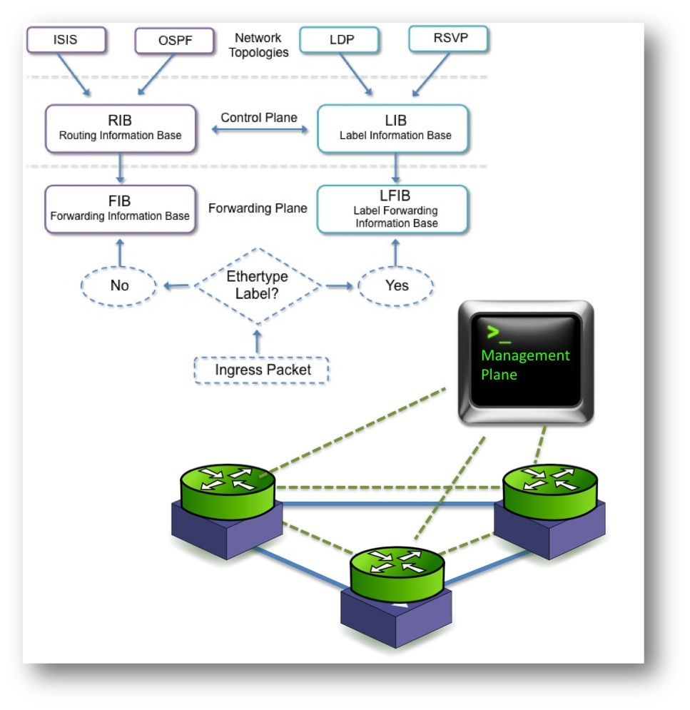
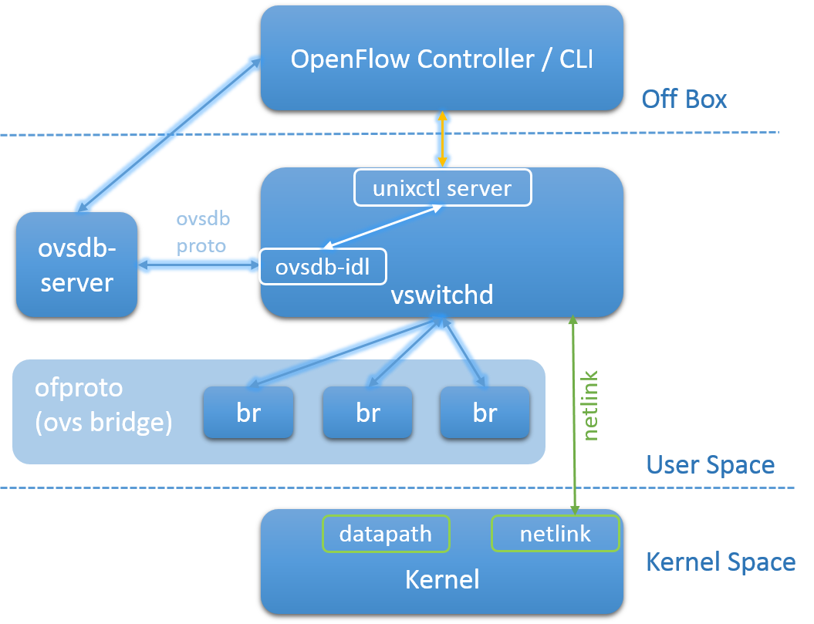
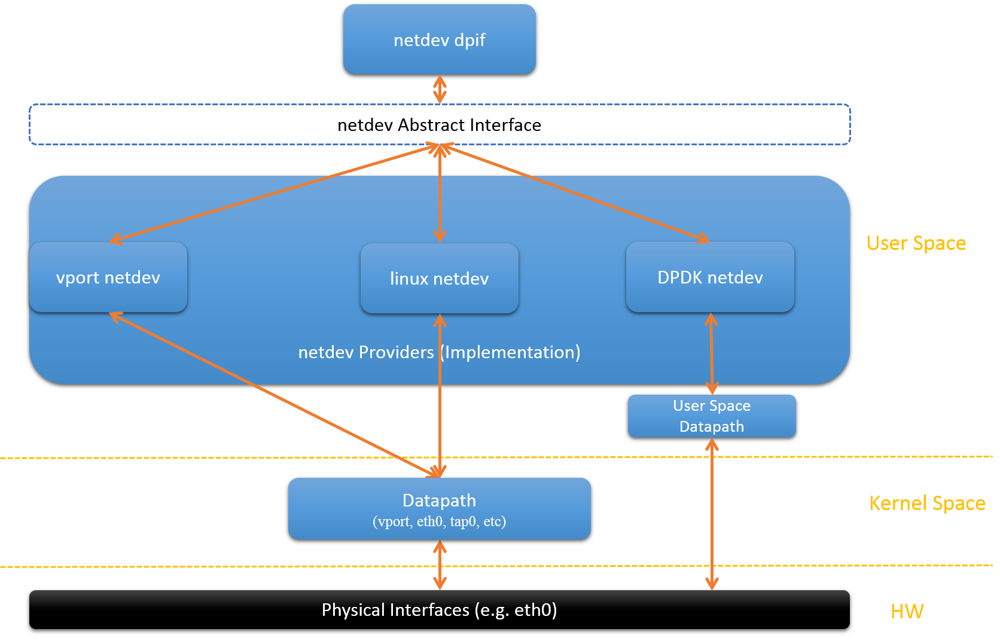

# Kiến trúc của OpenvSwitch (continue)
## [0. Bổ túc Control Plane, Data Plane](#botuc)
## [1. vswitchd (continue)](#vswitchd)
## [2. Datapath](#datapath)
---
## <a name="botuc"></a> 0. Control Plane, Data Plane (Forwarding Plane)
Mỗi process của một router hay switch có thể được gán với hoạt động ở một trong ba mặt phẳng trừu tượng (conceptual plane):
- Forwarding Plane: Chuyển các gói tin (packet) từ input đến output
- Control Plane: Xác định cách chuyển tiếp gói tin
- Management Plane: Phương pháp cấu hình Control Plane (CLI, SNMP,...)
Ví dụ: ta có thể SSH vào CLI của một router (management plane) và cấu hình EIGRP để trao đổi thông tin định tuyến với những router khác (control plane). Những thông tin này được cài đặt vào bảng CEF địa phương của nó (forwarding plane).	

Cụ thể:
**Control Plane**
Control Plane có chức năng cấu hình hệ thống, quản lý và trao đổi thông tin bảng định tuyến (những hoạt động không thường xuyên xảy ra lắm). Bộ điều khiển định tuyến (route controller) trao đổi thông tin cấu trúc liên kết (topology information) với các bộ định tuyến khác và xây dựng một bảng định tuyến dựa trên một giao thức định tuyến, ví dụ: RIP (Routing Information Protocol), OSPF (Open Shortest Path Forwarding), or BGP (Border Gateway Protocol). Nó cũng có thể tạo một bảng chuyển tiếp (forwarding table) cho máy chuyển tiếp (forwarding engine). Bởi vì chức năng điều khiển (control function) không được thực hiện trên từng gói tin, chúng sẽ không có ràng buộc nghiêm ngặt về tốc độ và nói chung được thực thi (implement) bằng phần mềm.  
Control Plane cung cấp những gì mà Data/Forward Plane cần để xây dựng forwarding table và cập nhật các thay đổi topology khi chúng xảy ra. Control Plane có thể được gọi là "slow path" trong legacy route khi chuyển đổi nhiều kiến trúc chuyển mạch gói (packet switching architechture). 




Những chức năng được thực hiện trong một routing engine/route processor truyền thống như sau:
- Cung cấp nguồn (resource) cho forwarding engine/plane
- Định tuyến trạng thái (routing state)
- Xử lý ARP (Address Resolution Protocol) luôn được thực hiện bởi bộ xử lý chức năng chung nằm trong routing engine
- Các chức năng bảo mật truy cập Control Plane: Telnet, ssh, AAA,...
- Thiết lập và duy trì các phiên quản lý (management sessions), ví dụ như kết nối telnet
- Định tuyến trạng thái các phân tử mạng lân cận
- Stacking nhà phân phối và nền tảng, phân cụm, ...

**Data Plane (Forwarding Plane)**
Data Plane có trách nhiệm phân tích packet header (hoặc cell, SONET) trong ASIC (Application-Specific Intergrated Circuit). Nó quản lý QoS, lọc, đóng gói, Queuing,... Data Plane phải thực hiện những hoạt động trên trong "Fast Path" để đáp ứng được nhu cầu hiệu suất trong các data center và core network. Forwarding Plane phải tìm kiếm tiền tố (prefix) và được gọi nhiều lần trong một giây vì thế cần có ASICs tìm kiếm nhanh.


## <a name="vswitchd"></a> 1. vswitchd (continue)
Phần này sẽ trình bày về một số procedure và submodule của **vswtichd**:
### 1.1. bridge module init
```c
/* Initializes the bridge module, configuring it to obtain its configuration
 * from an OVSDB server accessed over 'remote', which should be a string in a
 * form acceptable to ovsdb_idl_create(). */
void
bridge_init(const char *remote)
{
    /* step.1. Create connection to database. */
    idl = ovsdb_idl_create(remote, &ovsrec_idl_class, true, true);

    /* step.2. Register unixctl commands. (ovs-appctl <command>) */
    unixctl_command_register("qos/show-types", "interface", 1, 1)
    ...
    unixctl_command_register("bridge/dump-flows", "bridge", 1, 1,)

    /* step.3. init submodules */
    lacp_init(); // register command lacp/show <port>
    bond_init(); // register bond commands
    cfm_init();
    bfd_init();
    ovs_numa_init();
    stp_init();
    lldp_init();
    rstp_init();
    ifnotifier = if_notifier_create(if_change_cb, NULL);
}
```

- Đầu tiên, ```ovs-vswitchd``` tạo kết nối với ```ovsdb-server``` sử dụng một module gọi là **OVSDB IDL**. **IDL** là viết tắt của **Interface Definition Language**. **OVSDB** lưu trữ trong bộ nhớ (in-memory) một bản sao của database. Nó chuyển RPC request đến một OVSDB database server và phân tích response, chuyển raw JSON thành cấu trúc dữ liệu mà client có thể đọc dễ dàng hơn.
- ```unixctl_command_register()``` sẽ đăng kí (register) một unixctl command, command này cho phép kiểm soát ```ovs-switchd``` trên CLI. Mỗi submodule gọi phương thức này để đăng kí (register) và đưa chúng ra bên ngoài. Như đã đề cập bên trên, command line tool để tương tác với vswitchd là ```ovs-appctl```, ta có thể kiểm chứng những command đã được đăng ký đó:


Ở phần cuối của hàm ```bridge_init()```, một số submodule của vswitchd được khởi tạo, gồm có: **LACP**, **BOND**, **CFM**, **NUMA**, **STP**, **LLDP**, **RSTP** và ```ifnotifiers```. 
Cấu trúc bên trong của ```ovs-vswitchd``` được thể hiện như sau:



### 1.2. ofproto library init
ofproto duy trì một mảng class đã được đăng ký (registed) ```ofproto_classes``` trong ```ofproto/ofproto.c```:


Trong hàm ```ofproto_init()```, built-in ofproto class ```ofproto_dpif_class``` sẽ được đăng ký (registerd). ```ofproto_dpif_class``` đã được khai báo tại ```ofproto/ofproto-dpif.c```: 

```c
const struct ofproto_class ofproto_dpif_class = {
    init,
    ...
    port_alloc,
    port_construct,
    port_destruct,
    port_dealloc,
    port_modified,
    port_query_by_name,
    port_add,
    port_del,
    ...
    ct_flush,                   /* ct_flush */
};
```

Phương thức ```init()``` của ```ofproto_dpif_class``` sẽ đăng ký các lệnh ```unixctl``` của nó:
```c
static void
init(const struct shash *iface_hints)
{
    struct shash_node *node;

    /* Make a local copy, since we don't own 'iface_hints' elements. */
    SHASH_FOR_EACH(node, iface_hints) {
        const struct iface_hint *orig_hint = node->data;
        struct iface_hint *new_hint = xmalloc(sizeof *new_hint);

        new_hint->br_name = xstrdup(orig_hint->br_name);
        new_hint->br_type = xstrdup(orig_hint->br_type);
        new_hint->ofp_port = orig_hint->ofp_port;

        shash_add(&init_ofp_ports, node->name, new_hint);
    }

    ofproto_unixctl_init(); // register fdb/xxx commands
    udpif_init();           // register upcall/xxx commands
}
```
### 1.3. Datapath Processing
Sau khi thư viện ```ofproto``` được khởi tạo đúng (có nghĩa là tất cả các kiểu dữ liệu sẽ được sử dụng sau này đã được đăng ký), vswitchd sẽ loop các kiểu dữ liệu và để cho datapath xử lý tất cả những thứ cần thiết, chẳng hạn như, thay đổi cổng quá trình trong datapath này , xử lý upcall (gửi các gói được kết hợp sai tới bộ điều khiển OpenFlow). Datapath kết thúc các logic này bằng cách thực hiện callback ```type_run()```.
Đối với ```ofproto-dpif``` - kiểu dữ liệu được xây dựng trong datapath, ```type_run()``` được thực hiện trong ```ofproto / ofproto_dpif.c```:
```c
static int
type_run(const char *type)
{
    udpif_run(backer->udpif);
      |
      |--unixctl_command_reply() // handles upcall

    if (backer->recv_set_enable) {
        udpif_set_threads(backer->udpif, n_handlers, n_revalidators);
    }

    if (backer->need_revalidate) {
        // revalidate

        udpif_revalidate(backer->udpif);
    }

    /* Check for and handle port changes dpif. */
    process_dpif_port_changes(backer);
}
```
### 1.4. Bridge Processing
Trong mỗi loop, vswitchd cũng cho phép mỗi bridge xử lý tất cả các vấn đề của nó trong ```ofproto_run()```. ```ofproto_run()``` được định nghĩa trong ```vswitch/bridge.c```:
```c
int ofproto_run(struct ofproto *p)
{
    p->ofproto_class->run(p); // calls into ofproto-dpif.c for dpif class

    if (p->ofproto_class->port_poll) {
        while ((error = p->ofproto_class->port_poll(p, &devname)) != EAGAIN) {
            process_port_change(p, error, devname);
        }
    }

    if (new_seq != p->change_seq) {
        /* Update OpenFlow port status for any port whose netdev has changed.
         *
         * Refreshing a given 'ofport' can cause an arbitrary ofport to be
         * destroyed, so it's not safe to update ports directly from the
         * HMAP_FOR_EACH loop, or even to use HMAP_FOR_EACH_SAFE.  Instead, we
         * need this two-phase approach. */
        SSET_FOR_EACH (devname, &devnames) {
            update_port(p, devname);
        }
    }

    connmgr_run(p->connmgr, handle_openflow); // handles openflow messages
}
```
Trong phần trên, bridge đầu tiên gọi phương thức ```run()``` của ```ofproto class``` này, để cho ofproto class xử lý tất cả các vấn đề cụ thể của class. Sau đó, nó tiếp tục xử lý các thay đổi cổng và OpenFlow messages. Với ```dpif```, phương thức ```run``` được thực thi trong ```ofproto/ofproto-dpif.c```:
```c
static int
run(struct ofproto *ofproto_)
{
    if (ofproto->netflow) {
        netflow_run(ofproto->netflow);
    }
    if (ofproto->sflow) {
        dpif_sflow_run(ofproto->sflow);
    }
    if (ofproto->ipfix) {
        dpif_ipfix_run(ofproto->ipfix);
    }
    if (ofproto->change_seq != new_seq) {
        HMAP_FOR_EACH (ofport, up.hmap_node, &ofproto->up.ports) {
            port_run(ofport);
        }
    }
    if (ofproto->lacp_enabled || ofproto->has_bonded_bundles) {
        HMAP_FOR_EACH (bundle, hmap_node, &ofproto->bundles) {
            bundle_run(bundle);
        }
    }

    stp_run(ofproto);
    rstp_run(ofproto);
    if (mac_learning_run(ofproto->ml)) {
        ofproto->backer->need_revalidate = REV_MAC_LEARNING;
    }
    if (mcast_snooping_run(ofproto->ms)) {
        ofproto->backer->need_revalidate = REV_MCAST_SNOOPING;
    }
    if (ofproto->dump_seq != new_dump_seq) {
        /* Expire OpenFlow flows whose idle_timeout or hard_timeout has passed. */
        LIST_FOR_EACH_SAFE (rule, next_rule, expirable,
                            &ofproto->up.expirable) {
            rule_expire(rule_dpif_cast(rule), now);
        }

        /* All outstanding data in existing flows has been accounted, so it's a
         * good time to do bond rebalancing. */
        if (ofproto->has_bonded_bundles) {
            HMAP_FOR_EACH (bundle, hmap_node, &ofproto->bundles)
                if (bundle->bond)
                    bond_rebalance(bundle->bond);
        }
    }
}
```
### 1.5. Sumup: bridge_run()
```c
void
bridge_run(void)
{
    /* step.1. init all needed */
    ovsdb_idl_run(idl); // handle RPC; sync with remote OVSDB
    if_notifier_run(); // TODO: not sure what's doing here

    if (cfg)
        dpdk_init(&cfg->other_config);

    /* init ofproto library.  This only runs once */
    bridge_init_ofproto(cfg);
      |
      |--ofproto_init(); // resiter `ofproto/list` command
           |
           |--ofproto_class_register(&ofproto_dpif_class) // register default ofproto class
           |--for (ofproto classes):
                ofproto_classes[i]->init() // for ofproto_dpif_class, this will call the init() method in ofproto-dpif.c

    /* step.2. datapath & bridge processing */
    bridge_run__();
      |
      |--FOR_EACH (type, &types) /* Let each datapath type do the work that it needs to do. */
      |    ofproto_type_run(type);
      |
      |--FOR_EACH (br, &all_bridges) /* Let each bridge do the work that it needs to do. */
           ofproto_run(br->ofproto);
               |
               |--ofproto_class->run()
               |--connmgr_run(connmgr, handle_openflow) // handles messages from OpenFlow controller

    /* step.3. commit to ovsdb if needed */
    ovsdb_idl_txn_commit(txn);
}
```

## <a name="datapath"></a> 2. Datapath

- OVS kernel module cho phép kiểm soát linh hoạt userspace đối với việc xử lý gói tin ở mức flow-level trên các thiết bị mạng được chọn. Nó có thể được sử dụng để thực thi (implement) một plain Ethernet switch, liên kết thiết bị mạng, xử lý VLAN, điều khiển truy câp mạng, điều khiển mạng dựa trên flow,...
- Kernel module thực thi nhiều "datapath" (tương ứng với các bridge), mỗi datapath có thể có nhiều "vport" (tương ứng với các port trong bridge). Mỗi datapath có một "flow table" tương ứng mà userspace "điền" (populate) các flow tương ứng map từ các keys (dựa trên header của packet và megadata) với một tập các action. Action phổ biến nhất là chuyển tiếp (forward) packet tới vport khác.
- Khi một packet đến một vport, kernel module xử lý packet bằng cách lấy (extract) flow key của packet và tìm kiếm trong bảng flow table. Nếu một matching flow xảy ra, kernel sẽ tiến hành action tương ứng. Nếu không, module sẽ chuyển packet lên userspace để xử lý.
- Các loại datapath mà OVS hỗ trợ:
	- Linux upstream: là datapath triển khai bởi module 	của nhân đi cùng với bản phát hành Linux.
	- Linux OVS tree: là datapath triển khai bởi module của nhân phát hành cùng với cây mã nguồn của OVS. Một số tính năng của module này có thể không hỗ trợ các kernel phiên bản cũ, trong trường hợp này, Linux kernel version tối thiếu sẽ được đưa ra để tránh bị biên dịch lỗi. 
	- Userspace datapath: là datapath cho phép xử lý và chuyển tiếp gói tin ở userspace, điển hình là DPDK.
	- Hyper-V: hay còn gọi là Windows datapath.
- Data path là forwarding plane của OVS. Ngoài data path, các thành phần khác của OVS được thực thi tại userspace và ít phụ thuộc vào underlying system. Vì thế, porting ovs với OS khác hoặc platform khác tức là chỉ cần porting lại hoặc thực thi lại phần kernel cho OS hoặc platform đích. 



### 2.1. Kernel Datapath
Phần này chỉ nói về kernel datapath trên Linux platform.
Trên Linux, kernel datapath là loại datapath mặc định. Nó cần một kernel module ```openvswitch.ko``` để có thể load:

### 2.2. Userspace Datapath
Userspace datapath khác với datapath truyền thống ở chỗ: việc chuyển tiếp và xử lý gói tin được thực hiện trong userspace.
Ta có thể tạo ra ra một OVS bridge sử dụng userspace datapath:
```sh
ovs-vsctl add-br br0 -- set Bridge br0 datapath_type=netdev
```
### 2.3. Những cấu trúc dữ liệu chính
**Datapath**
```c
/** struct datapath - datapath for flow-based packet switching */
struct datapath {
	struct rcu_head rcu;
	struct list_head list_node;

	struct flow_table table;
	struct hlist_head *ports; /* Switch ports. */
	struct dp_stats_percpu __percpu *stats_percpu;
	possible_net_t net; /* Network namespace ref. */

	u32 user_features;
	u32 max_headroom;
};
```
**Flow**
```c
struct sw_flow {
	struct rcu_head rcu;
	struct {
		struct hlist_node node[2];
		u32 hash;
	} flow_table, ufid_table;
	int stats_last_writer;		/* NUMA-node id of the last writer on * 'stats[0]'.  */
	struct sw_flow_key key;
	struct sw_flow_id id;
	struct sw_flow_mask *mask;
	struct sw_flow_actions __rcu *sf_acts;
	struct flow_stats __rcu *stats[]; /* One for each NUMA node.  First one
					   * is allocated at flow creation time,
					   * the rest are allocated on demand
					   * while holding the 'stats[0].lock'.
					   */
};
```
**Flow Table**
```c
struct table_instance {
	struct flex_array *buckets;
	unsigned int n_buckets;
	struct rcu_head rcu;
	int node_ver;
	u32 hash_seed;
	bool keep_flows;
};

struct flow_table {
	struct table_instance __rcu *ti;
	struct table_instance __rcu *ufid_ti;
	struct mask_cache_entry __percpu *mask_cache;
	struct mask_array __rcu *mask_array;
	unsigned long last_rehash;
	unsigned int count;
	unsigned int ufid_count;
};
```
**vport**
```c
/** struct vport - one port within a datapath */
struct vport {
	struct net_device *dev;
	struct datapath	*dp;
	struct vport_portids __rcu *upcall_portids;
	u16 port_no;

	struct hlist_node hash_node;
	struct hlist_node dp_hash_node;
	const struct vport_ops *ops;

	struct list_head detach_list;
	struct rcu_head rcu;
};
```
**xlate**
tại ```ofproto/ofproto-dpif-xlate.c```
```c
struct xlate_out {
    enum slow_path_reason slow; /* 0 if fast path may be used. */

    struct recirc_refs recircs; /* Recirc action IDs on which references are
                                 * held. */
};

struct xlate_in {
    struct ofproto_dpif *ofproto;
    ovs_version_t        tables_version;   /* Lookup in this version. */

    /* Flow to which the OpenFlow actions apply.  xlate_actions() will modify
     * this flow when actions change header fields. */
    struct flow flow;

    /* Pointer to the original flow received during the upcall. xlate_actions()
     * will never modify this flow. */
    const struct flow *upcall_flow;

    /* The packet corresponding to 'flow', or a null pointer if we are
     * revalidating without a packet to refer to. */
    const struct dp_packet *packet;

    /* Should OFPP_NORMAL update the MAC learning table?  Should "learn"
     * actions update the flow table? Should FIN_TIMEOUT change the
     * timeouts? Or should controller action send packet to the controller?
     *
     * We want to update these tables if we are actually processing a packet,
     * or if we are accounting for packets that the datapath has processed, but
     * not if we are just revalidating, or if we want to execute the
     * side-effects later via the xlate cache. */
    bool allow_side_effects;

    /* The rule initiating translation or NULL. If both 'rule' and 'ofpacts'
     * are NULL, xlate_actions() will do the initial rule lookup itself. */
    struct rule_dpif *rule;

    /* The actions to translate.  If 'rule' is not NULL, these may be NULL. */
    const struct ofpact *ofpacts;
    size_t ofpacts_len;

    /* Union of the set of TCP flags seen so far in this flow.  (Used only by
     * NXAST_FIN_TIMEOUT.  Set to zero to avoid updating updating rules'
     * timeouts.) */
    uint16_t tcp_flags;

    /* If nonnull, flow translation calls this function just before executing a
     * resubmit or OFPP_TABLE action.  In addition, disables logging of traces
     * when the recursion depth is exceeded.
     *
     * 'rule' is the rule being submitted into.  It will be null if the
     * resubmit or OFPP_TABLE action didn't find a matching rule.
     *
     * 'indentation' is the resubmit recursion depth at time of invocation,
     * suitable for indenting the output.
     *
     * This is normally null so the client has to set it manually after
     * calling xlate_in_init(). */
    void (*resubmit_hook)(struct xlate_in *, struct rule_dpif *rule,
                          int indentation);

    /* If nonnull, flow translation calls this function to report some
     * significant decision, e.g. to explain why OFPP_NORMAL translation
     * dropped a packet.  'indentation' is the resubmit recursion depth at time
     * of invocation, suitable for indenting the output. */
    void (*report_hook)(struct xlate_in *, int indentation,
                        const char *format, va_list args);

    /* If nonnull, flow translation credits the specified statistics to each
     * rule reached through a resubmit or OFPP_TABLE action.
     *
     * This is normally null so the client has to set it manually after
     * calling xlate_in_init(). */
    const struct dpif_flow_stats *resubmit_stats;

    /* Counters carried over from a pre-existing translation of a related flow.
     * This can occur due to, e.g., the translation of an ARP packet that was
     * generated as the result of outputting to a tunnel port.  In that case,
     * the original flow going to the tunnel is the related flow.  Since the
     * two flows are different, they should not use the same xlate_ctx
     * structure.  However, we still need limit the maximum recursion across
     * the entire translation.
     *
     * These fields are normally set to zero, so the client has to set them
     * manually after calling xlate_in_init().  In that case, they should be
     * copied from the same-named fields in the related flow's xlate_ctx.
     *
     * These fields are really implementation details; the client doesn't care
     * about what they mean.  See the corresponding fields in xlate_ctx for
     * real documentation. */
    int indentation;
    int depth;
    int resubmits;

    /* If nonnull, flow translation populates this cache with references to all
     * modules that are affected by translation. This 'xlate_cache' may be
     * passed to xlate_push_stats() to perform the same function as
     * xlate_actions() without the full cost of translation.
     *
     * This is normally null so the client has to set it manually after
     * calling xlate_in_init(). */
    struct xlate_cache *xcache;

    /* If nonnull, flow translation puts the resulting datapath actions in this
     * buffer.  If null, flow translation will not produce datapath actions. */
    struct ofpbuf *odp_actions;

    /* If nonnull, flow translation populates this with wildcards relevant in
     * translation.  Any fields that were used to calculate the action are set,
     * to allow caching and kernel wildcarding to work.  For example, if the
     * flow lookup involved performing the "normal" action on IPv4 and ARP
     * packets, 'wc' would have the 'in_port' (always set), 'dl_type' (flow
     * match), 'vlan_tci' (normal action), and 'dl_dst' (normal action) fields
     * set. */
    struct flow_wildcards *wc;

    /* The frozen state to be resumed, as returned by xlate_lookup(). */
    const struct frozen_state *frozen_state;
};
```
```lib/dp-packet.h```:
```c
/* Buffer for holding packet data.  A dp_packet is automatically reallocated
 * as necessary if it grows too large for the available memory.
 */
struct dp_packet {
#ifdef DPDK_NETDEV
    struct rte_mbuf mbuf;       /* DPDK mbuf */
#else
    void *base_;                /* First byte of allocated space. */
    uint16_t allocated_;        /* Number of bytes allocated. */
    uint16_t data_ofs;          /* First byte actually in use. */
    uint32_t size_;             /* Number of bytes in use. */
    uint32_t rss_hash;          /* Packet hash. */
    bool rss_hash_valid;        /* Is the 'rss_hash' valid? */
#endif
    enum dp_packet_source source;  /* Source of memory allocated as 'base'. */
    uint8_t l2_pad_size;           /* Detected l2 padding size.
                                    * Padding is non-pullable. */
    uint16_t l2_5_ofs;             /* MPLS label stack offset, or UINT16_MAX */
    uint16_t l3_ofs;               /* Network-level header offset,
                                    * or UINT16_MAX. */
    uint16_t l4_ofs;               /* Transport-level header offset,
                                      or UINT16_MAX. */
    uint32_t cutlen;               /* length in bytes to cut from the end. */
    union {
        struct pkt_metadata md;
        uint64_t data[DP_PACKET_CONTEXT_SIZE / 8];
    };
};
```
### 2.4. Kernel Datapath Implementation
```lib/dpif-netlink.c```:
```c
/* Datapath interface for the openvswitch Linux kernel module. */
struct dpif_netlink {
    struct dpif dpif;
    int dp_ifindex;

    /* Upcall messages. */
    struct fat_rwlock upcall_lock;
    struct dpif_handler *handlers;
    uint32_t n_handlers;           /* Num of upcall handlers. */
    int uc_array_size;             /* Size of 'handler->channels' and */
                                   /* 'handler->epoll_events'. */

    /* Change notification. */
    struct nl_sock *port_notifier; /* vport multicast group subscriber. */
    bool refresh_channels;
};
```
```c
/* vport (netlink) request to kernel */
struct dpif_netlink_vport {
    /* Generic Netlink header. */
    uint8_t cmd;

    /* ovs_vport header. */
    int dp_ifindex;
    odp_port_t port_no;                    /* ODPP_NONE if unknown. */
    enum ovs_vport_type type;

    /* Attributes.
     *
     * The 'stats' member points to 64-bit data that might only be aligned on
     * 32-bit boundaries, so use get_unaligned_u64() to access its values.
     */
    const char *name;                      /* OVS_VPORT_ATTR_NAME. */
    uint32_t n_upcall_pids;
    const uint32_t *upcall_pids;           /* OVS_VPORT_ATTR_UPCALL_PID. */
    const struct ovs_vport_stats *stats;   /* OVS_VPORT_ATTR_STATS. */
    const struct nlattr *options;          /* OVS_VPORT_ATTR_OPTIONS. */
    size_t options_len;
};


static const char *
get_vport_type(const struct dpif_netlink_vport *vport)
{
    static struct vlog_rate_limit rl = VLOG_RATE_LIMIT_INIT(5, 20);

    switch (vport->type) {
    case OVS_VPORT_TYPE_NETDEV: {
        const char *type = netdev_get_type_from_name(vport->name);

        return type ? type : "system";
    }

    case OVS_VPORT_TYPE_INTERNAL:
        return "internal";

    case OVS_VPORT_TYPE_GENEVE:
        return "geneve";

    case OVS_VPORT_TYPE_GRE:
        return "gre";

    case OVS_VPORT_TYPE_VXLAN:
        return "vxlan";

    case OVS_VPORT_TYPE_LISP:
        return "lisp";

    case OVS_VPORT_TYPE_STT:
        return "stt";

    case OVS_VPORT_TYPE_UNSPEC:
    case __OVS_VPORT_TYPE_MAX:
        break;
    }

    VLOG_WARN_RL(&rl, "dp%d: port `%s' has unsupported type %u",
                 vport->dp_ifindex, vport->name, (unsigned int) vport->type);
    return "unknown";
}

static enum ovs_vport_type
netdev_to_ovs_vport_type(const struct netdev *netdev)
{
    const char *type = netdev_get_type(netdev);

    if (!strcmp(type, "tap") || !strcmp(type, "system")) {
        return OVS_VPORT_TYPE_NETDEV;
    } else if (!strcmp(type, "internal")) {
        return OVS_VPORT_TYPE_INTERNAL;
    } else if (strstr(type, "stt")) {
        return OVS_VPORT_TYPE_STT;
    } else if (!strcmp(type, "geneve")) {
        return OVS_VPORT_TYPE_GENEVE;
    } else if (strstr(type, "gre")) {
        return OVS_VPORT_TYPE_GRE;
    } else if (!strcmp(type, "vxlan")) {
        return OVS_VPORT_TYPE_VXLAN;
    } else if (!strcmp(type, "lisp")) {
        return OVS_VPORT_TYPE_LISP;
    } else {
        return OVS_VPORT_TYPE_UNSPEC;
    }
}

/* with ethtools */
dpif_netlink_port_add();
```
### 2.5. Userspace Datapath Implementation
Tại ```lib/dpif-netdev.c```:
```c
/* Datapath based on the network device interface from netdev.h.
 */
struct dp_netdev {
    const struct dpif_class *const class;
    const char *const name;
    struct dpif *dpif;
    struct ovs_refcount ref_cnt;
    atomic_flag destroyed;

    /* Ports. */
    struct hmap ports;

    /* upcall */
    upcall_callback *upcall_cb;  /* Callback function for executing upcalls. */

    /* Callback function for notifying the purging of dp flows (during
     * reseting pmd deletion). */
    dp_purge_callback *dp_purge_cb;

    /* Stores all 'struct dp_netdev_pmd_thread's. */
    struct cmap poll_threads;
    char *pmd_cmask;
};
```
```c
/* A port in a netdev-based datapath. */
struct dp_netdev_port {
    odp_port_t port_no;
    struct netdev *netdev;
    struct hmap_node node;      /* Node in dp_netdev's 'ports'. */
    struct netdev_saved_flags *sf;
    struct dp_netdev_rxq *rxqs;
    unsigned n_rxq;             /* Number of elements in 'rxq' */
    bool dynamic_txqs;          /* If true XPS will be used. */
    unsigned *txq_used;         /* Number of threads that uses each tx queue. */
    struct ovs_mutex txq_used_mutex;
    char *type;                 /* Port type as requested by user. */
    char *rxq_affinity_list;    /* Requested affinity of rx queues. */
};

/* 'dp_netdevs' contains both "netdev" and "dummy" dpifs.
 * If the class doesn't match, skip this dpif. */

/* Interface to netdev-based datapath. */
struct dpif_netdev {
    struct dpif dpif;
    struct dp_netdev *dp;
    uint64_t last_port_seq;
};

static const char *
dpif_netdev_port_open_type(const struct dpif_class *class, const char *type)
{
    return strcmp(type, "internal") ? type
                  : dpif_netdev_class_is_dummy(class) ? "dummy-internal"
                  : "tap";
}

/* default port: "internal" */
    do_add_port(dp, name, dpif_netdev_port_open_type(dp->class,"internal"), ODPP_LOCAL);
``` 