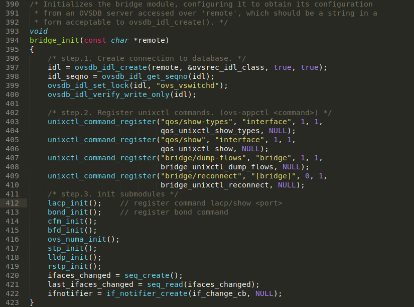

# Kiến trúc của OpenvSwitch (continue)
## [1. vswitchd](#vswitchd)
## [2. OVSDB](#ovsdb)
## [3. Datapath](#datapath)
---
## <a name="vswitchd"></a> 1. vswitchd (continue)
Phần này sẽ trình bày về một số procedure và submodule của **vswtichd**:
### 1.1. bridge module init



- Đầu tiên, ```ovs-vswitchd``` tạo kết nối với ```ovsdb-server``` sử dụng một module gọi là **OVSDB IDL**. **IDL** là viết tắt của **Interface Definition Language**. **OVSDB** lưu trữ trong bộ nhớ (in-memory) một bản sao của database. Nó chuyển RPC request đến một OVSDB database server và phân tích response, chuyển raw JSON thành cấu trúc dữ liệu mà client có thể đọc dễ dàng hơn.
- ```unixctl_command_register()``` sẽ đăng kí (register) một unixctl command, command này cho phép kiểm soát ```ovs-switchd``` trên CLI. Mỗi submodule gọi phương thức này để đăng kí (register) và đưa chúng ra bên ngoài. Như đã đề cập bên trên, command line tool để tương tác với vswitchd là ```ovs-appctl```, ta có thể kiểm chứng những command đã được đăng ký đó:


Ở phần cuối của ```bridge_init()```, một số submodule của vswitchd được khởi tạo, gồm có: **LACP**, **BOND**, **CFM**, **NUMA**, **STP**, **LLDP**, **RSTP** và ```ifnotifiers```. 
Cấu trúc bên trong của ```ovs-vswitchd``` được thể hiện như sau:


## <a name="ovsdb"></a> 2. OVSDB

## <a name="datapath"></a> 3. Datapath