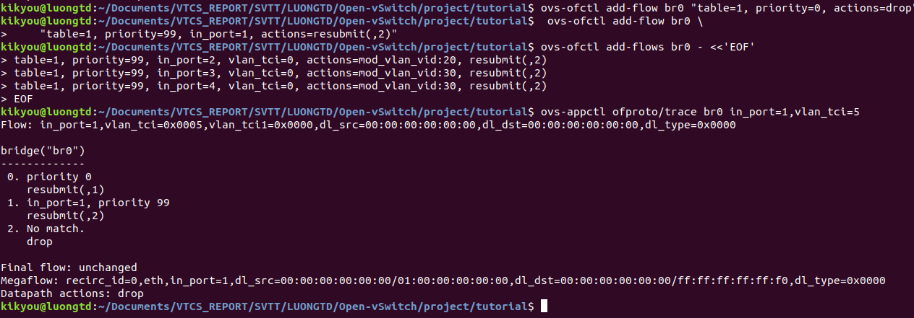
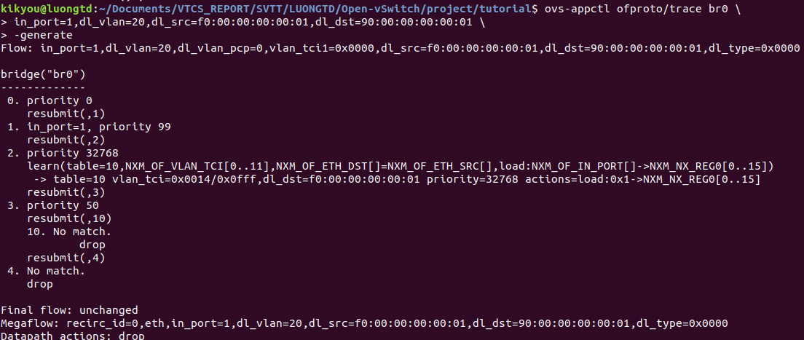
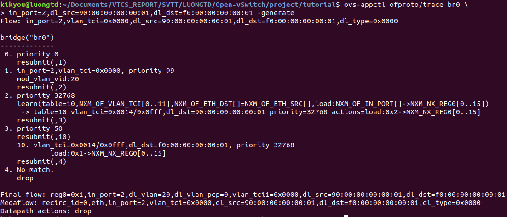
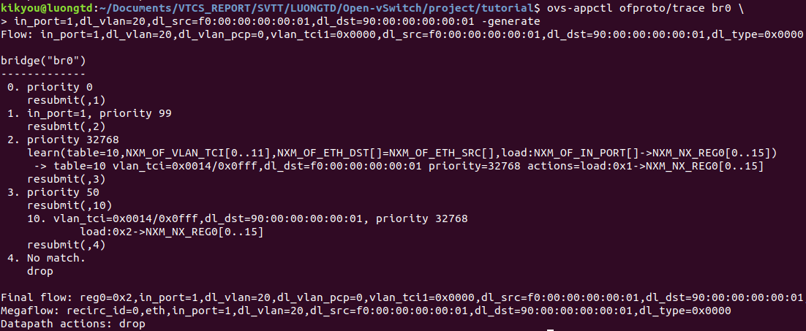
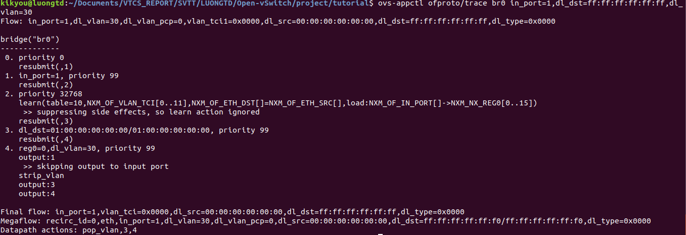
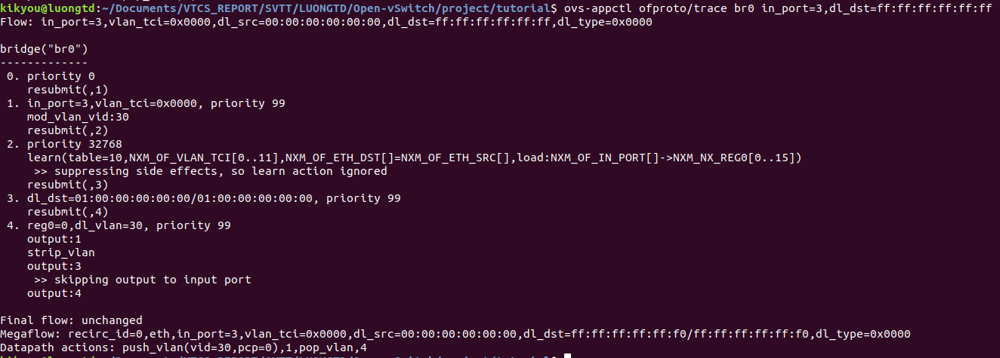
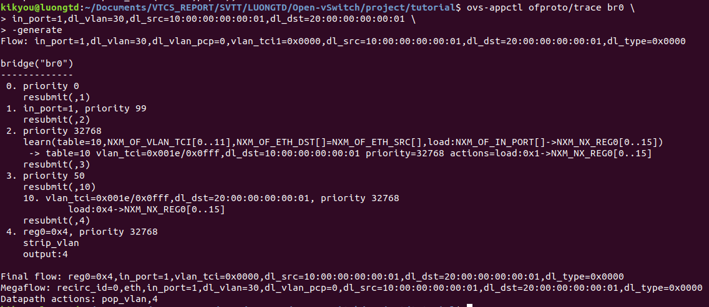
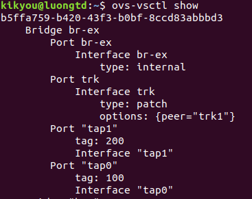
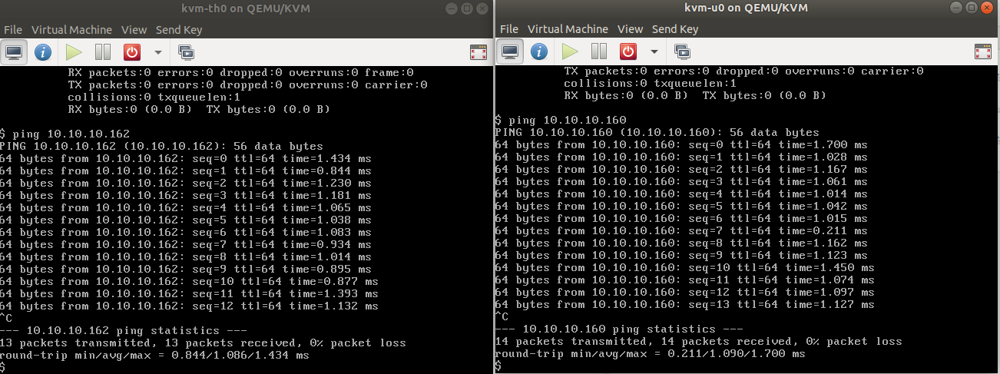

# OVS labs
## [1. Pipeline Testing](#pipeline)
### [1.1. Khởi động sandbox](#sandbox)
### [1.2. Kịch bản](#scenario)
### [1.3. Cài đặt](#install)
### [1.4. Triển khai Table 0: Admission Control](#tbl0)
### [1.5. Triển khai Table 1: VLAN input processing](#tbl1)
### [1.6. Triển khai Table 2: MAC+VLAN Learning for Ingress Port](#tbl2)
### [1.7. Triển khai Table 3: Look up destination port](#tbl3)
### [1.8. Triển khai Table 4: Output Processing](#tbl4)
## [2. VLAN Testing](#vlan)
### [2.1. Kịch bản](#scen2)
### [2.2. Cấu hình VLAN](#vl2)
---
## <a name="pipeline"></a> 1. Pipeline Testing
### <a name="sandbox"></a> 1.1. Khởi động Sandbox
- Chuyển vào thư mục tutorial của project Open vSwitch: ```cd /tutorial```
- Thực thi script ```ovs-sandbox```: ```./ovs-sandbox```. Script này sẽ thực hiện những thao tác sau:
	- Thư mục ```sandbox``` do phiên làm việc cũ sẽ bị xóa, đồng thời thư mục ```sandbox``` mới được tạo ra
	- Cài đặt biến môi trường đặc biệt, đảm bảo Open vSwitch sẽ nhìn vào thư mục sandbox và làm việc thay vì thư mục cài đặt Open vSwitch
	- Tạo cơ sở dữ liệu cấu hình trong thư mục ```sandbox```
	- Khởi động ```ovsdb-server``` trong thư mục ```sandbox```
	- Khởi động ```ovs-vswitchd``` trong thư mục ```sandbox```
	- Khởi động trình shell trong thư mục ```sandbox```


- Dưới góc nhìn của OVS thì các bridge tạo ra trên môi trường sandbox tương tự như bridge thường, nhưng network stack của hệ điều hành chủ không thể nhìn thấy được các bridge này nên không thể sử dụng các lệnh thông thường như ```ip``` hay ```tcpdump```\

### <a name="scenario"></a> 1.2. Kịch bản
- Lab này tạo nên các Open vSwitch flow table để phục vụ các tính năng VLAN, MAC learning của switch với 4 port:
	- p1: trunk port cho phép gói tin từ mọi VLAN, tương ứng với Open Flow port1
	- p2: access port cho VLAN 20, tương ứng OpenFlow port 2
	- p3, p4: cả hai access port này đều phục vụ VLAN 30, tương ứng với Open Flow port 3 và port 4
- Tạo switch bao gồm 4 bảng chính, mỗi bảng sẽ triển khai một stage trong pipeline của switch:
	- Table 0: Admission control - Cho phép kiểm soát các gói tin đầu vào ở mức cơ bản
	- Table 1: Xử lý VLAN đầu vào
	- Table 2: học MAC và VLAN đối với ingress port
	- Table 3: tìm kiếm port đã học nhằm xác định port đầu ra của gói tin
	- Table 4: xử lý đầu ra

### <a name="install"></a> 1.3. Cài đặt
- Tạo bridge ```br0``` ở ```fail-secure``` mode để Open Flow table rỗng khi khởi tạo, nếu không Open Flow table sẽ khởi tạo một flow thực thi ```normal``` action.
```sh
ovs-vsctl add-br br0 -- set Bridge br0 fail-mode=secure
```


- Tạo các port p1, p2, p3, p4 với tùy chọn ```ofport-request``` để đảm bảo **port p1** gán cho **Open Flow port1**, **port p2** được gán cho **OpenFlow port2** và tương tự như vậy...
```sh
for i in 1 2 3 4; do
	ovs-vsctl add-port br0 p$i -- set Interface p$i ofport_request=$i
	ovs-ofctl mod-port br0 p$i up
done
```


### <a name="tb0"></a> 1.4. Triển khai Table 0: Admission Control
- Table 0 là bảng đầu tiên gói tin đi qua đầu tiên, được sử dụng để bỏ qua các gói tin vì một số lý do nào đó hoặc gói tin không hợp lệ. Trong trường hợp này, các gói tin với địa chỉ nguồn multicast được coi là không hợp lệ và do đó ta thêm flow để hủy chúng:
```sh
ovs-ofctl add-flow br0 \ 
"table=0, dl_src=01:00:00:00:00:00/01:00:00:00:00:00, actions=drop"
```
- Switch br0 ở đây cũng không chuyển tiếp gói tin STP chuẩn IEEE 802.1D hoặc địa chỉ MAC đích là địa chỉ reversed multicast.
```sh
ovs-ofctl add-flow br0 \
"table=0, dl_dst=01:80:c2:00:00:00/ff:ff:ff:ff:ff:f0, actions=drop"
```
- Với các gói tin khác ta coi là hợp lệ thì chuyển (resubmit) gói tin sang bước tiếp theo trên **Open Flow table 1**:
```sh
ovs-ofctl add-flow br0 "table=0, priority=0, actions=resubmit(,1)"
```


### Testing Table 0
Nếu ta sử dụng Open vSwitch để thiết lập (set up) một switch vật lý hoặc switch ảo, ta có thể test bằng cách gửi gói tin thông qua nó bằng các công cụ kiểm tra mạng phổ biến như **ping** và **tcpdump** hoặc các công cụ chuyên biệt khác như Scapy. Trong bài lab này, switch của ta không "hiển thị" với hệ điều hành nên ta phải dùng công cụ **ofproto/trace**. **ofproto/trace** chỉ ra từng bước một cách một flow đi qua switch. 
#### Ví dụ 1
test command ```ovs-appctl ofproto/trace br0 in_port=1,dl_dst=01:80:c2:00:00:05```:


Dòng đầu tiên của kết quả cho biết *flow* đang duyệt. Nhóm các dòng tiếp theo cho biết hành trình của gói tin qua bridge br0. OpenFlow **flow table 0** thấy địa chỉ đích là địa chỉ reversed multicast và khớp với flow đã thiết lập nên hủy bỏ gói tin.
#### Ví dụ 2
test command ```ovs-appctl ofproto/trace br0 in_port=1,dl_dst=01:80:c2:00:00:10```:


Lần này, flow xử lý bởi ```ofproto/trace``` không khớp với bất kì "drop flow" nào trong **table 0** và nó chuyển qua flow có độ ưu tiên thấp hơn là "resubmit" để đưa gói tin sang **table 1** xử lý ở chặng tiếp theo. Vì ta chưa thêm bất cứ flow nào vào **OpenFlow table 1**, nên không có matching flow nào xảy ra trong lần lookup thứ 2 này. Gói tin cuối cùng cũng bị drop.

### <a name="tb1"></a> 1.5. Triển khai Table 1: VLAN input processing
- Gói tin sau khi đã vượt qua bước xác thực cơ bản ở **table 0** sẽ đi vào **table 1** để chứng thực VLAN của gói tin dựa trên cấu hình VLAN của port mà gói tin đi qua. Nếu gói tin đi vào acccess port mà chưa có VLAN header chỉ định thuộc VLAN nào thì nó sẽ được chèn thêm VLAN header để xử lý tiếp.
- Đầu tiên, thực hiện thêm flow mặc định với mức độ ưu tiên thấp để hủy bỏ mọi gói tin không khớp flow nào khác:
```sh
ovs-ofctl add-flow br0 "table=1, priority=0, actions=drop"
```
- Trunk port **p1** trên OpenFlow **port 1** gửi mọi gói tin (không kể đến VLAN header của chúng) đi vào **port 1** sang **table 2**:
```sh
ovs-ofctl add-flow br0 "table=1, in_port=1, actions=resubmit(,2)"
```
- Trên các access port khác, gói tin đi tới mà không có VLAN header sẽ được gắn VLAN number tương ứng với access port, sau đó được chuyển tới bảng tiếp theo:
```sh
ovs-ofctl add-flows br0 - <<'EOF'
table=1, priority=99, in_port=2, vlan_tci=0, actions=mod_vlan_vid:20, resubmit(,2)
table=1, priority=99, in_port=3, vlan_tci=0, actions=mod_vlan_vid:30, resubmit(,2)
table=1, priority=99, in_port=4, vlan_tci=0, actions=mod_vlan_vid:30, resubmit(,2)
EOF
```

### Testing table 1
**ofprot/trace** cho phép ta kiểm tra các VLAN flows mà ta vừa thêm vào.

#### Ví dụ 1: Packet on Trunk port (p1)

command kiểm thử gói tin trên trunk port (p1):
```sh
ovs-appctl ofproto/trace br0 in_port=1,vlan_tci=5
```
Kết quả đầu ra cho thấy, hành vi tìm kiếm (lookup) trên **table 0**, sau đó resubmit sang **table 1**, rồi resubmit tiếp tới **table 2** (ta chưa thêm flow nào table 2 nên cuối cùng gói tin vẫn bị drop)

 

#### Ví dụ 2: Valid Packet on Access Port

command kiểm thử gói tin hợp lệ trên Access Port: 
```sh
ovs-appctl ofproto/trace br0 in_port=2
```
Ở đây, gói tin đi vào port 2 mà không có VLAN header nên sẽ được chèn thêm VLAN header tương ứng của **port 2** với VLAN ID là 20.
 

#### Ví dụ 3: Invalid Packet on Access Port

command kiểm thử gói tin không hợp lệ trên Access Port:
```sh
ovs-appctl ofproto/trace br0 in_port=2,vlan_tci=5
```
Gói tin ở đây với ```Tag Control Information``` là 5 đi vào **port 2** tương ứng VLAN 20 sẽ bị hủy:


### <a name="tb2"></a> 1.6. Triển khai Table 2: MAC + VLAN Learning for Ingress Port
**table 2** cho phép switch (mà ta đang xây dựng) học (được) rằng source MAC của gói tin nằm trên ingress port (của gói tin) trong VLAN của nó (packet).
- Ta thêm flow sau:
```sh
ovs-ofctl add-flow br0 \
"table=2, actions=learn(table=10, NXM_OF_VLAN_TCI[0..11], \
						NXM_OF_ETH_DST[]=NXM_OF_ETH_SRC[], \
						load:NXM_OF_IN_PORT[]->NXM_NX_REG0[0..15]), \
				resubmit(,3)"
```
- Ở đây, hành động ```learn``` chỉnh sửa flow table (**MAC Learning Table**) dựa trên nội dung của flow đang được xử lý. Phần tiếp theo sẽ giải thích các thành phần của action ```learn```:
	- **table=10**: **flow table 10**. Đây sẽ là MAC learning table.
	- **NXM_OF_VLAN_TCI[0..11]**: đảm bảo flow ta thêm vào **flow table 10** sẽ match với cùng VLAN ID của gói tin đang xử lý
	- **NXM_OF_ETH_DST[]=NXM_OF_ETH_SRC[]**: đảm bảo flow mà ta vừa thêm vào bảng **flow table 10** match địa chỉ Ethernet đích như địa chỉ Ethernet nguồn, điều này chính là việc học địa chỉ MAC của gói tin đi vào từ port nào của bridge, để thực hiện chuyển tiếp một gói tin tới đích là MAC vừa học được tới port tương ứng với MAC đó.
	- **load:NXM_OF_IN_PORT[]->NXM_NX_REG0[0..15]**: ghi lại ingress port number vào thanh ghi 0. Thanh ghi 0 sẽ ghi lại địa chỉ port đầu ra mong muốn.

### Testing Table 2
#### Ví dụ 1: 
test command: 
```sh
ovs-appctl ofproto/trace br0 \
in_port=2,vlan_tci=20,dl_src=50:00:00:00:00:01 -generate
```
Output cho thấy hành động "learn" được thực hiện trong **table 2** và flow được thêm vào:


Để xem sự thay đổi trên **table 10**: ```ovs-ofctl dump-flows br0 table=10```:


Ta thấy các trường ```vlan_tci``` và ```dl_dst``` đã được học, đồng thời actions ghi (load) ingress port number vào thanh ghi cũng được thực hiện. Cụ thể, gói tin đến từ VLAN 20 với source MAC **50:00:00:00:00:01** cho ta một flow match VLAN 20 và destination MAC **50:00:00:00:00:01**. Flow này ghi lại (load) port số 1 (0x01, là port cho flow ta đang test) vào thanh ghi REG0. 

#### Ví dụ 2:
Ta thử với trường hợp gói tin có source MAC giống như ví dụ 1, VLAN là một access port VLAN (không phải là một 802.1Q header như ví dụ 1) 
```sh
ovs-appctl ofproto/trace br0 \
in_port=2,dl_src=50:00:00:00:00:01 -generate
```


Ta kiểm tra lại **flow table 10**: ```ovs-ofctl dump-flows br0 table=10```


Ta có thể thấy, port đã được học là port 2.

### <a name="tb3"></a> 1.7. Triển khai Table 3: Look up destination port
- Table này tìm kiếm xem port nào để gửi gói tin tới dựa trên địa chỉ MAC đích và VLAN.
- Thêm flow để thực hiện tìm kiếm:
```sh
ovs-ofctl add-flow br0 \
"table=3 priority=50 actions=resubmit(,10), resubmit(,4)"
```
Hành động đầu tiên của flow là resubmit sang **table 10**. Flows đã học được trong bảng này có ghi port vào thanh ghi 0. Nếu đích của packet chưa được học thì flow matching thất bại. Điều đó có nghĩa là thanh ghi 0 giờ đây vẫn có giá trị là 0 và sẽ là điều kiện để đưa ra tín hiệu flood gói tin ở bước tiếp theo trên table 4.
Hành động thứ hai là resubmit sang table 4 và tiếp tục bước tiếp theo của pipeline.
- Thêm flow khác để 	bỏ qua tìm kiếm cho gói tin multicast và broadcast:
```sh
ovs-ofctl add-flow br0 \
"table=3 priority=99 dl_dst=01:00:00:00:00:00/01:00:00:00:00:00 \
actions=resubmit(,4)"
```

### Testing Table 3
#### Ví dụ:
- Đầu tiên, học **f0:00:00:00:00:01** trên p1 thuộc VLAN 20:
```sh
ovs-appctl ofproto/trace br0 \
in_port=1,dl_vlan=20,dl_src=f0:00:00:00:00:01,dl_dst=90:00:00:00:00:01 \
-generate
```
Lúc này địa chỉ destination MAC chưa được học ("no match" looking up trong **table 10** thể hiện rằng flow's destination chưa được học)



Lúc này, source MAC của gói tin đã được đưa học và ghi vào **table 10**. Thử *dump-flows* của br0 trên **table 10**: ```ovs-ofctll dump-flows br0 table=10```, output như sau:

 

- Ta thực hiện test với gói tin có địa chỉ MAC nguồn và đích đảo ngược so với gói tin thử đầu tiên:
```sh
ovs-appctl ofproto/trace br0 \
in_port=2,dl_src=90:00:00:00:00:01,dl_dst=f0:00:00:00:00:01 -generate
``` 
Output như sau:



Ta thấy rằng, với thao tác *resubmit(,10)*, gói tin đã match flow đối với địa chỉ (source) MAC đầu tiên đã được học, đồng thời chỉ số port 0x1 tương ứng với **port p1** cũng được load vào thanh ghi 0, sau đó thao tác resubmit sang table 4 được thực hiện.
Một điểm nữa là, ở bước thứ 3, **table 10** đã học được địa chỉ MAC nguồn của của gói tin (đang test) trên port 2 và load chỉ số port tương ứng là 0x2 vào thanh ghi 0. Như vậy, **table 10** đã học được cả hai địa chỉ MAC đích và nguồn của gói tin thử đầu tiên.

- Ta sẽ thử lại với gói tin ở bưóc test đầu tiên:
```sh
ovs-appctl ofproto/trace br0 \
in_port=1,dl_vlan=20,dl_src=f0:00:00:00:00:01,dl_dst=90:00:00:00:00:01 \
-generate
``` 

Output như sau:


Ở bưóc này, bridge đã tìm thấy được MAC đích của gói tin bằng việc tìm kiếm trên **table 10** và *resubmit* sang **table 4** để xử lý tiếp. 

- Ta nhìn lại **table 10** trước khi chuyển sang thực thi **table 4**:


### <a name="tb4"></a> 1.8. Triển khai Table 4: Output Processing
- Tại entry của stage 4, thanh ghi 0 sẽ chứa port number mà gói tin được chuyển đến hoặc bằng 0 để thực hiện flood gói tin. (VLAN của gói tin nằm trong 802.1Q header của nó, kể cả VLAN của một gói tin đến từ một access port (implicit))
- Nhiệm vụ của pipeline stage cuối cùng này chính là output gói tin. Đầu tiên ta thực hiện output ra trunk port **p1**:
```sh
ovs-ofctl add-flow br0 "table=4 reg0=1 actions=1"
```
- Với output ra các access pỏt, ta thực hiện loại bỏ (strip) VLAN header trước khi đẩy gói tin ra:
```sh
ovs-ofctl add-flows br0 - <<'EOF'
table=4 reg0=2 actions=strip_vlan,2
table=4 reg0=3 actions=strip_vlan,3
table=4 reg0=4 actions=strip_vlan,4
EOF

```
- Đối với các gói tin broadcast và multicast với MAC đích không cụ thể (unlearned destination) thì thực hiện flood gói tin ra trunk port (với cả 802.1Q header) và gỡ bỏ VLAN header trước khi gửi ra các access port:  
```sh
ovs-ofctl add-flows br0 - <<'EOF'
table=4 reg0=0 priority=99 dl_vlan=20 actions=1,strip_vlan,2
table=4 reg0=0 priority=99 dl_vlan=30 actions=1,strip_vlan,3,4
table=4 reg0=0 priority=50 			  actions=1

```
Chú ý là output gói tin ra port phục vụ cho VLAN của gói tin đó. Một điểm nữa là các flow của ta dựa vào hành vi của OpenFlow standard, một action đầu ra sẽ không chuyển tiếp một gói tin trở lại port mà nó đi vào. Tức là, nếu gói tin đến trên p1, và chúng ta đã biết MAC đích của gói cũng nằm trên p1, (với action = 1) switch sẽ không chuyển tiếp gói tin trở lại port đầu vào của nó. Các trường hợp gói tin multicast/broadcast/unicast ở trên cũng dựa vào hành vi này.

### Testing Table 4
#### Ví dụ 1: Broadcast, Multicast, and Unknown Destination
- Duyệt gói tin broadcast trong VLAN 30 đến port **p1**
```sh
ovs-appctl ofproto/trace br0 \
in_port=1,dl_dst=ff:ff:ff:ff:ff:ff,dl_vlan=30
``` 
- Output sẽ là flood gói tin ra hai cổng **p3**, **p4** với VLAN header bị loại bỏ:



- Tương tự với gói tin broadcast trên port **p3**:
```sh
ovs-appctl ofproto/trace br0 in_port=3,dl_dst=ff:ff:ff:ff:ff:ff
```
Gói tin đi tới port **p3** chưa có VLAN header sẽ được thêm VLAN header với ID 30 rồi flood qua trunk port **p1** và access port **p4**. Output như sau:



- Ta thử tiếp một vài gói tin broadcast khác:
```sh
ovs-appctl ofproto/trace br0 \
in_port=1,dl_dst=ff:ff:ff:ff:ff:ff
```

Output như sau:


```sh
ovs-appctl ofproto/trace br0 \
in_port=1,dl_dst=ff:ff:ff:ff:ff:ff,dl_vlan=55
```

Output như sau:


Các gói tin này bị drop bởi output port của chúng (trong thanh ghi 0) là input port mà chúng đã đi vào. 

#### Ví dụ 2: MAC Learning
- Đầu tiên, học MAC của gói tin thuộc VLAN 30 (đến) trên port **p1**:
```sh
ovs-appctl ofproto/trace br0 \
in_port=1,dl_vlan=30,dl_src=10:00:00:00:00:01,dl_dst=20:00:00:00:00:01 \
-generate
```

Output như sau:


Ta thấy, gói tin này được flood ra các port **p3** và **p4** (cũng) thuộc VLAN 30, đồng thời địa chỉ MAC nguồn của gói tin (tới trên port 1) cũng được học.
- Tận dụng địa chỉ MAC đã học được đó, ta gửi một gói tin qua port 4 với các địa chỉ MAC đảo ngược với gói tin trên:
```sh
ovs-appctl ofproto/trace br0 \
in_port=4,dl_src=20:00:00:00:00:01,dl_dst=10:00:00:00:00:01, -generate 
```
Output như sau:


Ta thấy, lúc này, bridge tìm kiếm trên **table 10** thấy được MAC đích (đã học được từ MAC nguồn của gói tin trước) nên chuyển tiếp qua port 1 mà không flood qua port 3 nữa.

- Ta test lại với gói tin ban đầu:
```sh
ovs-appctl ofproto/trace br0 \
	in_port=1,dl_vlan=30,dl_src=10:00:00:00:00:01,dl_dst=20:00:00:00:00:01 \
	-generate
``` 
Output như sau:



Ta thấy rằng nó cũng không còn (bị) flood qua cổng 3 nữa mà (gói tin) được loại bỏ VLAN header và gửi qua cổng **p4**.

## <a name="vlan"></a> 2. VLAN Testing
---
### <a name="scen2"></a> 2.1. Kịch bản
- Sử dụng OVS tạo hai switch ảo br-ex và br-ex1 kết nối với nhau bằng một đường trunk, thiết lập các vlan tag 100 và 200.
- Tạo 4 máy ảo gán vào các vlan tương ứng với các tab interface của 2 switch ảo trên:
	- **kvm-th0** và **kvm-th1** gán vào switch **br-ex**
	- **kvm-u0** và **kvm-u1** gán vào switch **br-ex1**
- Gán các máy ảo vào các vlan: **kvm-th0** và **kvm-u0** gán vào vlan 100, **kvm-eth1** và **kvm-u1** gán vào vlan 200.
- Ping giữa các máy ảo để kiểm tra hoạt động của vlan.

### Topology:


### <a name="vl2"></a> 2.2. Cấu hình VLAN
#### Tạo các switch ảo và cấu hình vlan tag
- Tạo switch ảo:
```sh
ovs-vsctl add-br br-ex
ovs-vsctl add-br br-ex1
```
- Tạo các tab interface và gắn vào các vlan tag (các máy ảo được coi như các access port trên các vlan):
```sh
#tab interface on br-ex
ovs-vsctl add-port br-ex tap0 tag=100
ovs-vsctl add-port br-ex tap1 tag=200
#tab interface on br-ex1
ovs-vsctl add-port br-ex1 tap2 tag=100
ovs-vsctl add-port br-ex1 tap3 tag=200
```
- Tạo các trunk port trên các switch ảo và tạo đường trunk kết nối hai switch:
```sh
# create trunk 	ports on switches
ovs-vsctl add-port br-ex trk
ovs-vsctl add-port br-ex1 trk1
#Combine 2 switches
ovs-vsctl set interface trk type=patch options:peer=trk1
ovs-vsctl set interface trk1 type=patch options:peer=trk
```
- Kiểm tra lại cấu hình các switch: ```ovs-vsctl show```




#### Tạo network cho các máy ảo (kết hợp sử dụng OVS với libvirt)
- Để khai báo network mới với libvirt, ta tạo một file định dạng *.xml* và sử dụng công cụ **vrish** để áp dụng cấu hình trong file đó. Ở đây, ta khai báo hai file *xml* cấu hình hai network tương ứng	 với hai switch ảo trên:
	- Cấu hình network cho br-ex: ```nano ovs-vlan1.xml```:
```xml
<network>

	<name>ovs-network</name>
	<forward mode='bridge'/>
	<bridge name='br-ex'/>
	<virtualport type='openvswitch'/>

	<portgroup name='vlan-00' default='yes'/>
	</portgroup>

	<portgroup name='vlan-100'>
		<vlan>
			<tag id='100'/>
		</vlan>
	</portgroup>

	<portgroup name='vlan-200'>
		<vlan>
			<tag id='200'/>
		</vlan>
	</portgroup>

	<portgroup name='vlan-all'>
		<vlan trunk='yes'>
			<tag id='100'/>
			<tag id='200'/>
		</vlan>
	</portgroup>

</network>
```

	- Cấu hình network cho br-ex1: ```nano ovs-vlan2.xml```:
```xml
<network>

	<name>ovs-network</name>
	<forward mode='bridge'/>
	<bridge name='br-ex1'/>
	<virtualport type='openvswitch'/>

	<portgroup name='vlan-00' default='yes'/>
	</portgroup>

	<portgroup name='vlan-100'>
		<vlan>
			<tag id='100'/>
		</vlan>
	</portgroup>

	<portgroup name='vlan-200'>
		<vlan>
			<tag id='200'/>
		</vlan>
	</portgroup>

	<portgroup name='vlan-all'>
		<vlan trunk='yes'>
			<tag id='100'/>
			<tag id='200'/>
		</vlan>
	</portgroup>

</network>
```

- Áp dụng cấu hình các network mới:
```sh
#define new networks
vrish net-define ovs-vlan1.xml
vrish net-define ovs-vlan2.xml

#start new networks
vrish net-start ovs-network
vrish net-start ovs-network-1

#auto start networks when turning on
vrish net-autostart ovs-network
vrish net-autostart ovs-network-1
```

Kết quả như sau:


#### Tạo các máy ảo và thiết lập network cho các máy ảo
- Tạo bốn máy ảo và thực hiện cấu hình network cho 4 máy ảo sử dụng công cụ **vrish**. Cấu hình của các máy ảo được thiết lập trong 1 file *.xml* nằm trong thư mục ```/etc/libvirt/qemu/```. Để chỉnh sửa cấu hình một máy ảo (ở đây lấy ví dụ là kvm-th0) ta sử dụng lệnh: ```virsh edit kvm-th0```. Output như sau:


- Thiết lập cho máy ảo thuộc vlan-100 và gán vào switch br-ex (tương ứng với ovs-network). Ta chỉnh sửa section như sau:


- Cấu hình tương tự cho các máy ảo còn lại theo topology.

#### Kiểm tra kết nối
- Cấu hình IP tĩnh cho các máy ảo theo topology


- Tiến hành ping giữa các máy trong cùng VLAN: **kvm-th0** với **kvm-u0** (vlan-100) 



**kvm-th1** với **kvm-u1** (vlan-200) 


Kết quả, ping thành công

- Tiến hành ping giữa các máy khác vlan: **kvm-th0** với **kvm-th1** 


Kết quả ping không thành công.

