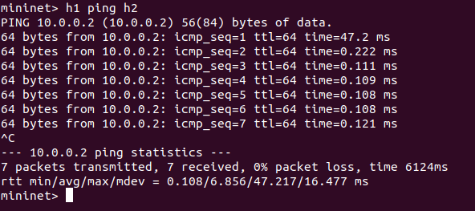
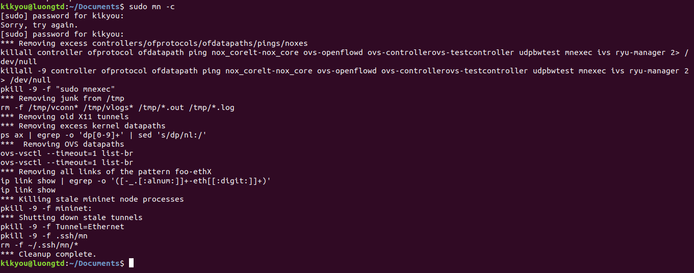
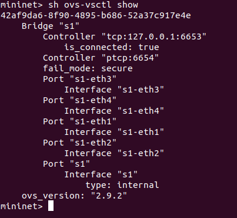
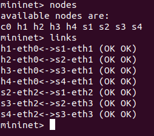
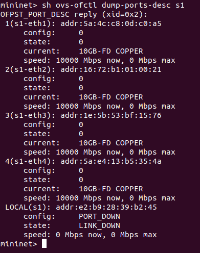

# OVS LABS (cont)
## [0. Giới thiệu về Mininet](#tongquan)
### [0.1. Một số topo cơ bản](#basic)
### [0.2. Kiểm tra Flow Table](#flowtb)
### [0.3. ](#3)
---
Ở week5, ta đã tìm hiểu về sơ lược về cơ chế một gói tin đi qua pipeline của OVS bridge (khảo sát các flow table trong một OVS bridge để chuyển gói tin đến các port khác nhau). Trong week6, ta sẽ xây dựng một vài topo cụ thể (nhìn dưới góc độ có thêm các host và OpenFlow controller) để khảo sát quá trình gói tin được truyền qua OVS bridge. //(Need to be redefined)
## <a name="tongquan"></a> 0. Giới thiệu về Mininet
Mininet là phần mềm giả lập mạng cho phép tạo switch, host và kết nối giữa chúng để phục vụ mục đích kiểm thử.

### Cài đặt Mininet
#### Clone source code:
```sh
git clone git://github.com/mininet/mininet
```

#### Install:
```sh
mininet/util/install.sh [options]
```
Các options cụ thể như sau:
- ```a```: cài đặt mọi thứ được chứa trong máy ảo Mininet, gồm cả các phụ thuộc (dependencies) như Open vSwitch cũng như các phần bổ sung như trình giải mã (dissector) OpenFlow Wireshark và POX. (Mặc định, các công cụ này sẽ được build trong các thư mục được tạo trong thư mục chính của bạn.)
- ```nfv```: cài đặt Mininet, OpenFlow reference switch và Open vSwitch 

#### Tạo một topology mặc định với command ```sudo mn```


#### Mininet cho phép sử dụng một số command từ trình shell mặc định của Linux. Để thực hiện điều đó, thêm ```sh``` vào trước mỗi lệnh trên trình shell của mininet


#### Kiểm tra cấu hình các OVS bridge sau khi có được topo mặc định ( 2 host và 1 switch)


#### Kiểm tra topo mặc định
- Kiểm tra các node, ở đây topo mặc định sẽ bao gồm hai host **h1**, **h2**, một switch **s1** kết nối với hai host và kết nối với controller **c0**.


- Kiểm tra chi tiết hết về mỗi thành phần trong topo. Sử dụng command ```dump```


- Kiểm tra kết nối giữa các node. Sử dụng command ```net```


- Ping thử giữa hai host



- Thử command trên một host


- Kiểm tra kết nối giữa toàn bộ các hót. Sử dụng command ```pingall```


- Thoát khỏi mininet


- Xóa bỏ toàn bộ các zombie process liên quan đến các thao tác với mininet ở trên



### <a name="basic"></a> 0.1. Một số topo cơ bản
#### 0.1.1. Tạo topo với 4 host và 1 switch
- Tạo topo: ```sudo mn --topo=single,4```


- Kiểm tra trạng thái của OVS bridge: ```sh ovs-vsctl show``` 



- Kiểm tra số lượng node: command ```nodes```, kiểm tra liên kết giữa các node: ```net```


#### 0.1.2. Tạo topo tuyến tính với 4 nodes
- Tạo topo: ```sudo mn --topo=linear,4```


- Kiểm tra trạng thái của OVS bridge: ```sh ovs-vsctl show```

```sh 
mininet> sh ovs-vsctl show
42af9da6-8f90-4895-b686-52a37c917e4e
    Bridge "s4"
        Controller "ptcp:6657"
        Controller "tcp:127.0.0.1:6653"
            is_connected: true
        fail_mode: secure
        Port "s4-eth2"
            Interface "s4-eth2"
        Port "s4-eth1"
            Interface "s4-eth1"
        Port "s4"
            Interface "s4"
                type: internal
    Bridge "s3"
        Controller "ptcp:6656"
        Controller "tcp:127.0.0.1:6653"
            is_connected: true
        fail_mode: secure
        Port "s3-eth3"
            Interface "s3-eth3"
        Port "s3-eth1"
            Interface "s3-eth1"
        Port "s3"
            Interface "s3"
                type: internal
        Port "s3-eth2"
            Interface "s3-eth2"
    Bridge "s2"
        Controller "ptcp:6655"
        Controller "tcp:127.0.0.1:6653"
            is_connected: true
        fail_mode: secure
        Port "s2-eth3"
            Interface "s2-eth3"
        Port "s2"
            Interface "s2"
                type: internal
        Port "s2-eth2"
            Interface "s2-eth2"
        Port "s2-eth1"
            Interface "s2-eth1"
    Bridge "s1"
        Controller "ptcp:6654"
        Controller "tcp:127.0.0.1:6653"
            is_connected: true
        fail_mode: secure
        Port "s1-eth1"
            Interface "s1-eth1"
        Port "s1"
            Interface "s1"
                type: internal
        Port "s1-eth2"
            Interface "s1-eth2"
    ovs_version: "2.9.2"
```

- Kiểm tra liên kết giữa các nodes: ```links```



- Topo tuyến tính sẽ có dạng như sau:
```sh

                   h2     h3
                   +       +
                   |       |
                   +       +
     h1-----s1-----s2-----s3-----s4-----h4
            +      +       +      +
            |      |       |      |
            |      +-------+      |
            +-------+ c0 +--------+
                    +----+

```

#### 0.1.3. Tạo topo dạng tree với 4 host và 3 switch

- Tạo topo với command ```sudo mn -topo=tree,2,2```


- Kiểm tra status của OVS

```sh
mininet> sh ovs-vsctl show
42af9da6-8f90-4895-b686-52a37c917e4e
    Bridge "s1"
        Controller "tcp:127.0.0.1:6653"
            is_connected: true
        Controller "ptcp:6654"
        fail_mode: secure
        Port "s1"
            Interface "s1"
                type: internal
        Port "s1-eth2"
            Interface "s1-eth2"
        Port "s1-eth1"
            Interface "s1-eth1"
    Bridge "s2"
        Controller "tcp:127.0.0.1:6653"
            is_connected: true
        Controller "ptcp:6655"
        fail_mode: secure
        Port "s2-eth2"
            Interface "s2-eth2"
        Port "s2"
            Interface "s2"
                type: internal
        Port "s2-eth1"
            Interface "s2-eth1"
        Port "s2-eth3"
            Interface "s2-eth3"
    Bridge "s3"
        Controller "ptcp:6656"
        Controller "tcp:127.0.0.1:6653"
            is_connected: true
        fail_mode: secure
        Port "s3"
            Interface "s3"
                type: internal
        Port "s3-eth3"
            Interface "s3-eth3"
        Port "s3-eth2"
            Interface "s3-eth2"
        Port "s3-eth1"
            Interface "s3-eth1"
    ovs_version: "2.9.2"
```

- Kiểm tra số node, thông tin IP và kết nối của chúng


- Topo dạng tree sẽ có dạng như sau

```sh
                        s1
                         +
h1+---------+            |          +----------+h4
            |            |          |
            |            |          |
            +            |          +
h2+--------+s2           |         s3+----------+h3
             +--------+  |  +-------+
                      +--+--+
                      | c0  |
                      +-----+

```

### <a name="flowtb"></a> 0.2. Kiểm tra Flow Table
- Tạo topo gồm 4 host nối vào 1 switch, sử dụng tùy chọn ```--mac``` để giữ địa chỉ MAC cho các host


- Thực hiện dump cấu hình của các port trên OVS bridge. Các host kết nối với các port riêng biệt của switch.
Command ```sh ovs-ofctl dump-ports-desc s1``` cho phép match số hiệu port với tên port. (Trong các flow table, ta chỉ thấy được số hiệu port, do đó command này sẽ hữu ích để tiện theo dõi hơn)



- Kiểm tra thông tin thống kê của mỗi port. Sử dụng command: ```sh ovs-ofctl dump-ports s1```


- In ra flow table do **ovs-vswitchd** quản lý: ```sh ovs-ofctl dump-flows s1```

```sh
mininet> sh ovs-ofctl dump-flows s1
mininet> 
```

Chưa có entry nào do chưa có bất kì kết nối nào giữa các host.

Thử kiểm tra controller điều khiển vswitch **s1**: ```sh ovs-vsctl get-controller s1```


- Tạo traffic đơn giản bằng cách ping giữa host **h1** và **h2**: ```h1 ping -c5 h2```


Ta thấy rằng, gói tin đầu tiên có RTT (Round Trip Time) lâu hơn do đó là gói tin đầu tiên của flow mới từ **host 1** gửi tới switch **s1**, switch chưa xử lý được nên sẽ gửi lên controller xử lý rồi mới gửi lại switch để chuyển tiếp sang **host 2**. Những gói tin tiếp theo do cùng flow nên thực hiện **flow matching** thành công ngay tại switch và chuyển trực tiếp sang **host 2** mà không cần lên hỏi controller nên RTT sẽ ngắn hơn.

- Thử dump-flow table lại: ```sh ovs-ofctl dump-flows s1```


Ta thấy, ARP rule đã được đưa thêm vào flow table. Output port là các port mà gói tin sẽ được forward ở đầu ra của pipeline trên switch. Số hiệu port tương ứng với các port dump ở command ```sh ovs-ofctl dump-ports-desc s1```.

### <a name="3"></a> 0.3. Kiểm tra Flow Table