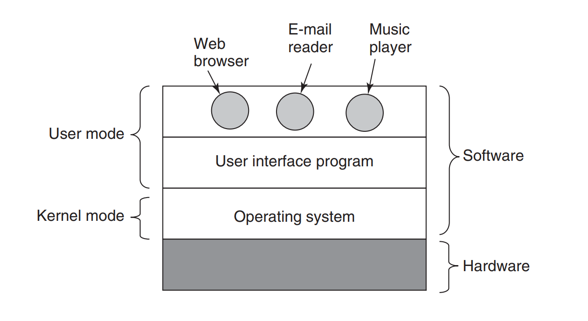
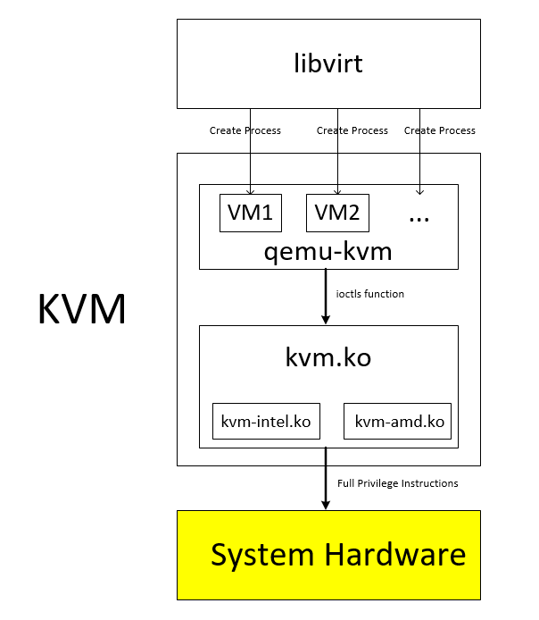
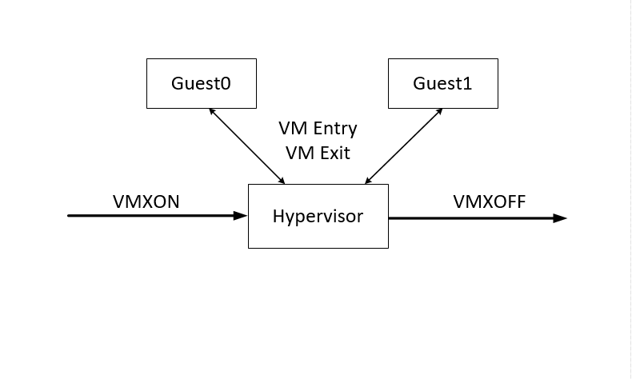

# Tìm Hiểu KVM
* Tuần 3
* Người Thực Hiện: Nguyễn Xuân Lưu

## 1. Bổ Trợ Kiến Thức Operating System

* Sách Modern Operating Systems 4th

Mỗi hệ thống máy tính có chứa rất nhiều thành phần phần cứng như bộ vi xử lý, bộ nhớ chính, card mạng, màn hình, ổ đĩa, ... Nếu những lập trình viên khi lập trình phải hiểu tất cả các thành phần phần cứng thì sẽ không thể nào có chương trình phần cứng nào xuất hiện. Vì vậy, để giải quyết vấn đề trên, khái niệm hệ điều hành (operating system) ra đời. Hệ điều hành là một lớp phần mềm trung gian giữa các phần cứng và phần mềm ứng dụng, nó cung cấp cài tài nguyên cần thiết cho các phần mềm chạy trên nó hoạt động.

  
Hầu hết hệ thống máy tính hiện tại đều có hai chế độ hoạt động: kernel mode và user mode. Hệ điều hành là một phần mềm chạy ở kernel mode. Với kernel mode, hệ điều hành có toàn quyền truy cập và quản lý phần cứng. Ngược lại, các phần mềm chạy dựa trên hệ điều hành sẽ chạy ở user mode. Với user mode, các phần mềm sẽ không thế truy cập và thao tác trực tiếp phần cứng, chúng cần xin được sự hỗ trợ từ hệ điều hành.

Một hệ điều hành thì khác những phần mềm ứng dụng chạy trên nó về nhiều thứ, không chỉ vị trí nằm của nó (kernel mode). Hệ điều hành lớn, phức tạp và chạy lâu dài. Kích thước mã nguồn của một hệ điều hành như linux hay windows cỡ 5 triệu dòng lệnh hoặc hơn thế. Dễ dàng tưởng tượng được, sẽ cần tới 100 cuốn sách, mỗi cuốn có 1000 trang, mỗi trang 50 dòng để lưu giữ source code của một hệ điều hành. Điều này còn chưa chỉ rõ sự phức tạp, 5 triệu dòng lệnh chỉ là những phần chạy ở kernel mode, chưa tính đến những thư viện cần thiết để cung cấp sự hoạt động cho các ứng dụng chạy trên nền hệ điều hành. Nếu kể cả chúng, đối với windows, chúng ta sẽ cần sẽ cần tới 70 triệu dòng lệnh.

### 1.1 Hệ điều hành
Nhiệm vụ của của hệ điều hành gồm 2 công việc. Thứ nhất, hệ điều hành cung cấp những đối tượng tài nguyên trừu tượng cho các ứng dụng chạy trên nó. Thứ hai, hệ điều hành quản lý các tài nguyên phần cứng.

Hệ điều hành cung cấp các tài nguyên trừu tượng. Một hệ thống máy tính thì chứa nhiều thành phần phần cứng. Các thành phần này yêu cầu điều khiển bằng ngôn ngữ máy, rất phức tạp. Việc hiểu và sử dụng ngôn ngữ máy của một thiết bị phần cứng sẽ cũng chẳng có ý nghĩa gì nếu thiết bị đó được nâng cấp hoặc thay thế. Giải pháp là hệ điều hành sẽ trừu tượng hóa phần cứng thành các đối tượng dễ thao tác để người phát triển phần mềm ứng dụng sử dụng. Ví dụ điển hình nhất là file. file là đối tượng được trữu tượng hóa từ phần cứng SATA disk. Sẽ thật tồi tệ nếu làm việc trực tiếp trên SATA disk.

Hệ điều hành sẽ quản lý tài nguyên phần cứng. Nếu là hệ điều hành đơn nhiệm đơn người dùng việc quản lý tài nguyên sẽ đơn giản. Tuy nhiên, một hệ thống có nhiều phần mềm chạy, nhiều người dùng cùng đăng nhập hoạt động, việc quản lý ưu tiên, phân phối tài nguyên sẽ phải đến tay hệ điều hành. Cách thức hệ điều hành xử lý công việc này là phân kênh. Kiểu phân kênh thứ nhất là phân kênh theo thời gian. Mỗi chương trình sẽ chạy trong một đoạn thời gian ngắn. Kiểu thứ hai là phân kênh theo không gian. Mỗi chương trình sẽ chạy trên một phần của phần cứng vật lý trong cùng một thời điểm.

## 1.2 Ring 1 và Ring 2 trong Hierachical Protection Domains

Trong tìm hiểu tuần số 2, Ring 1 và Ring 2 chưa được trình bày rõ ràng. Trong tuần này, vấn đề này sẽ được trình bày rõ như sau.
Về mô hình Hierachical Protection Domains ( hay Protection Ring), cụ thể, hệ điều hành sẽ cung cấp 4 Ring từ 0 đến 3. Ring càng thấp thì quyền càng cao. Nó thể hiện mức độ tin cậy hệ điều hành gán cho các tiến trình bên trong Ring đó. Một object trong một Ring có thể truy cập tới tất cả các đối tượng trong những Ring có quyền thấp hơn nó. Nếu nó muốn làm điều ngược lại, truy cập vào những Ring có quyền cao hơn, nó sẽ gửi request đến hệ điều hành nhờ hệ điều hành thực thi giúp. Điều này thực hiện thông qua System Call. Về 4 Ring sẽ được trình bày như sau:
*  Ring 0   Operating system kernel
*  Ring 1   Remaining parts of the operating system
*  Ring 2   I/O drivers and utilities
*  Ring 3   Applications and user activity

Ring 0 chứa lõi (kernel) của hệ điều hành. Ring 1 chứa các phần còn lại của hệ điều hành. Ring 2 chứa các drivers IO và các tiện ích hệ thống. Ring 3 chứa ứng dụng người dùng. Hiện nay, các hệ điều hành phổ biến như Linux hay Windows chỉ sử dụng Ring 0 và Ring 3. 

## 2. Công Nghệ Hardware-assisted Virtualization

Như đã trình bày từ trước, công nghệ Hardware-assisted Virtualization sẽ hỗ trợ các hypervisor hoạt động ở mức Ring -1 và quản lý các máy ảo chạy ở mức Ring 0. 

Trong mô hình dưới, ta bắt đầu tìm hiểu về công nghệ Hardware assisted Virtualization, nền tảng cho KVM hoạt động và cũng là đối tượng tương tác chính với kvm.ko .

### 2.1 Intel Virtualization Technology

Đầu tiên, về công nghệ Intel Virtualization Technology (VT-x), Các vi xử lý intel hỗ trợ công nghệ VT-x sẽ cung cấp một chế độ mở rộng là VMX operation. VMX viết tắt của Virtual Machine Extension. Có hai loại VMX operation là VMX root operation và VMX nonroot operation. Thông thường, hypervisor sẽ chạy ở chế độ VMX root và VM sẽ chạy ở chế độ VMX non-root. Sự chuyển đỗi giữa hai chế độ này gọi là VMX transitions. Chuyển đỗi từ VMX root sang VMX non-root gọi là VM entry. Sự chuyển đỗi từ VMX non-root về VMX root gọi là VM exit. 

Vi xử lý hoạt động ở chế độ VMX root gần giống như khi hoạt động ở chế độ thông thường. Điểm khác biệt cơ bản và ở chế độ VMX root, tập lệnh VMX có thể được sử dụng, còn ở chế độ thông thường thì không. Ngoài ra, khi ở chế độ VMX, vi xử lý sẽ cố định và không cho truy cập một số giá trị của các thanh ghi CR (Control Register). Điều này sẽ liên quan đến việc xác định các trạng thái của chế độ VMX.

Vi xử lý hoạt động ở chế độ VMX non-root sẽ có những sự giới hạn và chỉnh sửa để phù hợp với sự ảo hóa. Thay vì những hoạt động thông thường, các lệnh đặc biệt và các sự kiện sẽ gây ra sự kiện VM exit tới hypersior. Bởi vì sự xuất hiện của VM exit thay cho cách cư xử thông thường, hoạt động của VM ở chế độ VMX non-root có sự giới hạn. Chính sự giới hạn này cho phép hypervisor điều khiển được sự hoạt động của các VM.

Tựu chung, đối với dòng vi xử lý Intel, Ring -1 là chế độ VMX root dành cho hypervisor hoạt động. Ring 0 là chế độ VMX non root dành cho các VM hoạt động.

Vòng đời của một hypervisor và VM sẽ được giới thiệu như sau. Khởi chạy chế độ VMX bằng lệnh VMXON. Sử dụng VM entry, một hypervisor có thể truy cập vào một máy ảo cụ thể. Cụ thể, Hypervisor dùng các lệnh VMLAUNCH và VMRESUME để thực hiện VM entry. VM exit sẽ giúp hypervisor thoát khỏi một VM để thực hiện quyền quản trị. Thông thường, hypervisor tự sẽ quyết định việc thoát khỏi chế độ VMX bởi lệnh VMXOFF.

Chế độ VMX non-root và VMX transistion (VM entry và VM exit) được điều khiển bằng một cấu trúc dữ liệu gọi là virtual-machine control structure (VMCS). Truy cập vào VMCS được quản lý thông qua VMCS pointer. Giá trị của VMCS pointer là địa chỉ 64-bit của VMCS. VMCS pointer được đọc và viết khi sử dụng các lệnh VMPTRST và VMPTRLD. Hypervisor cấu hình VMCS sử dụng VMREAD, VMWRITE và VMCLEAR. Một hypervisor có thể sử dụng một VMCS khác nhau cho mỗi VM được nó hỗ trợ. Nếu một VM có nhiều virtual processor, hypervisor có thể sử dụng một VMCS khác nhau cho mỗi virtual processor.

Mỗi VMCS tương ứng với một virtual cpu của VM. Có 3 trạng thái cần quan tâm của một VMCS. Thứ nhất, VMCS đã active hay chưa. Thứ hai, VMCS là current hay not current. Chỉ có current VMCS mới có thể chạy các lệnh VMLAUCH, VMREAD, VMRESUME, VMWRITE. Cuối cùng, VMCS đó đang có trạng thái launched hay clear. Điều này ảnh hưởng tới VM entry. Chỉ có VMCS ở trạng thái clear mới cho phép lệnh VMLAUNCH. Ngược lại, chỉ có VMCS ở trạng thái launched mới cho phép lệnh VMRESUME. Các trạng thái cụ thể của một VMCS được minh họa trong hình sau

  
Cụ thể, ở đây ta có hai đối tượng VMCS X và VMCS Y. Lệnh VMPTRLD cho phép chuyển một VMCS tới trạng thái active, current, đồng thời nó cũng làm các VMCS khác chuyển hết về trạng thái not current. Lệnh VMCLEAR chuyển một VMCS tới trạng thái inactive, not current và clear. Cuối cùng, lệnh VMLAUNCH chuyển trạng thái clear thành launched.

Truy cập vào VMCS được quản lý thông qua VMCS pointer. Giá trị của VMCS pointer là địa chỉ 64-bit của VMCS. Vùng nhớ của VMCS có kích thước 4 Kbyte và được gọi là VMCS region. Vùng nhớ này gồm 3 phần. Phần đầu là 4 bytes đầu tiên bao gồm 31 bit gọi là VMCS revision identifier và bit thứ 32 gọi là shadow-indicator. Vi xử lý sử dụng VMCS data khác nhau sẽ có VMCS revision identifier khác nhau. Vùng VMCS revision identifier tránh việc dùng VMCS region được định dạng cho một vi xử lý cho một vi xử lý dùng VMCS data định dạng khác. VMCS revision identifier sẽ được hypervisor viết vào trước khi được sử dụng như một VMCS region. Khi lệnh VMPTRLD được chạy với VMCS revision identifier không tương thích với vi xử lý, nó sẽ thất bại. Chế độ shadow VMCS sẽ được phân tích sau. Phần thứ hai là 4 bytes tiếp theo gọi là VMX-abort indicator. Giá trị các bit của vùng này cũng không được điều khiển bởi vi xử lý mà bởi hypervisor. Các bit này sẽ có giá trị khác không khi VMCS bị kết thúc bất thường. Phần còn lại của vùng nhớ VMCS region được sử dụng cho VMCS data. VMCS data bao gồm các phần dữ liệu điều khiển VMX non-root và VMX transistion.

VMCS data tổ chức dưới dạng 6 phần:
* Guest-state area: Trạng thái của vi xử lý được lưu vào phần này khi VM exit xảy ra và được đọc từ phần này khi VM entry xảy ra
* Host-state: Trạng thái của vi xử lý được đọc từ phần này khi VM exit xảy ra
* VM-execution control fields: Phần này điều khiển thuộc tính của vi xử lý khi làm việc ở VM non-root mode. Chúng xác định các điều kiện gây ra VM exit.
* VM-exit control fields: Phần này điều khiển VM exit
* VM-entry control fields: Phần này điều khiển VM entry
* VM-exit information fields: Phần này nhận thông tin về lý do VM exit

Mỗi VMCS vừa có thể là một ordinary VMCS hoặc là một shadow VMCS. Điều này được xác định bởi shadow-indicator bit (bit số 32 của phần VMCS revision identifier trong VMCS Region). Sự khác biệt cơ bản của hai loại VMCS này là ở khả năng hoạt động và chỉnh sửa của nó. Thứ nhất, một ordinary VMCS có thể thực hiện VM entry nhưng không thể đọc hay ghi từ VM non-root mode. Dĩ nhiên nó có thể được đọc ghi ở VM root mode. Ngược lại một shadow VMCS có thể đọc ghi ở VM non-root mode nhưng không thể thực hiện VM entry với nó. Cuối cùng, việc chuyển một VMCS ở dạng ordinary sang shadow hay ngược lại có thể thực hiện bởi hypervisor ở VM root mode. Lưu ý, để thực hiện chuyển đỗi, VMCS phải ở trạng thái not active.

