# Tìm hiểu KVM
* Tuần 4
* Người tạo: Nguyễn Xuân Lưu

# Hướng Dẫn Sử Dụng KVM

KVM có nhiều hơn một cách quản trị, cụ thể người sử dụng có thể sử dụng các công cụ khác nhau để quản trị KVM


Có hai phương pháp chính. Thứ nhất là dùng nhóm công cụ do QEMU cung cấp. Ưu điểm là không cần công cụ trung gian, tốc độ thực hiện nhanh. Tuy nhiên, độ phức tạp cao và cần dùng những lệnh dài. Thứ hai là sử dụng một công cụ trung gian là libvirt. Libvirt hỗ trợ nhiều dòng hypervisor khác nhau quản trị máy ảo như KVM, Xen,... Libvirt bao gồm một nhóm các công cụ quản trị máy ảo. Trong số đó, hai công cụ cần tập chung quan tâm là virsh và virt-manager. virsh (virtual shell) là công cụ command line interface (CLI) và virt-manager là công cụ graphic user interface (GUI) hỗ trợ việc quản lý máy ảo một cách đơn giản và thao tác dễ dàng. Trong khuôn khổ tìm hiểu, ta sẽ đi từ công cụ đơn giản tới phức tạp cho từng loại tác vụ cơ bản.

## 1. Cài Đặt KVM

Trước hết là công việc cài đặt KVM, công việc cài đặt KVM thực hiện theo trình tự sau:

**Kiểm Tra sự hỗ trợ KVM từ phần cứng**

Trong màn hình Terminal, gõ lệnh kiểm tra:
```shell
grep --color -Ew 'vmx|svm' /proc/cpuinfo
```
Nếu xuất hiện cờ trạng thái vmx hoặc svm thì CPU hỗ trợ công nghệ ảo hóa để chạy được KVM.

**Kiểm Tra KVM module**

Như chúng ta đã tìm hiểu, KVM bao gồm phần nhân kvm.ko được hỗ trợ sẵn trong linux kernel. Để khởi chạy kvm.ko và kiểm tra ta sử dụng lần lượt các lệnh:
```shell
modprobe kvm
lsmod | grep kvm
```
Nếu kết quả trả về xuất hiện module kvm thì chứng tỏ kvm module đã hoạt động. Ví dụ:
```shell
kvm_intel             212992  0
kvm                   598016  1 kvm_intel
irqbypass              16384  1 kvm
```
**Cài Đặt các gói**

Các gói cần thiết cài đặt bao gồm:

* qemu-kvm : Gói qemu tùy biến hỗ trợ kvm
* libvirt-bin : Gói libvirt để hỗ trợ quản trị máy ảo
* virtinst : Một tool trong libvirt để hỗ trợ cài đặt máy ảo
* virt-manager : Một tool trong libvirt để hỗ trợ quản lý máy ảo
* bridge-utils : Một tool dùng để cấu hình mạng cho máy ảo

Lệnh cài đặt trong Ubuntu
```shell
sudo apt-get install qemu-kvm libvirt-bin virtinst virt-manager bridge-utils
```
Lệnh này yêu cầu nhập mật khẩu để thực thi.

<virt-host-validate kvm master tr 71>

## 2. Quản Lý KVM bằng giao diện người dùng

Như đã trình bày từ trước, việc quản lý KVM được thực hiện một cách đơn giản và trực quan nhất thông qua virt-manager. virt-manager cung cấp giao diện cửa sổ người dùng thân thiện. Sau khi cài đặt thành công các gói như trình bày ở phần trên, ta khởi chạy virt-manager bằng cách gõ trong màn hình terminal lệnh

```shell
virt-manager
```
Màn hình khởi động của virt-manager có dạng:

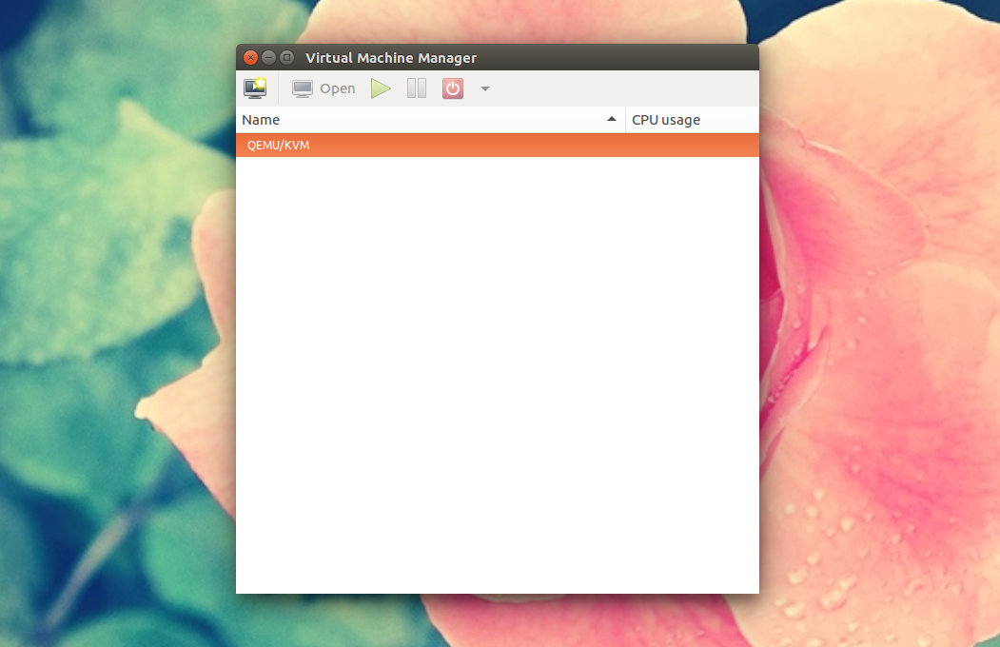

### 2.1. Cài đặt máy ảo

Từ màn hình chính của virt-manager, chọn Create a new virtual machine


Một cửa sổ mới hiện ra cho phép lựa chọn các phương pháp cài đặt máy ảo khác nhau


**Local install media (ISO Image or CDROM)**

*Bước 1:* Phương pháp cài đặt đầu tiên là thông qua file cài đặt. Chọn Local install media và click forward.

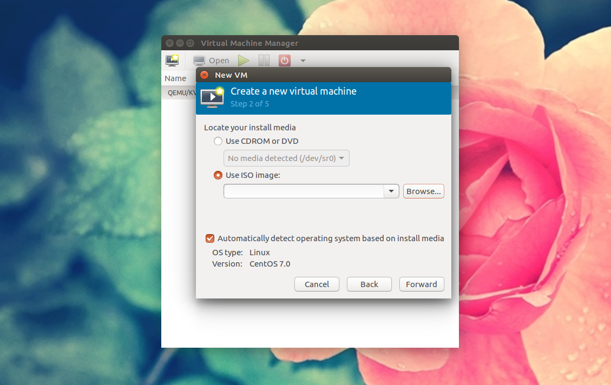

*Bước 2:* Tại đây ta sẽ lựa chọn file iso hoặc ổ đĩa CD chứa bản cài hệ điều hành. Lưu ý, nếu lựa chọn cài hệ điều hành cho máy ảo từ file iso tải xuống trong ổ cứng. Khi chọn Browse.., ở màn hình bên dưới cần chọn Browse Local để tìm đến file iso trong ổ cứng.


File ISO cho các hệ điều hành mã nguồn mở phổ biến có thể tải từ các nguồn:

Official Ubuntu images: https://www.ubuntu.com/download/alternative-downloads

Official CentOS images: https://centos.org/download/

Official Debian images: https://www.debian.org/CD/

Official Fedora images: https://getfedora.org/

Official openSUSE images: https://software.opensuse.org/
 
*Bước 3:* Sau khi lựa chọn file iso thành công, virt-manager sẽ tự động phát hiện hệ điều hành, công việc tiếp theo là ấn forward để chuyển sang màn hình cài đặt CPU và RAM. Việc lựa chọn kích thước RAM ảo và số lượng CPU ảo phải dựa vào yêu cầu sử dụng và tài nguyên sẵn có của hệ thống.

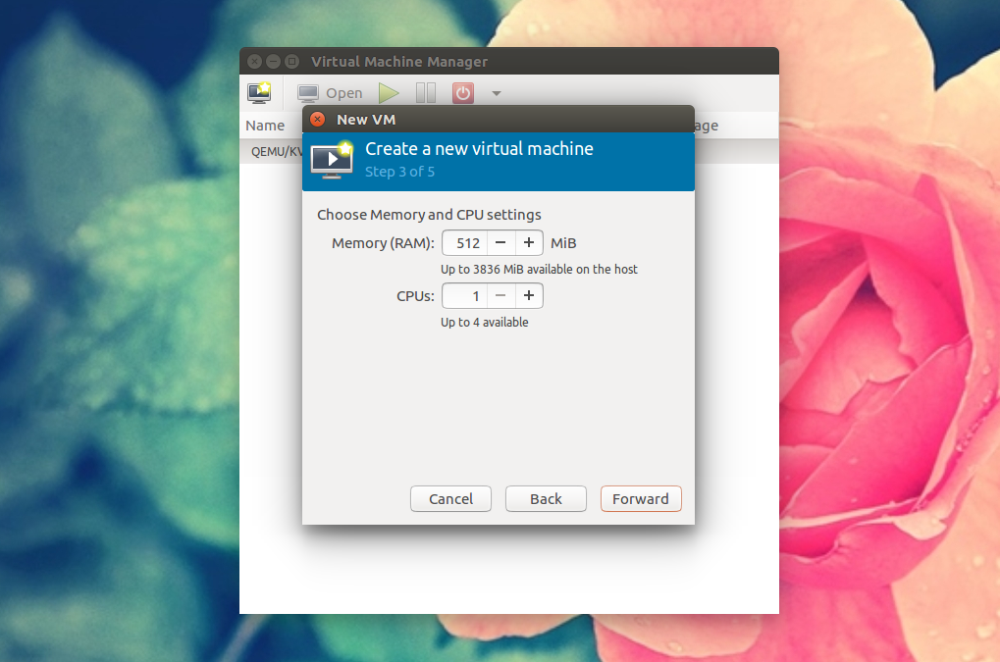

*Bước 4:* Sau khi cài đặt CPU và RAM, ấn forward sẽ chuyển sang màn hình cài đặt kích thước bộ nhớ.

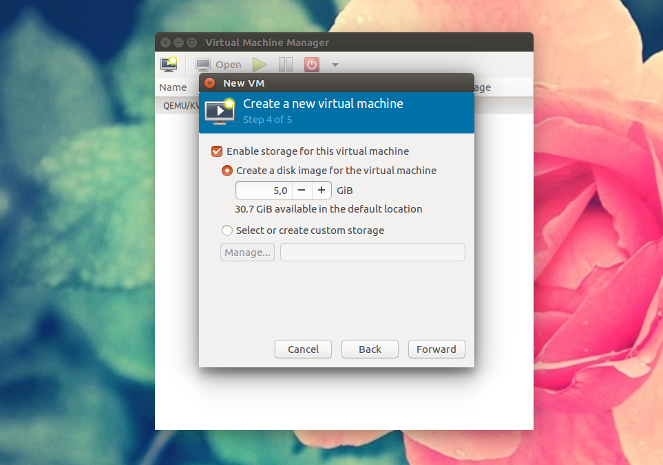

*Bước 5:* Việc lựa chọn bộ nhớ cho máy ảo kết thúc, ấn forward chuyển sang màn hình cài đặt cuối cùng. Ở đây, ta cần đặt tên cho máy ảo và thay đỗi thiết lập mạng nếu cần. Cuối cùng, ấn finish để hoàn tất việc thiết lập máy ảo.


Việc cài đặt hệ điều hành hoàn tất và có thể sử dụng bình thường

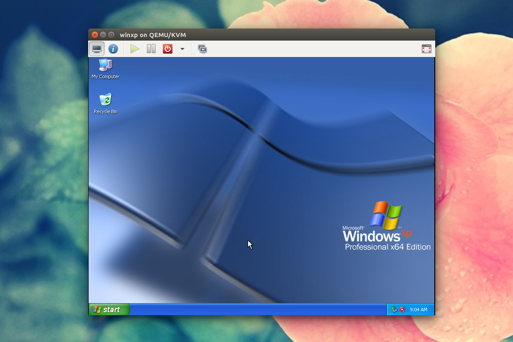

**Network Install (http, fpt, nfs)**

Phương pháp thứ hai để cài đặt hệ điều hành cho máy ảo là thông qua đường dẫn thư mục nguồn của hệ điều hành trên internet. Phương pháp này chỉ khác phương pháp đầu ở bước thứ nhất và thứ 2. Cụ thể, ta chọn Network Install, ấn forward.

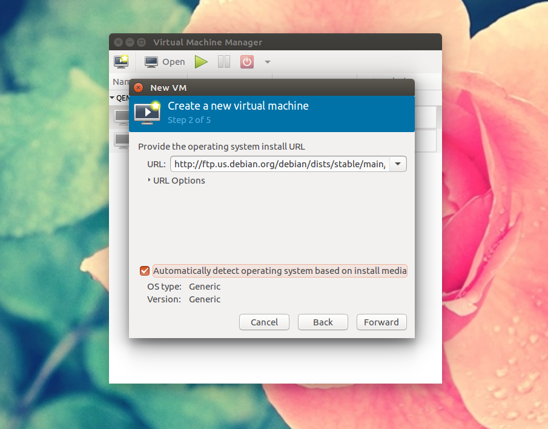

Trên màn hình này, ta cần nhập link dẫn tới thư mục nguồn của hệ điều hành, ví dụ:
```
http://ftp.us.debian.org/debian/dists/stable/main/installer-amd64/
```

Các bước tiếp theo sẽ tương tự phương pháp cài đặt đầu tiên. Tuy nhiên, thời gian cài đặt sẽ lâu hơn và có thể xuất hiện sự cố nếu đường truyền mạng không ổn định.

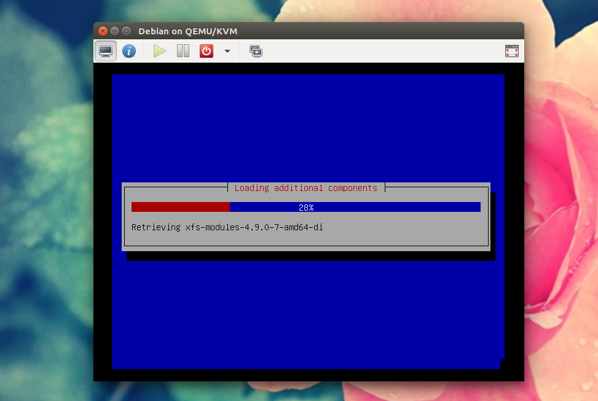

**Network Boot (PXE)**

Phương pháp cài đặt này sử dụng một server Preboot eXecution Environment (PXE) để cài đặt hệ điều hành cho máy ảo. server PXE phải thuộc cùng subnet với hệ thống hiện tại. Do giới hạn về thiết bị, em hiện chưa tìm hiểu thêm.

**Import an existing disk image**

Phương pháp cuối cùng cho phép cài đặt nhanh hệ điều hành cho máy ảo thông qua một file ảnh hệ điều hành. Phương pháp này tương tự phương pháp đầu tiên. Chọn Import an existing disk image và click forward.

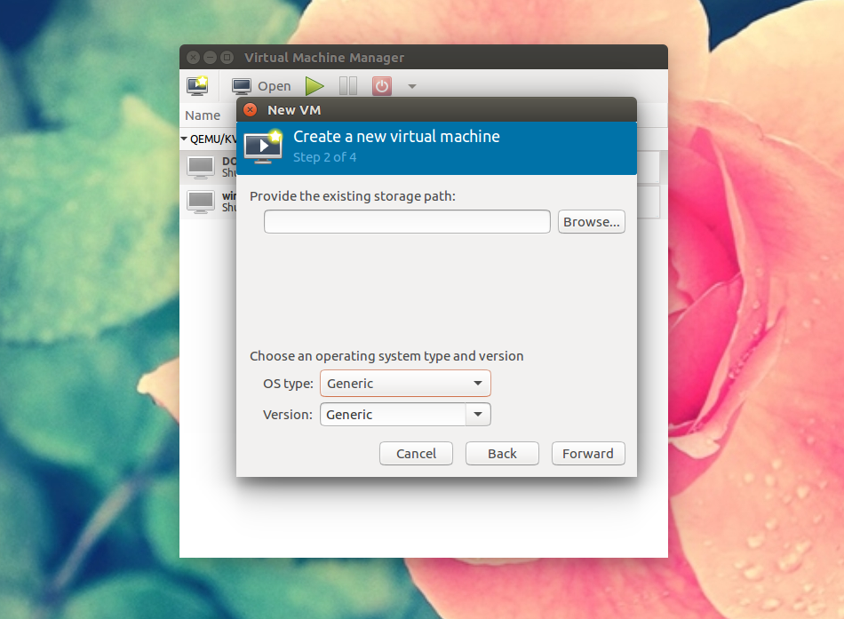

Trên màn hình này, ta chọn Browse.. và chọn file ảnh hệ điều hành để tiến hành cài. Các file ảnh dùng để cài đặt hệ điều hành tương thích với virt-manager có định dạng qcow2.

### 2.2 Vận hành và giám sát máy ảo

Các tác vụ chính sau khi cài đặt thành công một máy ảo là tiến hành sử dụng, giám sát máy ảo. Cụ thể, công việc này bao gồm:

* Khởi động máy ảo
* Tạm dừng máy ảo
* Thoát máy ảo
* Giám sát máy ảo

**Khởi động máy ảo**

Sau khi cài đặt thành công máy ảo, trên cửa số chính của phần mềm virt-manager sẽ xuất hiện các lựa chọn máy ảo. Ta click vào máy ảo muốn khởi động, ấn lựa chọn Power on the virtual machine để khởi động máy ảo.


Sau khi khởi động máy ảo thành công, trạng thái của máy ảo chuyển thành Running. Tuy nhiên, để có thể mở và truy cập giao diện của máy ảo trên màn hình hệ thống, ta cần click nút open. Một cửa số mới hiện lên cho ta thao tác với hệ điều hành của máy ảo.

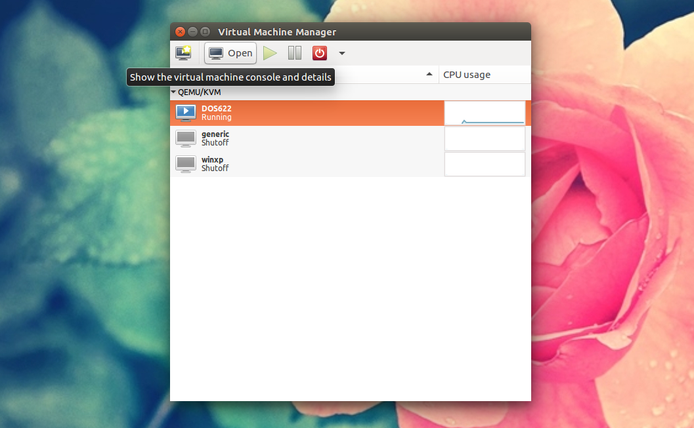

**Tạm dừng máy ảo**

Việc tạm dừng máy ảo được thực hiện thông qua virt-manager bằng cách ấn nút pause trên thanh điều khiển của cửa số chính virt-manager hoặc cửa sổ đồ họa hệ điều hành máy ảo.

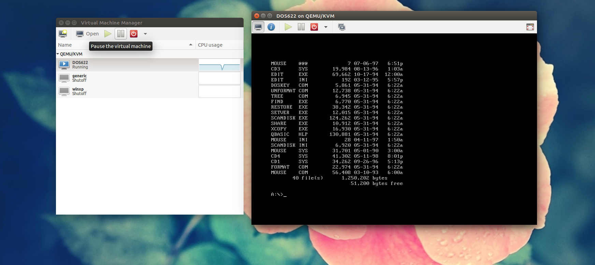

Lưu ý, khi tương tác với máy ảo, con trỏ chuột của hệ thống có thể bị disabled bên ngoài vùng cửa sổ đồ họa của hệ điều hành máy ảo. Để khôi phục con trỏ chuột, ấn tổ hợp phím Ctrl + Alt + L.

Sau khi tạm dừng máy ảo và muốn máy ảo quay trở lại hoạt động, ta ấn nút pause thêm một lần nữa.

**Thoát máy ảo**

Để đóng một máy ảo, có 3 phương pháp.

Đầu tiên, có thể đóng một máy ảo bằng cách tắt hệ điều hành của máy ảo thông qua tương tác với hệ điều hành đó. Ví dụ, turn off hệ điều hành windows xp

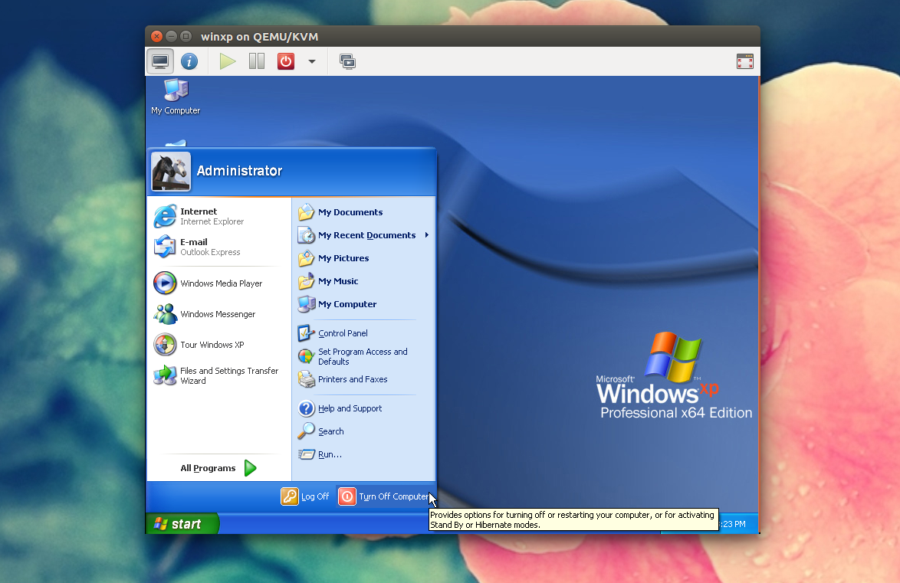


Thứ hai, việc đóng một máy ảo có thể được thực hiện bằng cách ấn nút shutdown trong cửa số chính của virt-manager hoặc trong cửa sổ hệ điều hành của máy ảo hoạt động.


Thứ ba, khi việc đóng máy ảo bằng phương pháp thứ hai không hiện quả, có thể đóng ngay máy ảo bằng cách chọn lựa chọn force off như hình dưới. Phương pháp này có thể nguy hiểm vì hủy mọi hoạt động hiện tại của máy ảo, có thể dẫn tới phá hủy dữ liệu hoặc hệ điều hành máy ảo.


**Giám sát máy ảo**

Việc giám sát máy ảo thông qua virt-manager tập chung vào 4 thông số: CPU usage, Memory usage, Disk I/O usage và Network Usage.

Có hai mức độ giám sát máy ảo.

Thứ nhất, ở cấp độ tổng quát, ta có thể quan sát các thông số của các máy ảo đang chạy trên hệ thống một cách trực quan qua màn hình chính của virt-manager. Cụ thể, như hình dưới.


Lưu ý, việc bật tắt hiển thị các thông số trên màn hình chính của virt-manager được thực hiện bằng lựa chọn qua toolbar view/graph.

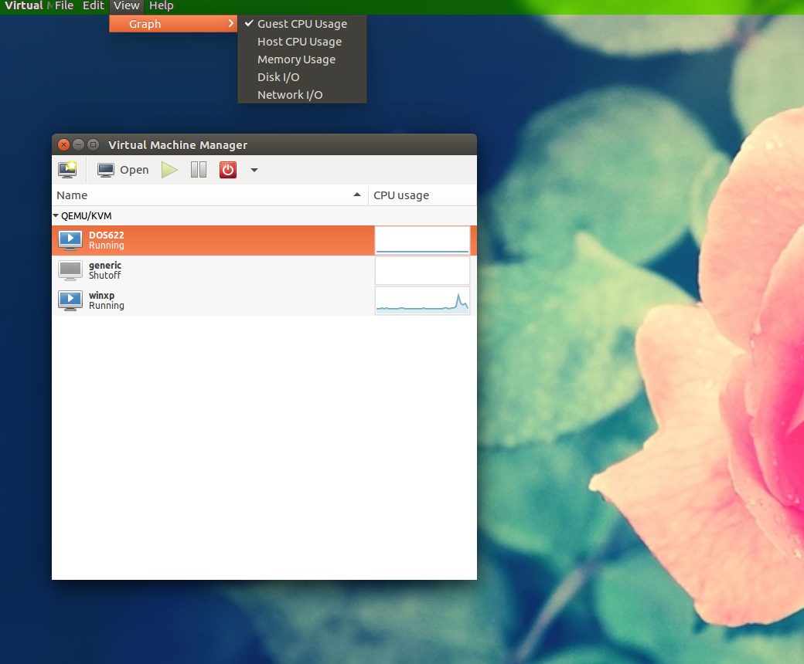

Thứ hai, ở cấp độ chi tiết, ta có thể giám sát chi tiết các thông số của một máy ảo đang chạy trên hệ thống bằng cách click nút info trên màn hình cửa số máy ảo.

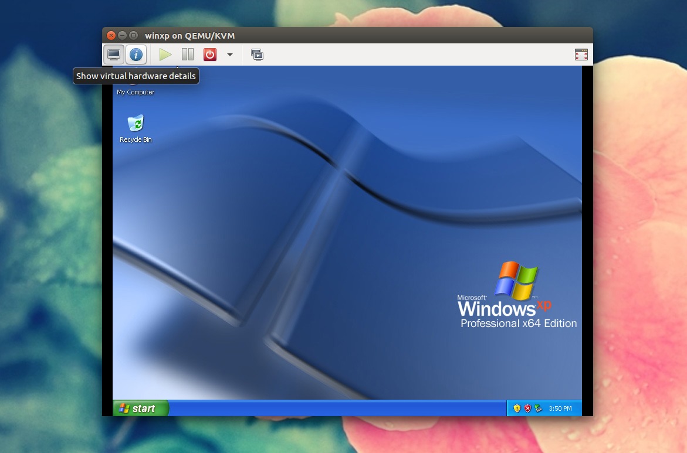

Trong màn hình mới hiện lên, chọn Performance và quan sát các thông số.

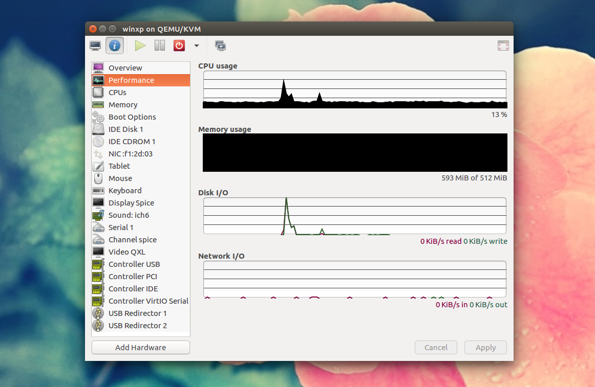

### 2.3 Di chuyển, Back up, Clone và Xóa máy ảo

//TODO

### 2.4 Quản lý chi tiết các tài nguyên phần cứng ảo hóa

//TODO

## 3. Quản lý KVM bằng giao diện dòng lệnh với virsh và các công cụ liên quan

//TODO

## 4. Quản lý KVM bằng giao diện dòng lệnh với nhóm công cụ hỗ trợ từ QEMU

//TODO

# Hướng Dẫn Sử Dụng KimChi

## 1. Cài đặt KIMCHI

Việc cài đặt kimchi được thực hiện qua Terminal như sau

Đầu tiên, cập nhật server

```shell
sudo apt-get update && sudo apt-get upgrade
```

Tiếp theo, cài đặt KVM nếu chưa cài đặt

```shell
sudo apt-get install qemu qemu-kvm libvirt-bin
```

Tải gói cài đặt kimchi cho ubuntu
```
wget https://github.com/kimchi-project/kimchi/releases/download/2.5.0/wok-2.5.0-0.noarch.deb

wget http://kimchi-project.github.io/gingerbase/downloads/latest/ginger-base.noarch.deb

wget https://github.com/kimchi-project/kimchi/releases/download/2.5.0/kimchi-2.5.0-0.noarch.deb
```

Cài đặt các gói

```
sudo apt-get install nginx

sudo dpkg -i wok-2.5.0-0.noarch.deb

sudo apt-get install -f

sudo service wokd start

sudo dpkg -i ginger-base.noarch.deb

sudo apt-get install -f

sudo service wokd restart

sudo dpkg -i kimchi-2.5.0-0.noarch.deb

sudo apt-get install -f

sudo ufw allow 8001/tcp
```

Kiểm tra cài đặt thành công, vào trình duyệt web, truy cập địa chỉ:

```
https://localhost:8001
```

Lưu ý, trên phiên bản hiện tại, nếu truy cập vào đường link trên và trình duyệt web thông báo lỗi chứng chỉ, hãy chọn tiếp tục truy cập để mở được trang đăng nhập của wok server.

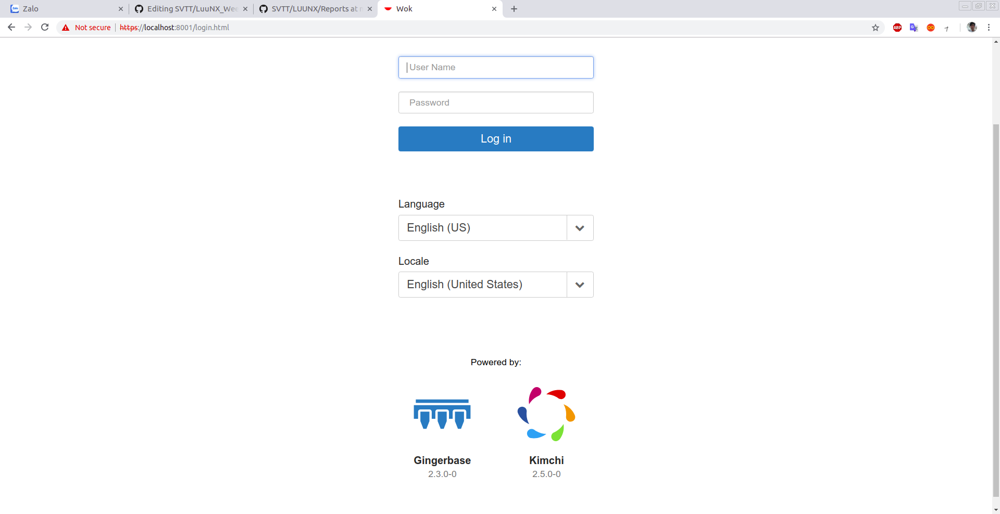

## 2. Tạo máy ảo bằng KIMCHI

Trên màn hình đăng nhập, nhập tài khoản ubuntu để truy cập vào wok server. Tại đây, ta có giao diện làm việc như sau:

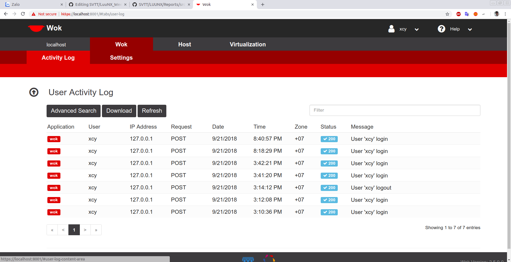

Chọn tab Virtualization để thực hiện các công việc ảo hóa. Tại đây, việc đầu tiên cần làm là tạo một template cho máy ảo. Chọn tiếp tab Templates:

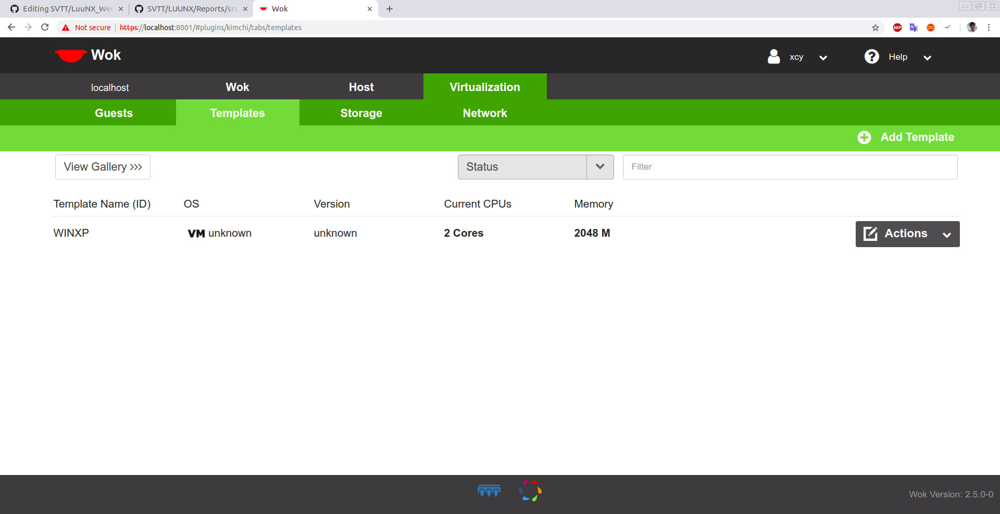

Chọn Add Template để tạo template. Trên cửa sổ mới hiện ra, nhập tên máy ảo và đường dẫn tới file iso của hệ điều hành muốn cài. Lưu ý, kimchi tự động tìm các file iso trong ổ cứng để người dùng chọn nhanh hơn. Ngoài ra, một số hệ điều hành phổ biến cũng có thể chọn trực tiếp tại đây. 


Sau khi lựa chọn xong, ấn create để tạo. Công việc tạo template chưa hoàn tất vì ta chưa chỉnh sửa các thông tin chi tiết phù hợp. Ta chọn Actions/Edit với template vừa tạo.

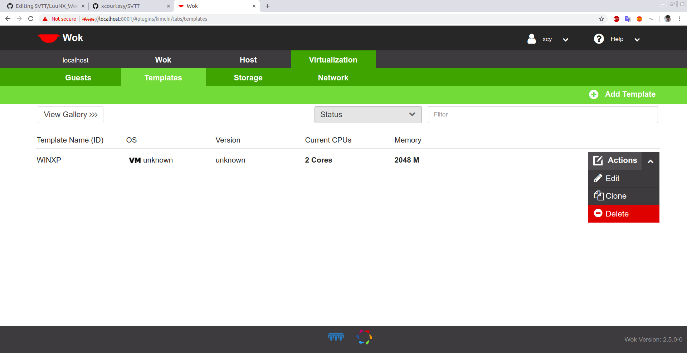

Lựa chọn General cho phép chỉnh sửa tên, kích thước RAM và lựa chọn kết nối đồ họa tới máy ảo.

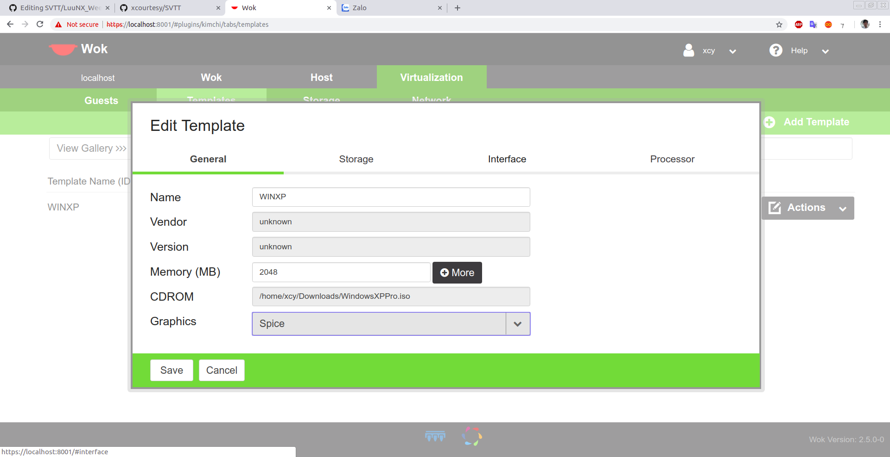

Lựa chọn Storage cho phép chỉnh sửa kích thước bộ nhớ trong cấp cho máy ảo.

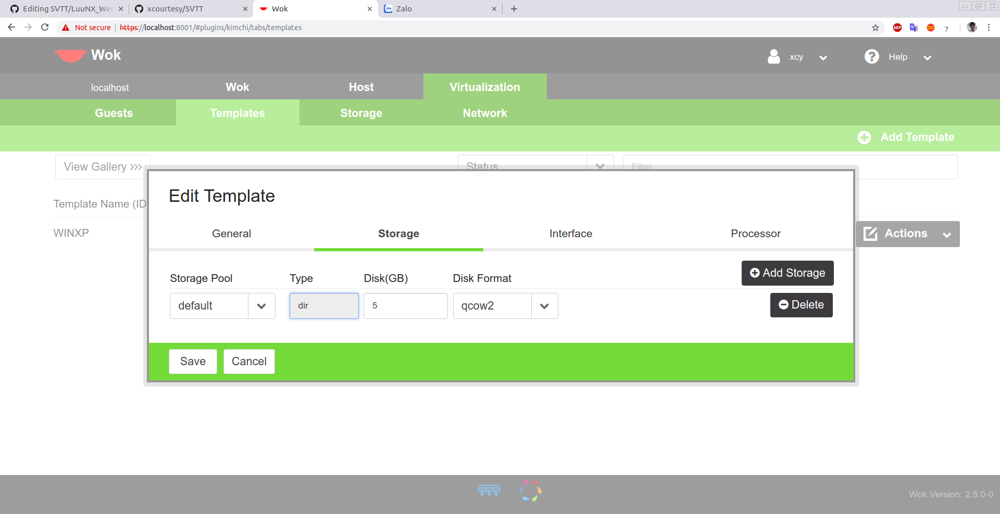

Lựa chọn Interface cho phép cài đặt giao thức mạng cho máy ảo.

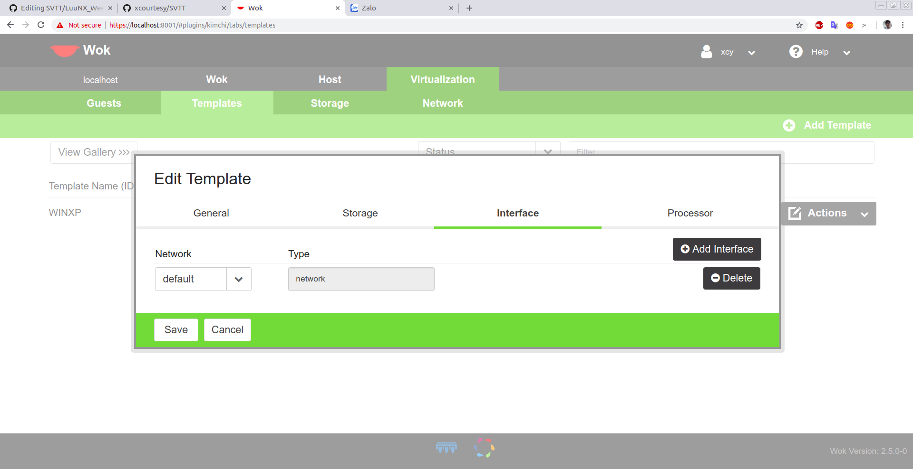

Lựa chọn Processor cho phép lựa chọn số nhân CPU cho máy ảo.

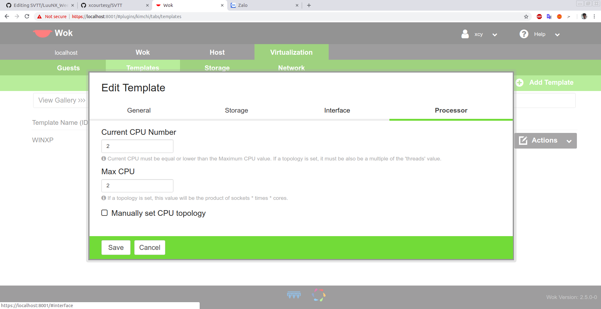

Sau khi cài đặt các thông số cho template, ấn save để lưu lại. Ta chọn sang tab Guest để tạo máy ảo. Tại đây, lựa chọn Add Guest, cửa sổ hiện ra cho phép nhập tên máy ảo và lựa chọn template cho máy ảo.


Việc cài đặt máy ảo hoàn tất, danh sách máy ảo được hiển thị trong cửa sổ chính của tab Guest


## 3. Vận hành và giám sát máy ảo bằng KIMCHI

Công việc vận hành và giám sát máy ảo bằng KIMCHI tương tự virt-manager. Trong tab Virtualization / Guests, lựa chọn Actions / Start để khởi động máy ảo mong muốn.


Sau khi máy ảo đã khởi chạy, lựa chọn Show Console để truy cập vào màn hình làm việc của hệ điều hành máy ảo.


Lựa chọn này sẽ mở một tab mới trên trình duyệt.


Để tạm dừng hoạt động của một máy ảo, trong tab Virtualization/Guests, lựa chọn Actions / Pause với máy ảo đang chạy.


Việc đóng máy ảo được thực hiện thông qua 3 cách.
