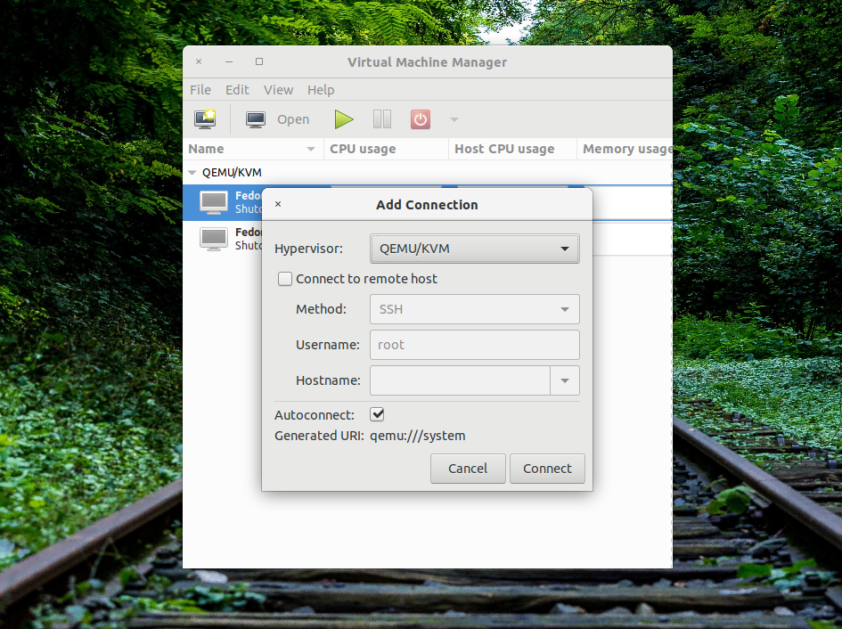
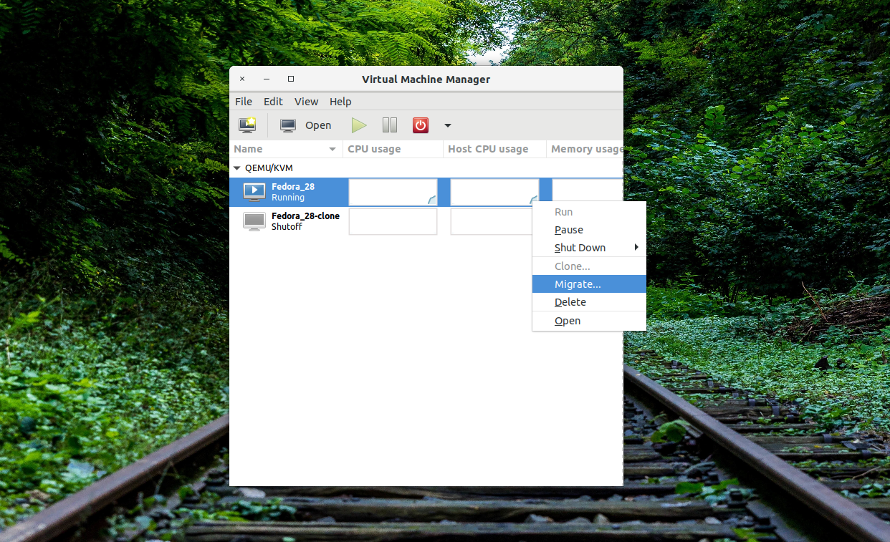
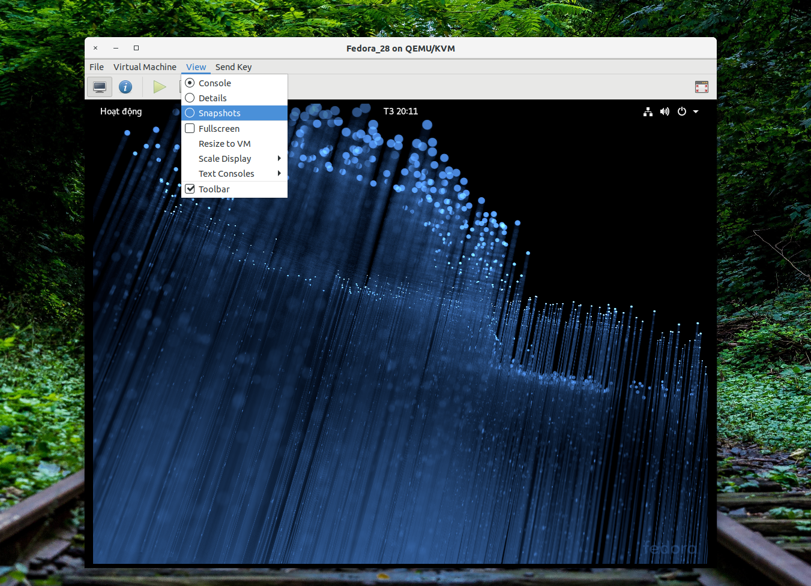
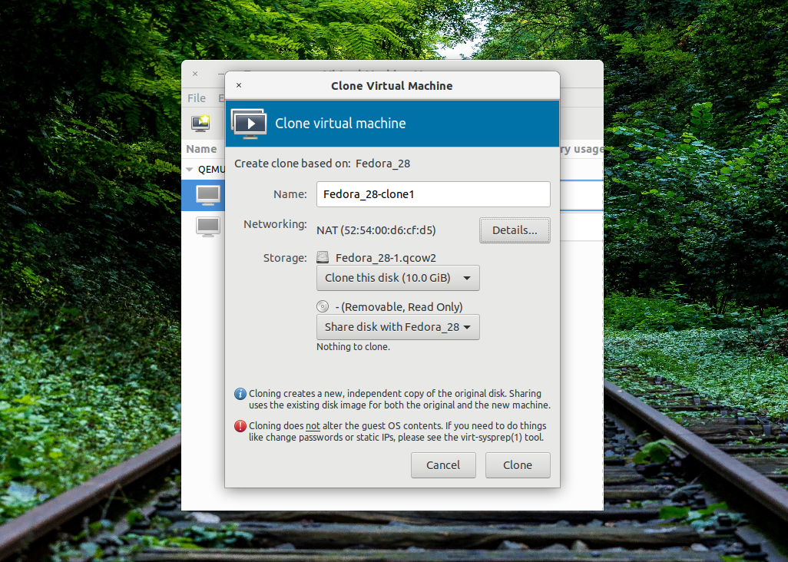
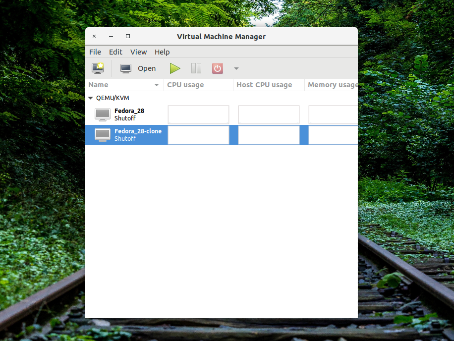

# Tìm hiểu KVM
* Tuần 4
* Người tạo: Nguyễn Xuân Lưu

# [Hướng Dẫn Sử Dụng KVM](#1)
## [2. Quản Lý KVM bằng giao diện người dùng](#1.2)

### 2.3 Di chuyển, Back up, Clone và Xóa máy ảo

**Di chuyển**

Việc di chuyển một máy ảo từ phần cứng vật lý này tới phần cứng vật lý khác sẽ cần thiết trong công tác bảo trì bảo dưỡng, thay thế, nâng cấp phần cứng vật lý của hệ thống.

Để thực hiện di chuyển, ta cần thiết lập kết nối từ virt-manager của máy nguồn tới máy đích. Công việc được thực hiện qua việc add connect từ cửa sổ chính của virt-manager, ở đây, ta sử dụng giao thức SSH.

Sau khi hoàn tất việc thiết lập kết nối. Chọn chuột phải và máy ảo muốn di chuyển, chọn migrate và chọn địa chỉ đích đã tạo ở phía trên. Do hạn chế về thiết bị, em không thể thực hiện bước này.

**Back up**

Trong quá trình sử dụng KVM, việc tạo ra bản backup cho máy ảo là cần thiết, việc này được thực hiện đơn giản theo một số bước sau.

Trên cửa sổ làm việc của hệ điều hành máy ảo, lựa chọn view / snapshots.

Khi đó, cửa sổ snapshot được hiển thị để người dùng quản lý snapshot

Kế đến, trong cửa sổ tạo snapshóts, chọn create snapshot bằng cách ấn dấu cộng ở góc dưới bên trái cửa sổ. Khi đó, một cửa sổ mới mở lên cho phép ta đặt tên và bổ sung miêu tả về snapshot.

Sau khi tạo snapshot, snapshot mới được tạo nên sẽ hiển thị trong danh sách snapshots. Khi muốn thực hiện restore lại bản back up (snapshot), chọn snapshot, chọn run ( dấu play ở góc dưới bên trái cửa sổ). Cuối cùng, khi muốn xóa bản back up đã tạo, chọn snapshot đó và click delete ( dấu delete ở góc dưới bên trái cửa sổ.

**Clone**

Bên cạnh việc tạo backup, một nhiệm vụ quan trọng khác của KVM là tạo ra template nhằm nhanh chóng cài đặt hàng loạt các máy ảo đã được set up cấu hình phù hợp với một loạt nhiệm vụ riêng. Thông qua template, việc cài đặt hệ điều hành cho máy ảo được thực hiện rất nhanh và hiệu quả.

Đối với virt-manager, để tạo máy ảo từ template, ta sử dụng tính năng clone. Chọn máy ảo dùng làm template, lưu ý, máy ảo này phải ở chế độ shutoff, click chuột phải, chọn clone.

Sau khi lựa chọn clone, một cửa sổ mới xuất hiện cho phép người dùng lựa chọn các thông số cho máy ảo sắp được tạo bởi template.

Việc tạo máy ảo clone kết thúc, trên màn hình chính virt-manager, danh sách máy ảo được hiển thị.

**Delete**

Cuối cùng, việc xóa bỏ một máy ảo được thực hiện dễ dàng bằng việc chuột phải vào máy ảo, chọn delete. Lưu ý, máy ảo đó phải đang ở chế độ shutoff.

### 2.4 Quản lý chi tiết các tài nguyên phần cứng ảo hóa

**Virtual Network**

KVM cung cấp nhiều loại mạng ảo cho máy ảo, trong đó có 3 loại chính:

* isolated virtual network
* routed virtual network
* NATed virtual network

Để tạo các dạng mạng ảo này, ta vào chế độ cấu hình bằng cách chọn Edit/Connection Details trên màn hình chính của virt-manager.

## 3. Quản lý KVM bằng giao diện dòng lệnh với virsh và các công cụ liên quan

//TODO

## 4. Quản lý KVM bằng giao diện dòng lệnh với nhóm công cụ hỗ trợ từ QEMU

//TODO

