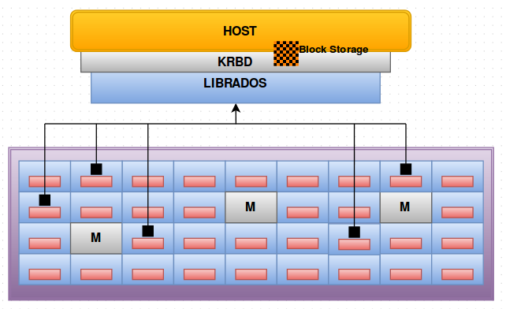
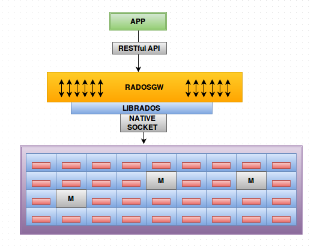
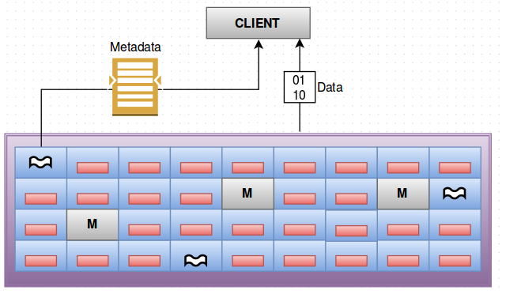

## Ceph Architecture and components

## Mục Lục

- [1. Architecture](#1)
- [2. Ceph Storage cluster](#2)
	- [2.1 OSD](#21)
	- [2.2 Monitor](#2.2)
- [3. LIBRADOS - Library to access RADOS](#3)
- [4. Ceph Clients](#4)
	- [4.1 Ceph Object Storage](#41)
	- [4.2 Ceph Block Device](#42)
	- [4.3 Ceph Filesystem](#43)

## Nội dung 

### 1. Architecture

Kiến trúc của Ceph Storage được thể hiện như hình dưới:

Ceph cung cấp các dạng lưu trữ Object, block và file trong một hệ thống thống nhất. 

### 2. The Ceph Storage Cluster.

Ceph Storage cluster xây dựng từ một vài Software daemon. Mỗi tiến trình đều có vai trò riêng trong tính năng của Ceph. Kiến trúc của Ceph Object Storage như hình bên dưới:

**Ceph Storage Cluster** xây dựng dựa trên RADOS (Reliable Autonomic Distributed Object Store) là thành phần cốt lõi của Ceph Storage. 

**Cung cấp các tính năng:**
- Lưu trữ Object phân tán có tính sẵn sàng cao, tin cậy, không có **Single point failure**, tự sửa lỗi, tự quản lý. Xử lý dữ liệu theo kiểu Object
- Các phương thức truy xuất Ceph như RBD (RADOS Block Devices), Ceph FS (Ceph filesystem), RADOSGW (RADOS object gateway) và librados đều hoạt động trên lớp RADOS
- Thuật toán CRUSH tính toán vị trí và thiết bị mà dữ liệu sẽ được ghi vào. Thông tin này được đưa lên lớp RADOS để xử lý. Dựa vào quy tắc của CRUSH, RADOS phân tán dữ liệu lên tất cả cac node dưới dạng Object các Object này được lưu tại các OSD.
- RADOS khi cấu hình với nhân bản nhiều hơn hai sẽ chịu trách nhiệm về độ tin cậy của dữ liệu. Sao chép object, tạo các bản sao và lưu trữ tại các zone khác nhau, do đó các bản ghi giống nhau không nằm trên cùng 1 zone. RADOS đảm bảo có nhiều hơn một bản copy của object trong RADOS cluster. 
-  RADOS cũng đảm bảo object luôn nhất quán. Trong trường hợp object không nhất quán, tiến trình khôi phục sẽ chạy. Tiến trình này chạy tự động và trong suốt với người dùng vì Ceph có 2 cơ chế tự quản lý và sửa lỗi.

Có thể coi kiến trúc Ceph gồm 2 phần. RADOS là tầng dưới, nằm trong Ceph cluster, không giao tiếp trực tiếp với client, Tầng trên sẽ có các client interface.

- Một Ceph storage cluster có sức chứa số lượng lớn các node với khả năng giao tiếp với nhau để tái tạo và phân phối lại dữ liệu một cách tự động.
- Ceph filesystem, Ceph Object Storage và Ceph Block Devices đọc dữ liệu từ Ceph Storage Cluster và ghi dữ liệu vào Ceph Storage cluster.

Ceph Storage cluster gồm có 2 thành phần chính là Object Storage Daemon và Monitor:
- OSD (Object Storage Device)
- Monitor

#### 2.1 Cấu trúc của OSD

Dữ liệu sau khi qua librados sẽ được lưu dưới dạng Object. Mỗi Object tương ứng tới một file trong filesystem và chúng được lưu trữ trên một Object Storage Device. Một OSD thường được gắn với một đĩa lưu trữ vật lý. Và gọi chung là OSD.

Một Object có Identifer (ID), Binary data và metadata bao gồm một tập các cặp tên biến. Object ID là duy nhất trong toàn cluster.

Filesystem có các thuộc tính cung cấp các thông tin về trạng thái Object, metadata, snapshot và ACL cho Ceph OSD daemon, hỗ trợ việc quản lý dữ liệu. Filesystem có thể là btrfs, xfs hay ext4.

#### 2.2 Ceph Monitor

Ceph monitor chịu trách nhiệm giám sát tình trạng của toàn hệ thống. Nó hoạt động như các daemon duy trì sự kết nối trong cluster bằng cách chứa các thông tin cơ bản về cluster, tình trạng các node lưu trữ và thông tin cấu hình cluster. Ceph monitor thực hiện điều này bằng cách duy trì các cluster map. Các cluster map này bao gồm monitor, OSD, PG, CRUSH và MDS map.

1. Monitor map: Map này lưu trữ thông tin về các node monitor gồm Ceph cluster ID, Monitor hostname, địa chỉ IP và số port. Nó cũng giữ epoch (phiên map tại một thời điểm) hiện tại để tạo map và thông tin về lần thay đổi map cuối cùng.
2. OSD map: Map này lưu trữ các trường như cluster ID, epoch cho việc tạo map OSD và lần thay đổi cuối. và thông tin liên quan đến pool như tên, ID, loại, mức nhân bản và PG. Nó cũng lưu các thông tin OSD như tình trạng, trọng số, thông tin host OSD.
3. PG map: lưu trữ các phiên bản của PG (thành phần quản lý các Object trong Ceph), timestamp, bản OSD map cuối cùng, tỉ lệ đầy và gần đầy dung lượng. Nó cũng lưu các ID của PG, object count, tình trạng hoạt đọng và srub (hoạt động kiểm tra tính nhất quán của lưu trữ).
4. CRUSH map: Map này lưu các thong tin của thiết bị lưu trữ trong Cluster, các quy tắc cho từng vùng lưu trữ.
5. MDS map: Lưu thông tin về thời gian tạo và chỉnh sửa, dữ liệu và metadata pool ID, Cluster MDS count, tình trạng hoạt động của MDS, epoch của MDS map hiện tại.

Ceph monitor không lưu trữ dữ liệu, thay vào đó nó gửi các bản update cluster map cho client và các node khác trong cluster. Client và các node khác định kỳ check các cluster map và gửi báo cáo về monitor node.

Tiến trình giám sát rất nhẹ, nó sẽ ko ảnh hướng tới tài nguyên có sẵn của server. Monitor node cần có đủ dung lượng đễ lưu trữ cluster log bao gồm OSD, MDS và monitor logs.

Trong mỗi hoạt động đọc ghi client request tới cluster map từ monitors, sau đó sẽ tương tác trực tiếp OSD với hoạt động đọc ghi không có sự can thiệp của monitors. Dẫn đến tiến trình xử lý nhanh hơn khi tới OSD, lưu trữ data trực tiếp mà khong thông qua các lớp xử lý data khác. Cơ chế data-storage-and-retrieval mechanism gần như độc nhất khi so sánh ceph với các công cụ khác.

### 3. LIBRADOS - Library to access RADOS

LIBRADOS là một nhóm các libraries hay một API mà có chức năng giao tiếp với RADOS (Ceph Storage Cluster). Bất kỳ application nào muốn giao tiếp với RADOS thì phải thông qua librados API.

Chỉ librados mới có quyền truy cập trực tiếp vào storage cluster. Theo mặc đinh Ceph Storage cluster cung cấp 3 dịch vụ lưu trữ cơ bản là: Object Storage, Block Storage, File Storage. Tuy nhiên không phải giới hạn của Ceph.

Sử dụng librados API chúng ta có thể tạo interface cho riêng mình để truy cập vào storage cluster ngoài RESTfull(RADOS Gateway), Block (RBD) hay POSIX (CephFS) 

#### Hoạt động

Khi một Application muốn tương tác với Storage Cluster nó được link tới **librados** librados sẽ cung cấp các hàm cần thiết để app có thể tương tác với storage cluster.

LIBRADOS giao tiếp với RADOS sử dụng một native protocol (một [socket](notes.md/#socket) được thiết kế chỉ cho mục đích này).
Việc sử dụng một native protocol tạo kết nối giữa LIBRADOS và storage cluster rất nhanh và không giống với bất kỳ các Service Sockets hay Protocols nào khác.

**Vai trò của LIBRADOS**:
- Cung cấp truy cập trực tiếp tới Ceph Storage Cluster cho Application, cùng với hỗ trợ các ngôn ngữ C, C++, Java, Python, Ruby và PHP.
- Nếu muốn thêm chức năng RADOS, object class hoặc chức năng nâng cao khác, librados cung cấp các chức năng này tới clients/applications dưới dạng một thư viện
- LIBRADOS API cho phép tương tác với 2 loại daemon trong Ceph Storage Cluster.
	- Ceph OSD Daemon (OSD) - Lưu dữ liệu dưới dạng object trong một storage node.
	- Ceph Monitor (MON) - Duy trì bản sao chính của cluster map.

### 4. Ceph client
Ceph client bao gồm 3 service interface:
- **Block Device**: Ceph Block Device service cung cấp block devices với các tính năng có thể thay đổi kích thước, [thin-provisioned](notes.md/#thin-provisinoed), [snapshot](notes.md/#snapshots) và nhân bản. Ceph hỗ trợ cả **kernel object (KO)** và **QEMU hypervisor** (sử dụng trực tiếp thư viện librbd)
- **Object store**: dịch vụ Ceph Object Storage cung cấp RESTfull APIs với interfaces tương thích với [Amazon S3](notes.md/#amazons3) và [OpenStack Swift](notes.md/#openstack-swift)
- **Filesystem**: Ceph Filesystem (CephFS) service cung cấp POSIX compliant filesystem nằm trên RADOS.

#### 4.1 Ceph Block Device - RADOS Block Device (RBD)

RADOS Block Device cung cấp giải pháp lưu trữ block-based trong Ceph storage cluster. Ceph block storage có các tính năng như [thin-provisioned], có thể thay đổi kích thước và lưu trữ dữ liệu ngang/dọc trên nhiều OSDs trong Ceph storage cluster.

Block là một chuỗi bytes. Block-based storage interfaces là cách phổ biến trong lưu trữ với các thiết bị quay như đĩa cứng, CDs, floppy disk.

RBD tách disk thàn các khối nhỏ và trải nó qua các OSD trong Ceph Storage Cluster do đó cần thư viện librbd lấy các khối và cung cấp chúng trở lại thành như 1 đĩa ảo. 

RBD tương tác với OSD sử dụng kernel modul KRBD (Kernel RBD) hoặc thư viện librbd mà Ceph cung cấp. KRBD cung cấp block devices tới một linux host và librbd cung cấp block storage tới Virtual Machine. RBD được sử dụng phổ biến nhất với máy ảo, nó cung cấp môi trường ảo hoá các tính năng bổ sung như di chuyển VM trên contener đang chạy.

#### Hoạt động

Giả sử có nhiều ổ nhỏ có kích thước 10M được trải ở nhiều các OSD khác nhau trong Ceph Storage cluster. librbd sẽ gộp chúng lại và tạo thành một block và duy trì có sẵn cho VM.

librbd link LIBRADOS để kết nối vào trong RADOS cluster và cũng link với virtualization container. librbd cung cấp ổ đĩa ảo tới VM bằng việc kết nối nó với virtualization container.

Lợi thế của kiến trúc này là dữ liệu hay image of a virtual machine không lưu trữ trên contener và do đó mang lại việc có thể di chuyển VM bằng việc dừng container và mang nó đến một container khác như hình bên dưới.

Một cách khác để truy cập RBD là sử dụng Kernel Module KRBD như hình dưới. khi đó Block device như một thiết bị có sẵn cho ổ cứng và có thể mount để sử dụng.

Túm lại RBD cung cấp các đặc tính:
- Tạo điều kiện lưu trữ [disk image](notes.md/#disk-image) trong Ceph Storage cluster.
- Có thể tách VM từ host node vì dữ liệu được lưu trên Ceph Storage Cluster.
- Images được trải trong cluster ở các OSD khác nhau.
- Hỗ trợ Linux kernel
- Hỗ trợ Qemu/KVM virtualization. 
- Hỗ trợ OpenStack, CloudStack...

#### 4.2 Ceph Object Gateway 

Ceph Object Gateway hay RADOS gateway, là proxy chuyển đổi HTTP request thành RADOS request và ngược lại, cung cấp RESTfull object storage, tương thích S3, Swift. Ceph Object Storage sử dụng Ceph Object Gateway daemon (radosgw) để tương tác librgw và Ceph Cluster, librados. Nó thực thi [FASTCGI](#fastcgi) module sử dụng libfcgi và có thể sử dụng FastCGI-capable web server.

Ceph Object Store hỗ trợ hai giao diện:
- S3 compatible: Cung cấp chức năng Object Storage tương thích với một mạng con lớn của Amazon S3 RESTfull
- Swift compatible: Cung cấp chức năng Object Storage tương thích với một mạng con lớn của OpenStack Swift API

#### Hoạt động

Một application muốn giao tiếp với Ceph Object Storage sử dụng object thì phải thực hiện thông qua Ceph Object Gateway.

RADOS gateway nằm giữa application và Cluster. Dữ liệu được lưu trữ như object trong Cluster sử dụng radosgw

radosgw được link với top của LIBRADOS, vì chỉ librados có thể giao tiếp với RADOS cluster và librados sử dụng native socket để giao tiếp với Cluster bên dưới.

Application được link tới RADOSGW sử dụng RESTfull API. đặc biệt là Amazon S3 và OpenStack SWIFT

#### 4.3 Ceph Filesystem 

Ceph Filesystem (CephFS) là một file system tương thích với chuẩn POSIX-compliant, với linux kernel và hỗ trợ file system trong user space ([FUSE](#fuse)). Nó cho phép dữ liệu được lưu trong các files thư mục như một file system thông thường được lưu. Cung cấp một một file system interface truyền thống với POSIX semantics.

#### Hoạt động

Ceph Storage cluster có 2 loại chính là OSD và Monitors. Tuy nhiên trong kiến trúc này một loại mới được thêm và Cluster là metadata server.

 

Khi mount CephFS file system ở client. Chúng ta cần phải nói chuyện với metadata server đầu tiên cho tất cả POSIX semantics như: permission, ownership, timestamps, hierarchy của các thư mục và file. Và khi semantics được cung cấp tới client bằng metadata server, OSD mới cung cấp dữ liệu.

Metadata server không xử lý dữ liệu. Nó chỉ lư các POSIX sematics cho dữ liệu được lưu hoặc retrieved (được lấy).

- metadata server quản lý metadata cho POSIX-compiliant filesystem
- Lưu trữ và quản lý metadata (owner, timestamps, permission, ...)
- Lưu và quản lý thư mục theo mô hình cấp bậc
- Lưu metadata trong RADOS cluster và không phục vụ dữ liệu cho client
- chỉ yêu cầu cho shared filesystem.

Ban đầu lưu cấu hình Ceph metadata server lưu tất cả các POSIX semantics cho tất cả các OSD. Khi số lượng metadata server tăng lên chúng tự phân chia tải với nhau, do đó không có **single point failure** 

## Tham khảo

[1. https://www.supportsages.com/ceph-part-3-technical-architecture-and-components/](https://www.supportsages.com/ceph-part-3-technical-architecture-and-components/)
[2. http://docs.ceph.com/docs/master/architecture/](http://docs.ceph.com/docs/master/architecture/)