# Tổng quan về Software Defined Networking và OpenvSwitch

## [1. Software Defined Networking và OpenFlow](#SDN)
## [2. OpenFlow](#OF)
## [3. OpenvSwitch](#OVS)
## [4. Cài đặt OpenvSwitch](#install)
## [5. Ví dụ sử dụng OVS](#ex)
---
## <a name="SDN"></a> 1. Software Defined Networking và OpenFlow
Software Defined Networking (SDN) hay mạng điều khiển bằng phần mềm hoạt động dựa trên cơ chế tách bạch việc kiểm soát một luồng mạng với luồng dữ liệu. SDN định nghĩa ra một lớp phần mềm đứng giữa các phần tử mạng và người quản trị mạng (là người cấu hình và cài đặt chúng). Lớp phần mềm này cung cấp cho người quản trị mạng khả năng điều khiển các thiết bị mạng của họ thông qua một giao diện phần mềm thay vì phải tự cấu hình phần cứng hoặc điều chỉnh các yếu tố vật lý của thiết bị mạng. 
SDN tách riêng luồng điều khiển (control plane) với luồng dữ liệu (và data plane). Điều này cho phép luồng các gói dữ liệu đi qua mạng được kiểm soát theo lập trình. Control plane được tách ra từ các thiết bị vật lý và chuyển đến các bộ điều khiển (trong lớp phần mềm). Các bộ điều khiển tương tác với các thiết bị mạng vật lý thông qua giao thức Open Flow. 

Kiến trúc SDN gồm 3 lớp riêng biệt: lớp ứng dụng (Application Layer), lớp điều khiển (Control Layer), lớp cơ sở hạ tầng - phần thiết bị (Infrastructure Layer). Các lớp này liên kiết với nhau thông qua giao thức OpenFlow và các API.

- Lớp ứng dụng: Là các ứng dựng kinh doanh đưọc triển khai trên mạng, được kết nối tới lớp điều khiển thông qua các API, cung cấp khả năng cho phép lớp ứng dụng lập trình lại (cấu hình lại) mạng (điều chỉnh các tham số trễ, băng thông, định tuyến,...) thông qua lớp điều khiển.
- Lớp điều khiển: Là nơi tập trung các bộ điều khiển thực hiện việc điều khiển cấu hình mạng theo các yêu cầu từ lớp ứng dụng và khả năng của mạng. Các bộ điều khiển này có thể là các phần mềm được lập trình.
- Lớp cơ sở hạ tầng: Là các thiết bị mạng thực tế (vật lý hay ảo hóa) thực hiện việc chuyển tiếp  gói tin theo sự điều khiển của lớp điều khiển. Một thiết bị mạng có thể hoạt động theo sự điều khiển của nhiều bộ điều khiển khác nhau, điều này giúp tăng cường khả năng ảo hóa của mạng.

## <a name="OF"></a> 2. OpenFlow
OpenFlow là tiêu chuẩn đầu tiên, cung cấp khả năng truyền thông giữa các giao diện của lớp điều khiển và lớp chuyển tiếp trong kiến trúc SDN. OpenFlow cho phép truy cập trực tiếp và điều khiển một mặt phẳng chuyển tiếp của các thiết bị mạng như switch, router, cả thiết bị vật lý và thiết bị ảo, do đó giúp di chuyển phần điều khiển mạng ra khỏi các thiết bị chuyển mạch thực tế tới phần mềm điều khiển trung tâm. Các quyết định về các luồng traffic sẽ được quyết định tập trung tại OpenFlow Controller giúp đơn giản hóa việc quản trị cấu hình trong toàn hệ thống. Một thiết bị OpenFlow bao gồm ít nhẩt ba thành phần:
- Source Channel: Kênh nối thiết bị tới bộ điều khiển (Controller), cho phép các lệnh và gói tin được gửi giữa bộ điều khiển và thiết bị.
- OpenFlow Protocol: giao thức cung cấp phương thức tiêu chuẩn và mở cho một bộ điều khiển truyền thông với thiết bị.
- Flow Table: một liên kết hành động với mỗi luồng, giúp thiết bị xử lý các luồng.
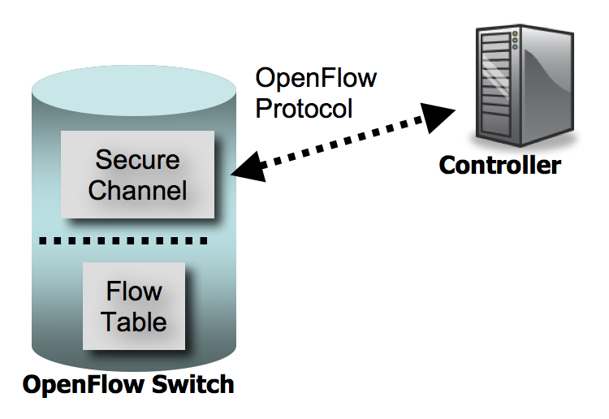

## 3. OpenvSwitch
### 3.1. Giới thiệu
- OpenvSwitch (OVS) là một dự án phần mềm mã nguồn mở về chuyển mạch ảo đa lớp hỗ trợ giao thức Openflow.
- OVS là một trong những thành phần quan trọng hỗ trợ SDN. 
- Mục đích chính của OVS là cung cấp lớp chuyển mạch cho môi trường ảo hóa phần cứng. OVS hỗ trợ nhiều giao thức và tiêu chuẩn được sử dụng trong hệ thống chuyển mạch thông thường. OVS hỗ trợ nhiều công nghệ ảo hóa dựa trên nền tảng Linux như Xen/XenServer, KVM và VirtualBox.
- OVS được sử dụng với các hypervisor để kết nối giữa các máy ảo trên một host vật lý và các máy ảo giữa các host vật lý khác nhau qua mạng.

- OVS hỗ trợ các tính năng sau:  
    - VLAN tagging và chuẩn 802.1q trunking
    - STP (spanning tree protocol)
    - LACP (Link Aggregation Control Protocol)
    - Port mirroring (SPAN, RSPAN)
    - Flow export (sử dụng các giao thức sflow và netflow)
    - Các giao thức đường hầm (GRE, VXLAN, IPSEC, tunneling)
    - Kiểm soát QoC


### 3.2. Các thành phần chính của OpenvSwitch:
- ovs-vswitchd: thực hiện chuyển đổi các luồng chuyển mạch
- ovsdb-server: là một lightweight database server, cho phép ovs-vswitchd thực hiện các truy vấn đến cấu hình
- ovs-dpctl: công cụ để cấu hình các switch kernel module
- ovs-vsctl: tiện ích để truy vấn và cập nhật cấu hình ovs-vswitchd
- ovs-appctl: tiện ích gửi command để chạy OVS

## <a name="install"></a> 4. Cài đặt OpenvSwitch trên Ubuntu 18.04 LTS
### 4.1. Building OpenvSwitch Debian packages
  1. Cài đặt các gói "build-essential" và fakeroot"
```sh
$ apt-get install build-essential fakeroot
```
  2. Download và giải nén OVS source distribution và cd vào top level directory

  3. Cài đặt các gói phụ thuộc (build dependencies) được liệt kê trong "Build-Depends:" ở gần đầu file debian/control. Ta có thể cài đặt với apt-get install.
  Kiểm tra xem đã đủ các gói phụ thuộc chưa bằng cách chạy dpkg-checkbuilddeps ở cấp cao nhất trong thư mục OVS. Nếu đã cài đặt tất cả các phụ thuộc đúng cách, dpkg-checkbuilddeps sẽ thoát mà không cần in bất kỳ thứ gì. Nếu ta quên cài đặt một số phụ thuộc, nó sẽ cho ta biết mục nào còn thiếu.


  4. Build package:
 ```sh
$ fakeroot debian/rules binary
 ```
  Lệnh này sẽ tiến hành một serial build chạy các unit tests. Quá trình này sẽ mất khoảng 8 đến 10 phút. Ta thể chạy một bản build song song nhanh hơn:
  ```sh
  DEB_BUILD_OPTIONS='parallel=8' fakeroot debian/rules binary
  ```
  Nếu gấp, thậm chí có thể bỏ qua các unit tests:
  ```sh
  DEB_BUILD_OPTIONS='parallel=8 nocheck' fakeroot debian/rules binary
  ```
  Chú ý: Có một vài "bẫy" (pitfall) trong hệ thống packaging Building của Debian, thỉnh thoảng, có thể thấy rằng trong một cây đã sử dụng trong một thời gian, lệnh build ở trên thoát ngay lập tức mà không thực sự build bất cứ thứ gì. Để khắc phục sự cố, chạy:
  ```sh
$ fakeroot debian/rules clean
  ```
  hoặc bắt đầu từ một bản sao mới của source tree.

  5. File .deb được tạo ra sẽ nằm ở thư parent directory của OVS source distribution.
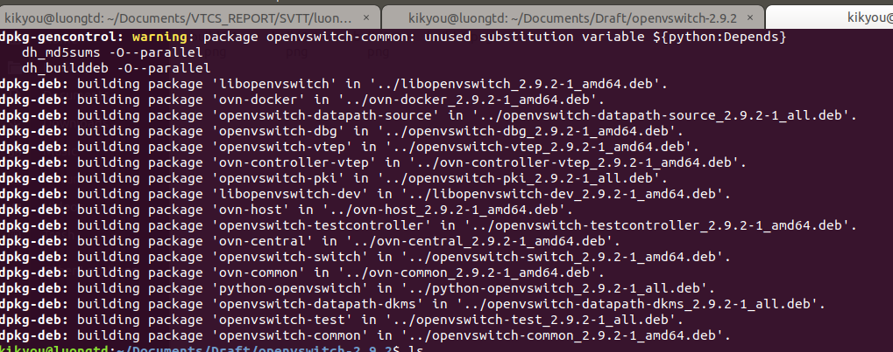


### 4.2. Cài đặt .deb Packages
  Các lệnh này áp dụng để cài đặt từ các gói Debian mà ta vừa tự xây dựng, như được mô tả trong phần trước. Trong trường hợp này, sử dụng lệnh như ```dpkg -i``` để cài đặt các tệp .deb mà ta tạo. Ta sẽ phải tự cài đặt bất kỳ phụ thuộc bị thiếu nào. Kết quả thu được như sau:


## <a name="ex"></a> 5. Ví dụ sử dụng OpenvSwitch
Trong ví dụ này, ta sẽ tạo ra một bridge trên OpenvSwitch đóng vai trò là một switch ảo. Ta sẽ tạo thêm các port ảo và interface ảo gắn cho các máy ảo để chúng kết nối với bên ngoài thông qua bridge. Trước hết, ta giới thiệu sơ lược về một số kiến thức và công cụ sẽ sử dụng trong ví dụ này.

### 5.1 Giới thiệu về Linux bridge và Mininet
#### 5.1.1. Linux Bridge
- Linux bridge là một phần mềm được tích hợp vào trong nhân Linux để giải quyết vấn đề ảo hóa phần network trong các máy vật lý. Về mặt logic, Linux bridge sẽ tạo ra một switch ảo để cho các máy ảo (VM) kết nối được vào và có thể nói chuyện với nhau cũng như sử dụng để kết nối với mạng ngoài.
- Kiến trúc:
  - Tap: Có thể hiểu là một giao diện mạng để các máy ảo có thể giao tiếp được với bridge và nó nằm trong nhân kernel. Tap hoạt động ở lớp 2 trong mô hình OSI.
  - fd (forward data): dùng để chuyển tiếp data từ máy ảo.

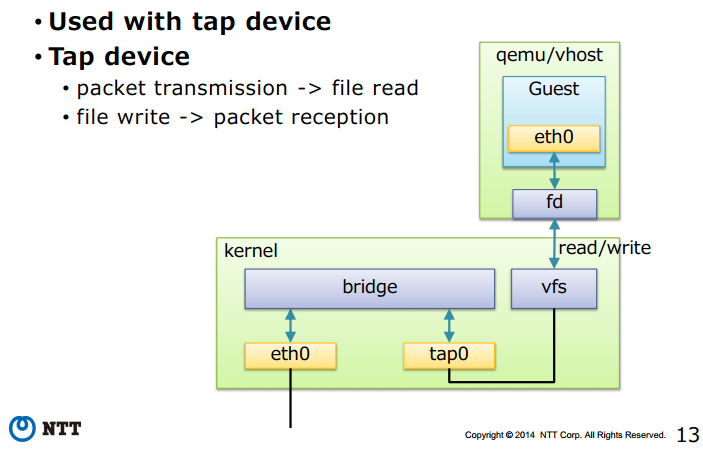

- Chức năng của một switch ảo do Linux bridge tạo ra:
  - STP: tính năng chống loop gói tin trong switch
  - VLAN: Virtual LAN
  - FDB: tính năng chuyển gói tin theo database được xây dựng giúp tăng tốc độ switch


#### 5.1.2. Mininet
- Mininet là một công cụ giả lập mạng, bao gồm tập hợp các host đầu cuối, các switch, router và các liên kết trên một Linux kernel. Mininet sử dụng công nghệ ảo hóa (ở mức đơn giản) để tạo nên hệ thống mạng hoàn chỉnh, chạy chung trên cùng một kernel, hệ thống và user code.
- Các host ảo, switch, liên kết và các controller trên mininet là các thực thể thực sự, đưọc giả lập dưới dạng phần mềm thay vì phần cứng. Một host mininet có thể thực hiện ssh vào đó, chạy bất kì phần mềm nào đã cài trên hệ thống linux (môi trường mà mininet đang chạy). Các phần mềm này có thể gửi gói tin thông qua ethernet interface của mininet với tốc độ liên kết và trễ đặt trưóc.
- Mininet cho phép tạo topo mạng nhanh chóng, tùy chỉnh được topo mạng, tùy chỉnh được việc chuyển tiếp gói tin, chạy được phần mềm thực sự như web server, TCP monitoring, Wireshark,... Mininet cũng dễ dàng sử dụng và không yêu cầu cấu hình gì đặc biệt về phần cứng để chạy. Mininet có thể cài trên laptop, server, VM, cloud (linux),...

### 5.2. Tiến hành ví dụ sử dụng OVS

- Kiểm tra routing table:
```route -n```


Laptop này có một cổng enp3s0 với IP và Default Gateway được cấp bởi giao thức DHCP. Ta sẽ mô hình hóa lại những phần tử trên với sơ đồ sau:
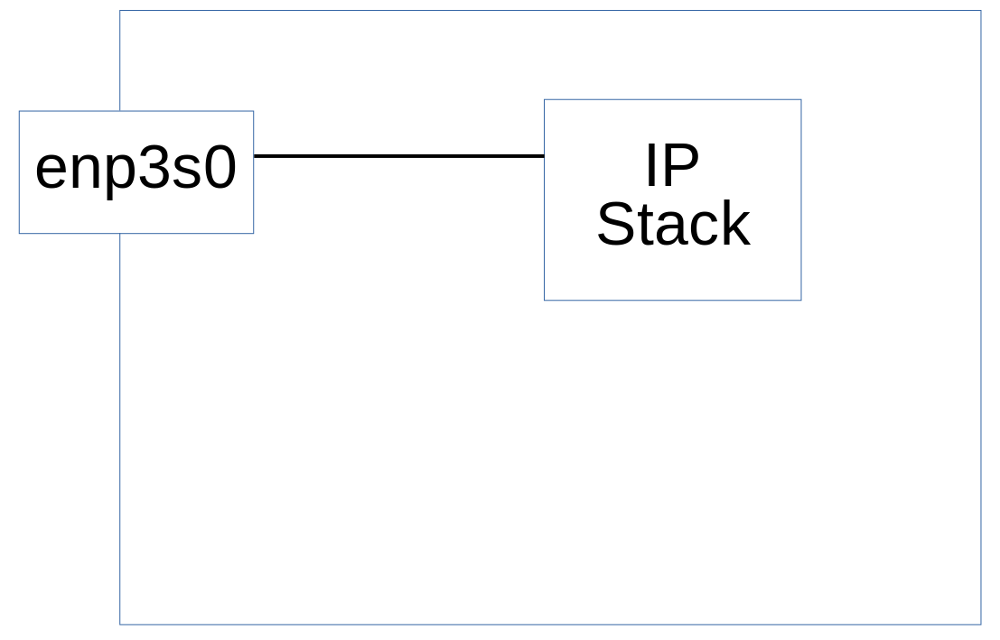 
- Tạo một bridge mới có tên mybridge: 
```sudo ovs-vsctl add-br mybridge``` 
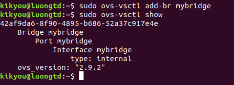
- Bật (turn up) mybridge port: 
```sudo ifconfig mybridge up```
- Kiểm tra: 
```ifconfig``` 
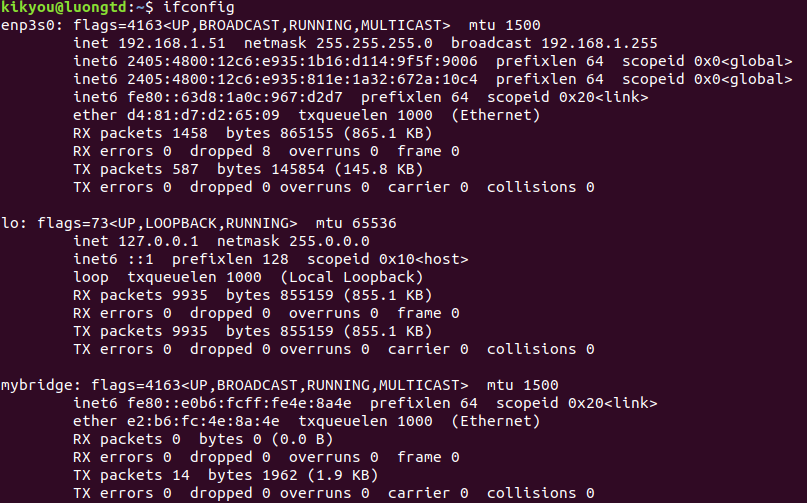

Ta vừa thêm một OpenvSwitch có tên mybridge. Ở thời điểm này mybridge chưa có kết nối với bên ngoài. enp3s0 chưa kết nối với mybridge. Khi laptop muốn kết nối với network bên ngoài, nó vẫn phải đi qua cổng enp3s0.
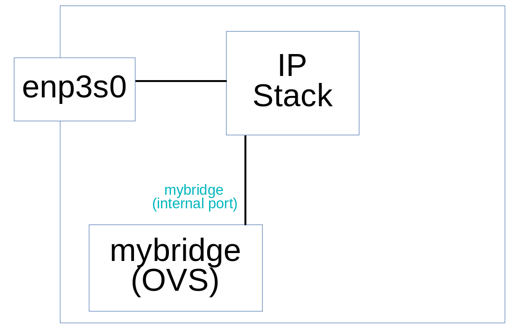
- Kết nối enp3s0 với mybridge: 
```sudo ovs-vsctl add-port mybridge enp3s0```
- Kiểm tra kết quả: 
```sudo ovs-vsctl show```
- Kiểm tra kết nối với internet: ```ping google.com```
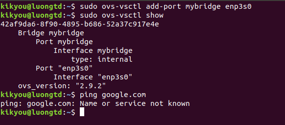

Có vẻ như laptop đã bị mất kết nối internet. Bằng lệnh ```sudo ovs-vsctl add port mybridge enp3s0``` ta đã định hướng lại enp3s0 kết nối với mybridge.

Đó là chính xác là điều ta muốn nhưng laptop vẫn thử kết nối với network bên ngoài trực tiếp qua enp3s0 (mặc dù liên kết này không còn nữa).
Bây giờ, ta sẽ điều khiển luồng kết nối từ laptop tới switch ảo mybridge để đến được cổng enp3s0 bằng cách xóa cấu hình IP của enp3s0 và thiết lập mybridge thành một DHCP client. Sơ đồ dưới đây thể hiện hướng kết nối mà ta sẽ thực hiện. 
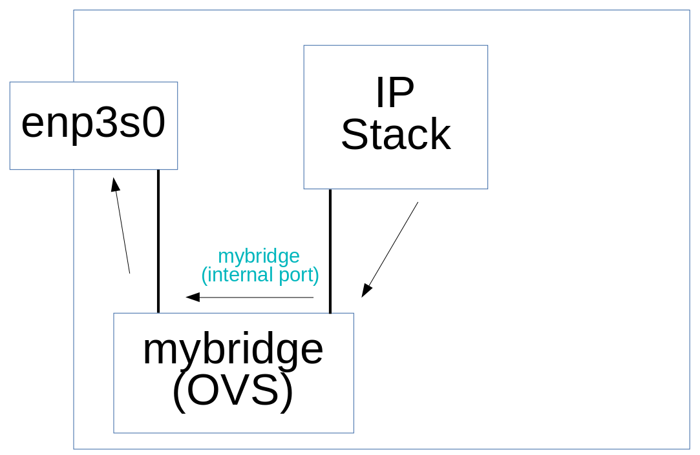
- Xóa cấu hình IP của enp3s0: 
```sudo ifconfig enp3s0 0```
- Chuyển cổng (internal port) mybridge thành một DHCP client để nó có thể nhận IP và Default Gateway từ giao thức DHCP: 
```sudo dhclient mybridge```
- Kiểm tra ```ifconfig```
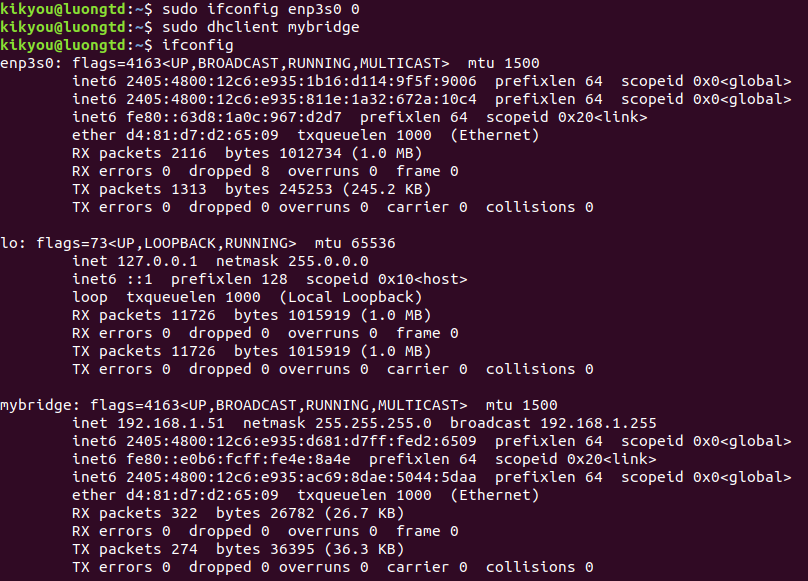
- Kiểm tra bảng định tuyến: ```route -n```
- Kiểm tra kết nối: ping google.com

Như vậy là ta đã thiết lập thành công hướng kết nối mong muốn đi qua vSwitch mybridge và có thể kết nối lại với internet. Tiếp theo ta sẽ thêm 2 tap interface để sử dụng cho kết nối với các máy ảo (Ubuntu Mininet).
- Thêm tap interfaces vào mybridge để sử dụng cho các máy ảo:   
```ip tuntap add mode tap vport1```             
```ip tuntap add mode tap vport2```
- Bật (turn up) port1 và port
```ifconfig vport1 up ```
```ifconfig vport2 up```
- Kiểm tra: ifconfig
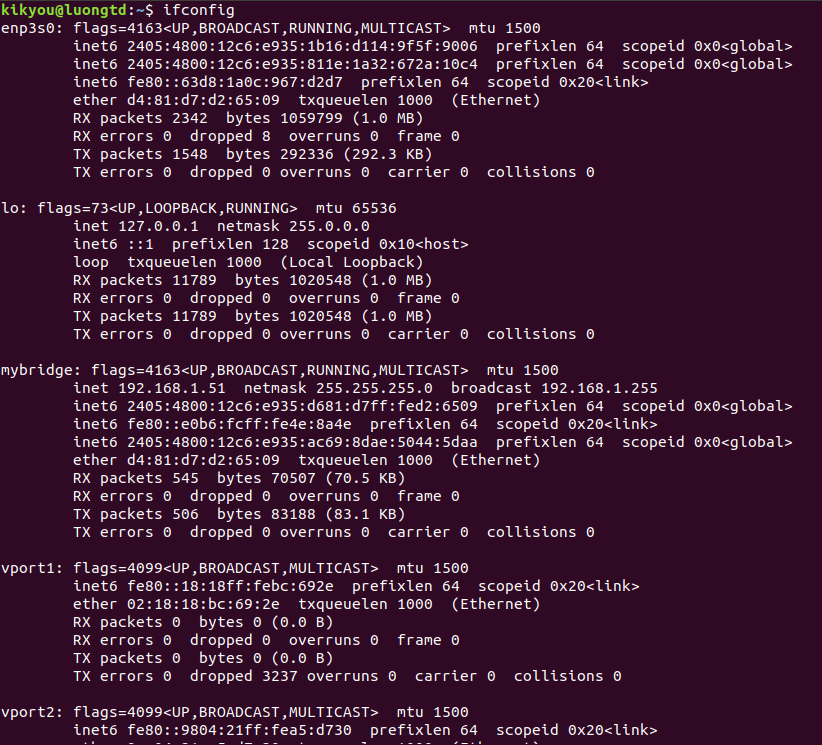

Ta đã tạo được 2 interface ảo.
- Thêm tap interfaces vào mybridge: 
```ovs-vsctl add-port mybridge vport1 -- add-port mybridge vport2```
- Kiểm tra chi tiết mybridge: ```ovs-vsctl show ```
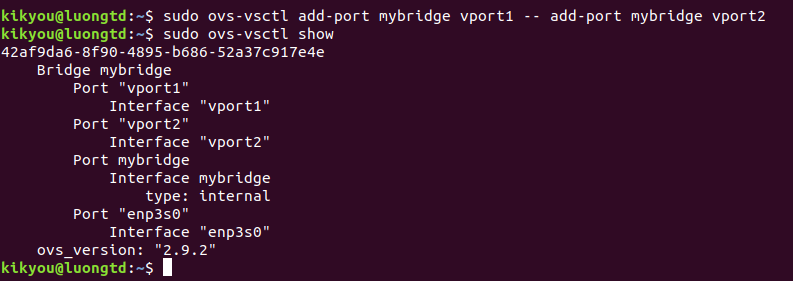

Như vậy ta đã gán hai interface ảo vào mybridge. Sơ đồ tương đương lúc này:

- Gán các interface ảo cho máy ảo: trên Oracle Virtualbox, trong tab Settings/network chọn đến 2 interface ảo vport1 và vport2 vừa tạo.

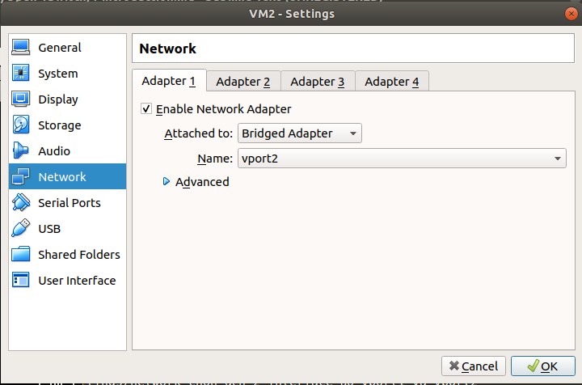
- Hai máy ảo đã nhận được IP từ DHCP và có thể kết nối với bên ngoài.
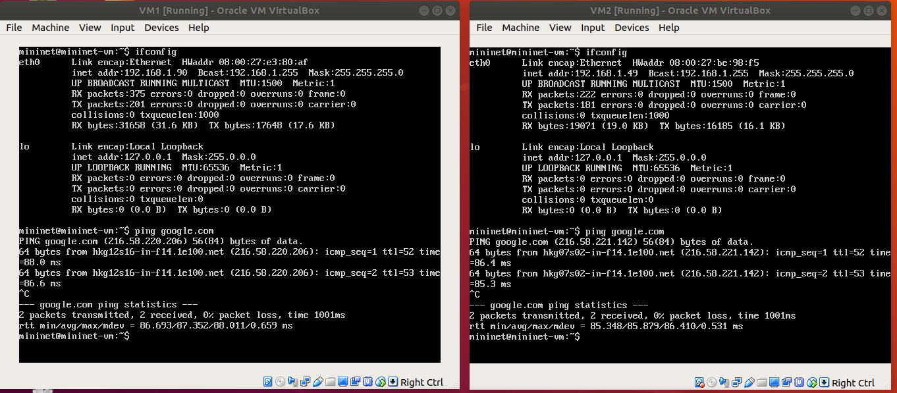

Sơ đồ kết nối hoàn chỉnh:
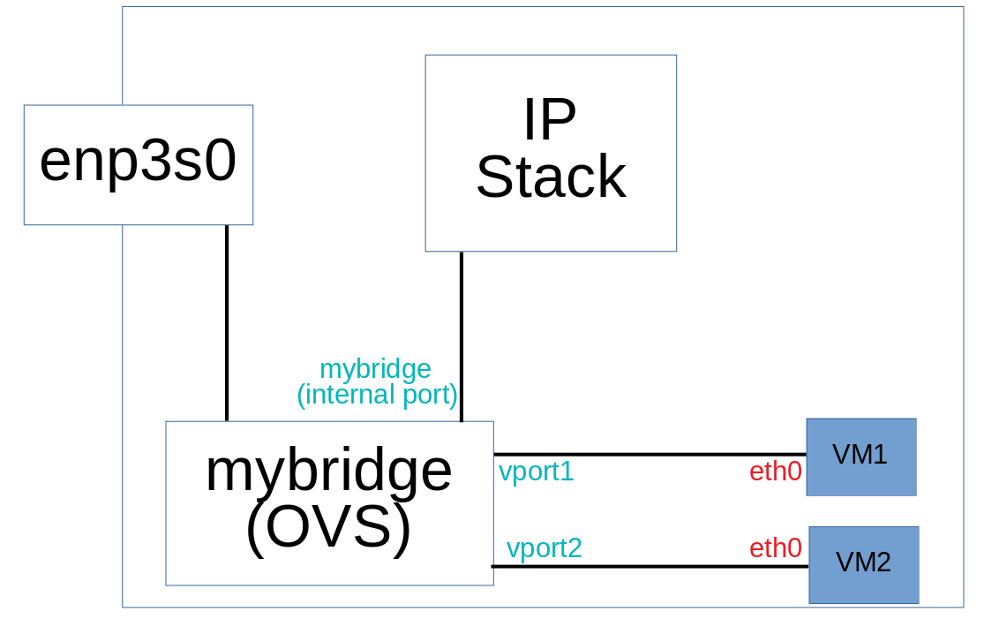

- Xem forwarding table (MAC address table): 
```sudo ovs-appctl fdb/show mybridge ```

- Kiểm tra thông tin về mybridge: (ovs-ofctl là command dùng với OpenFlow Switch để cài đặt và truy vấn các tham số OpenFlow)
```sudo ovs-ofctl show mybridge```
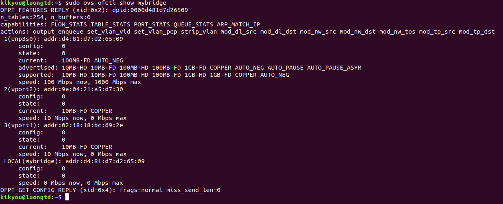

Như vậy, chúng ta đã tạo được bridge trên OpenvSwitch, tạo được các interface ảo và gắn cho các máy ảo để kết nối với bên ngoài.

##Note:
Wireless base stations generally only allow packets with the source MAC address of NIC that completed the initial handshake. Therefore, without MAC rewriting, only a single device can  communicate over a single wireless link.
This isn't specific to Open vSwitch, it's enforced by the access point, so the same problems will show up with the Linux bridge or any other way to do bridging.
